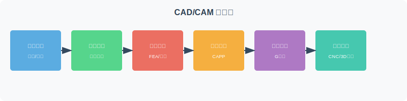
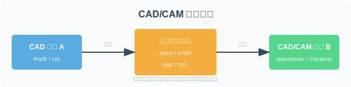

============
课程总览
============

这门课解决什么问题
====================

CAD/CAM 技术是现代制造业数字化转型的核心。本课程旨在帮助你：

1. **理解 CAD/CAM 的基本概念** — 从设计到制造的全流程数字化
2. **掌握几何建模方法** — 线框、曲面、实体建模的原理与应用
3. **学会图形变换** — 二维/三维几何变换的数学基础
4. **了解工程分析** — 有限元分析、优化设计的基本方法
5. **熟悉工艺规划** — CAPP 的自动化工艺设计
6. **掌握数控编程** — 从 CAD 模型到 CNC 代码的转换
7. **理解系统集成** — CAD/CAM 与 PDM/PLM 的集成应用

CAD/CAM 在制造系统中的位置
==============================

如上图所示，CAD/CAM 是产品全生命周期管理（PLM）的核心环节：

- **上游**：市场需求 → 概念设计 → 详细设计（CAD）
- **中游**：工程分析（CAE）→ 工艺规划（CAPP）→ 数控编程（CAM）
- **下游**：加工制造 → 质量检测 → 装配交付

8 章之间的关系
================

纵向层次：

- 基础层（第1-3章）：概念、数据处理、图形变换
- 建模层（第4章）：几何建模技术
- 分析层（第5章）：有限元、优化设计
- 工艺层（第6-7章）：CAPP、数控编程
- 集成层（第8章）：CAD/CAM 集成与数据交换

横向贯穿：数据交换标准（IGES、STEP）贯穿所有章节，实现异构系统间的数据互通。

推荐学习顺序
============

1. **第1章**：建立 CAD/CAM 概念框架
2. **第2章**：理解工程数据的计算机处理
3. **第3章**：掌握图形变换的数学基础
4. **第4章**：学习几何建模的核心技术
5. **第5章**：了解 CAE 分析与优化设计
6. **第6章**：学习 CAPP 工艺规划
7. **第7章**：掌握数控编程方法
8. **第8章**：理解系统集成与数据交换

初学者容易混淆的概念
====================

.. list-table:: 容易混淆的概念对比
   :header-rows: 1
   :widths: 20 20 60

   * - 概念 A
     - 概念 B
     - 区别
   * - CAD
     - CAE
     - CAD 是设计，CAE 是分析
   * - CAD
     - CAM
     - CAD 是设计，CAM 是制造
   * - CAPP
     - CAM
     - CAPP 是工艺规划，CAM 是数控编程
   * - 线框建模
     - 实体建模
     - 线框无面和体信息，实体有完整拓扑
   * - 曲面建模
     - 实体建模
     - 曲面无厚度，实体有体积
   * - IGES
     - STEP
     - IGES 是较早的标准，STEP 是现代的、更完整的标准

学完后的能力清单
================

- [ ] 能解释 CAD/CAM/CAPP/CAE 的区别与联系
- [ ] 能选择合适的几何建模方法
- [ ] 能进行二维/三维图形变换计算
- [ ] 能理解有限元分析的基本流程
- [ ] 能描述 CAPP 的工作步骤
- [ ] 能说明数控编程的内容与步骤
- [ ] 能理解 CAD/CAM 集成的基本方式
- [ ] 能使用至少一种 CAD/CAM 软件（如 SolidWorks、Mastercam）
