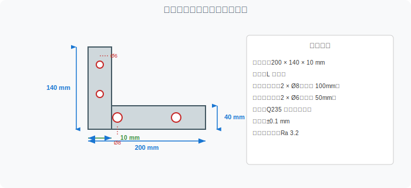
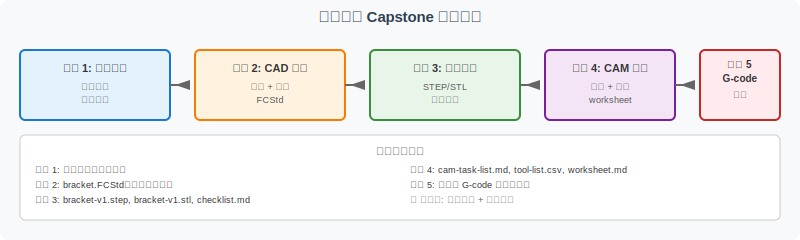
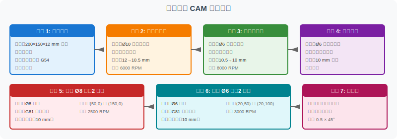

========================================
支架零件 Capstone 综合项目
========================================

本页面是 FreeCAD 实操线的最终综合项目，集成 V5A-V5D 全部学习成果，完成一个真实的 L 型支架从需求分析到 G-code 理解的完整流程。

项目概述
========

**项目名称**：L 型支架（Bracket）设计与加工规划

**项目目标**：

通过完成本项目，验证你已经具备 FreeCAD 实践线的全部能力：

- 能独立完成零件需求分析和建模
- 能系统进行导出检查和数据流转
- 能规划完整的 CAM 加工工序
- 能理解 G-code 指令和刀具路径
- 能反思学习过程并迭代改进

**零件特征**：

- L 型支架，用于设备安装
- 包含底板和立板两部分
- 需要 4 个安装孔（底板 2 个，立板 2 个）
- 多面加工，需要翻转装夹

注意：这是教学练习项目，尺寸、参数和工艺仅用于学习目的，不是工业生产文件。

零件规格
========

零件参数
--------

.. list-table:: 支架零件规格
   :header-rows: 1
   :widths: 30 70

   * - 参数
     - 值
   * - 外轮廓尺寸
     - 200 × 140 × 10 mm
   * - 形状
     - L 型支架
   * - 底板尺寸
     - 200 × 40 × 10 mm
   * - 立板尺寸
     - 40 × 140 × 10 mm
   * - 底板安装孔
     - 2 × Ø8 mm（间距 100 mm）
   * - 立板安装孔
     - 2 × Ø6 mm（间距 50 mm）
   * - 材料
     - Q235 钢（教学用）
   * - 公差
     - ±0.1 mm
   * - 表面粗糙度
     - Ra 3.2

项目流程
========

5 个阶段
--------

本项目分为 5 个阶段，每个阶段对应一个能力验证点：

1. **阶段 1：需求分析** （1-2 小时）
   - 理解零件功能（安装用途、承重需求）
   - 确定材料和公差
   - 输出需求文档

2. **阶段 2：CAD 建模** （3-4 小时）
   - FreeCAD Part Design 工作区
   - 草图 + 拉伸 + 孔特征
   - 输出 bracket.FCStd

3. **阶段 3：导出验证** （1-2 小时）
   - 导出 STEP 和 STL
   - 完成导出检查清单
   - 输出 bracket-v1.step, bracket-v1.stl, checklist.md

4. **阶段 4：CAM 规划** （2-3 小时）
   - 工序拆解
   - 刀具选择和参数
   - 翻转装夹策略
   - 输出 cam-task-list.md, tool-list.csv, worksheet.md

5. **阶段 5：G-code 理解** （1-2 小时）
   - 解读 CAM 生成的 G-code
   - 对应工序到 G-code 指令
   - 输出 G-code 解读笔记

项目任务单
==========

阶段 1 任务：需求分析
----------------------

- [ ] 阅读项目描述，理解零件用途
- [ ] 调研材料 Q235 钢的加工特性
- [ ] 确定关键尺寸和公差要求
- [ ] 列出加工难点（多面加工、薄壁等）
- [ ] 编写需求文档（requirements.md）

**产出**：``requirements.md`` （需求文档，500-1000 字）

阶段 2 任务：CAD 建模
----------------------

- [ ] 新建 FreeCAD 文档，进入 Part Design 工作区
- [ ] 创建底板草图：200 × 40 mm 矩形
- [ ] 拉伸底板：10 mm 厚度
- [ ] 创建立板草图：40 × 140 mm 矩形（以底板左端为基准）
- [ ] 拉伸立板：10 mm 厚度
- [ ] 在底板上创建 2 个 Ø8 孔草图
- [ ] 在立板上创建 2 个 Ø6 孔草图
- [ ] 应用 Pocket 特征生成所有孔
- [ ] 验证模型：尺寸、约束、孔位置
- [ ] 保存为 bracket.FCStd

**产出**：``bracket.FCStd`` （FreeCAD 原生文件）

**参考**：:doc:`freecad-plate-modeling` （V5A 学习内容）

阶段 3 任务：导出验证
----------------------

- [ ] 将 bracket.FCStd 导出为 bracket-v1.step
- [ ] 将 bracket.FCStd 导出为 bracket-v1.stl
- [ ] 完成 :doc:`freecad-export-checklist` 中的所有检查项
- [ ] 在其他 CAD 软件（如 FreeCAD、Blender）中打开 STEP 验证
- [ ] 在切片软件中打开 STL 验证
- [ ] 记录导出检查结果到 export-checklist.md

**产出**：

- ``bracket-v1.step`` （精确几何）
- ``bracket-v1.stl`` （三角网格）
- ``export-checklist.md`` （检查记录）

**参考**：:doc:`freecad-export-checklist` （V5B 学习内容）

阶段 4 任务：CAM 规划
----------------------

CAM 工序拆解
~~~~~~~~~~~~

本项目需要 7 个工序（含毛坯准备和去毛刺）：

.. list-table:: CAM 工序列表
   :header-rows: 1
   :widths: 10 25 20 20 25

   * - 工序
     - 内容
     - 刀具
     - 主轴
     - 备注
   * - 工序 1
     - 毛坯准备
     - 无
     - -
     - 200×150×12 mm 钢板
   * - 工序 2
     - 底板粗加工
     - Ø10 平底立铣刀
     - 6000 RPM
     - 深度 12→10.5 mm
   * - 工序 3
     - 底板精加工
     - Ø6 平底立铣刀
     - 8000 RPM
     - 深度 10.5→10 mm
   * - 工序 4
     - 立板加工
     - Ø6 平底立铣刀
     - 8000 RPM
     - 翻转装夹
   * - 工序 5
     - 底板 Ø8 孔（2 个）
     - Ø8 钻头
     - 2500 RPM
     - G81 钻孔循环
   * - 工序 6
     - 立板 Ø6 孔（2 个）
     - Ø6 钻头
     - 3000 RPM
     - G81 钻孔循环
   * - 工序 7
     - 去毛刺
     - 倒角刀
     - 5000 RPM
     - 倒角 0.5 × 45°

任务清单
~~~~~~~~

- [ ] 阅读 :doc:`freecad-to-cam-worksheet` 复习 CAM 规划方法
- [ ] 识别零件加工特征（面、孔、轮廓、圆角）
- [ ] 规划加工顺序（先面后孔、先粗后精）
- [ ] 考虑翻转装夹方案（一次装夹 vs 多次装夹）
- [ ] 为每个工序选择合适的刀具
- [ ] 填写完整的 worksheet-template.md
- [ ] 创建 cam-task-list.md 记录工序拆解
- [ ] 创建 tool-list.csv 记录刀具参数

**产出**：

- ``cam-task-list.md`` （工序列表）
- ``tool-list.csv`` （刀具参数表）
- ``worksheet-template.md`` （填写的 CAM 工作单）

**参考**：:doc:`freecad-to-cam-worksheet` （V5C 学习内容）

阶段 5 任务：G-code 理解
------------------------

- [ ] 在 CAM 软件中导入 bracket-v1.step
- [ ] 按 cam-task-list.md 设置工序和参数
- [ ] 生成 G-code（不实际运行机床）
- [ ] 用文本编辑器打开 G-code 文件
- [ ] 识别 G00/G01/G02/G03 指令
- [ ] 识别 M03/M05/M08 等辅助指令
- [ ] 识别 G81 钻孔循环
- [ ] 对应每个 G-code 段到具体工序
- [ ] 撰写 G-code 解读笔记

**产出**：

- ``bracket.gcode`` （CAM 生成的 G-code）
- ``gcode-notes.md`` （G-code 解读笔记）

**参考**：:doc:`gcode-toolpath-visualization` （V4A 学习内容）

CAM 任务拆解详解
================

为什么需要 7 个工序？
----------------------

对于 L 型支架，加工难点在于：

1. **多面加工**：底板和立板在两个不同的方向，需要翻转装夹
2. **多孔加工**：4 个安装孔分布在两个面上
3. **精度要求**：底板和立板的连接处需要紧密配合

具体拆解逻辑：

翻转装夹策略
------------

**方案 A：一次装夹加工（高级）**

- 使用专用夹具或 5 轴机床
- 一次装夹完成所有面
- 优势：精度高、效率高
- 劣势：设备要求高

**方案 B：两次装夹（推荐）**

- 第一次装夹：加工底板 + 底板孔
- 翻转 90°
- 第二次装夹：加工立板 + 立板孔
- 优势：通用 3 轴机床即可
- 劣势：精度略低

本项目采用方案 B。

工序顺序逻辑
------------

- **先面后孔**：平面是基准，先加工平面再加工孔可确保位置精度
- **先粗后精**：粗加工去除大部分材料，精加工获得最终尺寸
- **先主后次**：主要特征（底板、立板）先加工，次要特征（孔、倒角）后加工
- **先大后小**：大刀具去除大部分材料，小刀具精加工细节

刀具选择详解
------------

.. list-table:: 刀具选择说明
   :header-rows: 1
   :widths: 20 15 15 50

   * - 工序
     - 刀具
     - 齿数
     - 选择理由
   * - 底板粗加工
     - Ø10 平底立铣刀
     - 2 齿
     - 大直径快速去除材料，2 齿利于排屑
   * - 底板精加工
     - Ø6 平底立铣刀
     - 4 齿
     - 小直径提高表面质量，4 齿利于精加工
   * - 立板加工
     - Ø6 平底立铣刀
     - 4 齿
     - 立板较薄，小直径减少切削力
   * - 底板 Ø8 孔
     - Ø8 钻头
     - -
     - 钻孔专用，标准 G81 循环
   * - 立板 Ø6 孔
     - Ø6 钻头
     - -
     - 钻孔专用，标准 G81 循环
   * - 去毛刺
     - 倒角刀
     - 6 齿
     - 专用倒角，保证倒角尺寸一致

项目提交清单
============

完成所有阶段后，你应该有以下文件：

必需文件
--------

- [ ] ``requirements.md`` — 需求分析文档
- [ ] ``bracket.FCStd`` — FreeCAD 建模源文件
- [ ] ``bracket-v1.step`` — STEP 格式导出
- [ ] ``bracket-v1.stl`` — STL 格式导出
- [ ] ``export-checklist.md`` — 导出检查记录
- [ ] ``cam-task-list.md`` — CAM 工序列表
- [ ] ``tool-list.csv`` — 刀具参数表
- [ ] ``worksheet-template.md`` — CAM 工作单
- [ ] ``bracket.gcode`` — CAM 生成的 G-code
- [ ] ``gcode-notes.md`` — G-code 解读笔记

反思笔记
--------

- [ ] ``reflection.md`` — 反思笔记（500-1000 字），包含：
  - 项目过程中遇到的最大困难
  - 你是如何解决的
  - 学到了什么（不仅技术，还有方法论）
  - 下一步想深入的方向

提交包结构
----------

推荐的提交包目录结构：

::

    bracket-capstone/
    ├── requirements.md
    ├── bracket.FCStd
    ├── bracket-v1.step
    ├── bracket-v1.stl
    ├── export-checklist.md
    ├── cam-task-list.md
    ├── tool-list.csv
    ├── worksheet-template.md
    ├── bracket.gcode
    ├── gcode-notes.md
    └── reflection.md

评分标准
========

更多详细的评分标准（包括完成度、深度、创新三大维度的详细评分项、评分等级、常见扣分项和加分项）请参考 :doc:`bracket-assessment-rubric` 页面。

完成度
------

- [ ] 所有必需文件齐全
- [ ] FreeCAD 模型可正确打开，尺寸符合规格
- [ ] STEP 文件可在其他 CAD 软件中打开
- [ ] STL 文件可在切片软件中打开
- [ ] CAM 工序规划合理（先面后孔、先粗后精）
- [ ] G-code 解读笔记覆盖所有工序

深度
----

- [ ] 需求文档有详细的功能分析
- [ ] 导出检查清单逐项完成
- [ ] CAM worksheet 填写完整
- [ ] G-code 笔记有具体指令解析
- [ ] 反思笔记有具体案例和方法论

创新
----

- [ ] 工艺方案有自己的思考（不只是照搬）
- [ ] 提出了可能的改进方向
- [ ] 记录了学习过程中的"顿悟时刻"

进一步参考
==========

完成本项目后，建议使用以下页面和资源整理项目成果、进行自我评估：

- :doc:`bracket-project-portfolio`：项目档案页面（使用模板整理项目成果）
- :doc:`bracket-assessment-rubric`：项目评分表（自我评估与等级判定）
- 资源包：``assets/bracket-capstone/`` （包含 portfolio-template、submission-checklist、reflection-template、rubric-summary）

常见问题
========

Q1：模型多次装夹后精度不够怎么办？
------------------------------------

A：考虑以下方法：

- 使用精密虎钳，提高装夹刚性
- 第一次装夹时预留精加工余量（0.1-0.2 mm）
- 第二次装夹时先精加工基准面
- 必要时考虑方案 A（一次装夹）

Q2：CAM 软件不熟悉怎么办？
--------------------------

A：本项目不要求真实运行 CAM 软件。你可以：

- 用纸笔绘制刀路示意图
- 用文本编辑器模拟 G-code
- 重点关注工序规划和参数选择，不需要真实输出 G-code
- 参考 :doc:`gcode-toolpath-visualization` 理解 G-code 逻辑

Q3：模型尺寸不准确怎么办？
--------------------------

A：检查以下方面：

- 草图是否完全约束
- 拉伸方向是否正确
- 孔的 Diameter 和 Depth 参数
- 是否选错了参考面

Q4：项目时间太长，能否简化？
----------------------------

A：可以简化部分内容：

- 跳过阶段 1（需求分析），直接用本页面提供的规格
- 用更简单的 L 型（例如 100 × 70 × 8 mm）
- 减少孔的数量（例如只做 2 个）
- 但仍需完成 5 个阶段的完整流程

Q5：完成本项目后下一步学什么？
--------------------------------

A：可以深入以下方向：

- 真实 CAM 软件（Mastercam、Fusion 360 CAM）
- 多轴加工（4 轴/5 轴）
- 后处理（Post-processor）定制
- 真实加工验证（3D 打印或 CNC 加工）
- 阅读真实工业案例

相关页面
========

- :doc:`freecad-plate-modeling`：V5A 建模基础
- :doc:`freecad-export-checklist`：V5B 导出检查
- :doc:`step-stl-mini-lab`：V4B 格式对比
- :doc:`freecad-to-cam-worksheet`：V5C CAM 任务规划
- :doc:`gcode-toolpath-visualization`：V4A G-code 理解
- :doc:`freecad-workflow-index`：V5D 五步学习路线总览
- :doc:`../workflow-roadmap`：工具链总览
- :doc:`../release-showcase`：版本发布说明
