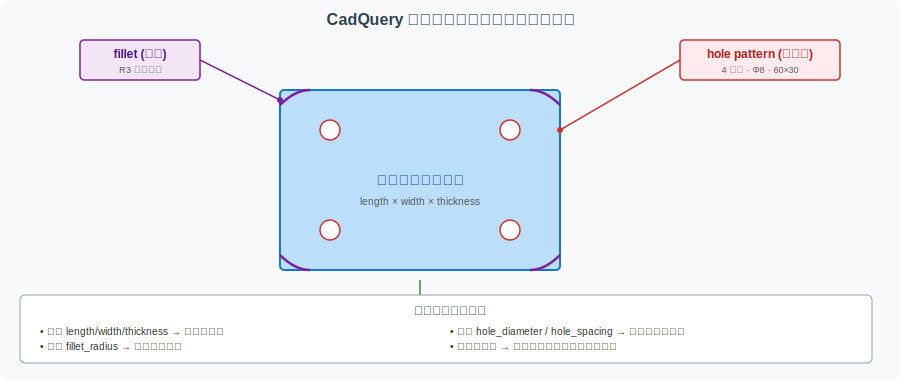
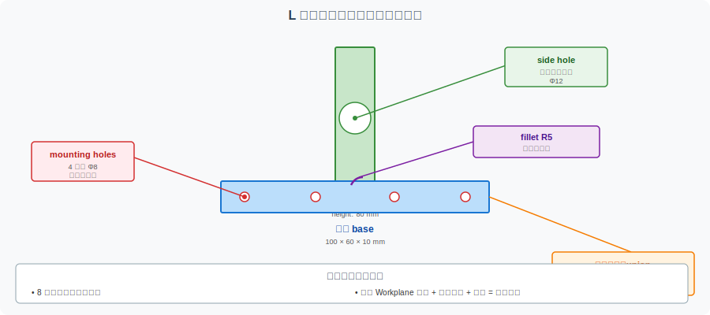

==========================================
CadQuery 进阶：圆角、倒角、阵列与支架变体
==========================================

本页是 :doc:`cadquery-parametric-modeling` （V7A）的进阶篇。V7A 用一个带孔矩形板展示了 CadQuery 的基本用法，本页进一步展示真实 CAD 建模中常见的**高级特征** ：圆角、倒角、孔阵列、参数化支架变体。

本页面是 V7A 的**自然延伸**，不是替代。建议在阅读 V7A 后再来。

A. 本页解决什么问题
====================

V7A 演示了带孔矩形板
--------------------

V7A 用 80×50×8 mm 的板 + 20 mm 通孔 + 1 mm 倒角演示了 CadQuery 的"最小可用形态"。这覆盖了 70% 的入门需求，但还有 30% 的常见建模操作没讲。

V7B 进一步展示真实建模中的高级特征
----------------------------------

本节聚焦四个核心概念：

- **圆角（Fillet）**：缓和应力集中、改善外观
- **倒角（Chamfer）**：便于装配、防止割伤
- **孔阵列（Hole Pattern）**：参数化批量打孔
- **参数化支架变体**：从单板到装配部件的过渡

这四类特征在机械设计中出现频率极高，掌握它们意味着可以应对 90% 以上的教学级建模任务。

教学定位
--------

本页面和 V7A 一样是**教学示例**，不追求工业级完整性：

- 不追求每个特征都"完美"
- 不追求参数完全符合设计规范
- 重点是理解"如何用代码表达这些特征"和"参数如何驱动几何"

B. 从"带孔板"到"可变零件"
==========================

参数化建模的核心是**把变量提到顶部，把逻辑藏在函数里**。

参数化的两个层次
----------------

.. list-table:: 参数化的两个层次
   :header-rows: 1
   :widths: 25 35 40

   * - 层次
     - 说明
     - CadQuery 表达
   * - **参数层**
     - 长度、宽度、孔径、圆角半径
     - 文件顶部命名变量
   * - **特征层**
     - 板、孔、圆角、倒角
     - Workplane 上的链式方法

参数和特征的分离让代码更易读、更易修改。

为什么参数化适合教学
--------------------

.. code-block:: text

   # 改一个变量 → 整张图重画
   length = 80 → 120

   课堂效果：
   • 学生看到"参数改变，几何自动跟随"
   • 教师可以演示"如果圆角太大，会出现什么"
   • 团队可以同时修改不同参数，对比设计

为什么参数化适合版本管理
------------------------

- **diff 直观**：`fillet_radius: 3.0 → 5.0` 一眼能读
- **分支实验**：开新分支改参数、不破坏主分支
- **可重复生成**：同一份代码 + 不同参数 = 不同零件

C. 示例 1：带圆角和倒角的矩形板
================================

V7A 的板只有倒角，本例加入**圆角**。圆角和倒角经常被混淆，这里特别区分：

- **倒角（Chamfer）**：把棱边斜切 45 度，常见于装配接触面
- **圆角（Fillet）**：把棱边磨成圆弧，常见于需要缓和应力的位置

零件规格
--------

.. list-table:: 带圆角和倒角的板参数
   :header-rows: 1
   :widths: 30 25 45

   * - 参数
     - 数值
     - 说明
   * - ``length``
     - 80 mm
     - 板的长度（X 方向）
   * - ``width``
     - 50 mm
     - 板的宽度（Y 方向）
   * - ``thickness``
     - 8 mm
     - 板的厚度（Z 方向）
   * - ``hole_diameter``
     - 20 mm
     - 中心通孔直径
   * - ``fillet_radius``
     - 3 mm
     - 内棱边圆角半径（4 条顶面边和 4 条底面边）
   * - ``chamfer_size``
     - 1 mm
     - 外棱边倒角（可选）

完整代码
--------

.. code-block:: python

   """
   带圆角和倒角的矩形板 — CadQuery 进阶示例 (V7B)
   ============================================

   本文件是 CAD-CAM-Technology-docs 项目的教学示例，
   配合 examples/cadquery-advanced-features.rst 使用。
   演示：圆角（fillet）+ 倒角（chamfer）+ 通孔

   依赖：cadquery >= 2.0
   """

   import cadquery as cq

   # ---------- 参数集中区 ----------
   length = 80.0
   width = 50.0
   thickness = 8.0
   hole_diameter = 20.0
   fillet_radius = 3.0   # 内棱边圆角
   chamfer_size = 1.0    # 外棱边倒角（演示用，本例不实际添加）

   # ---------- 几何建模 ----------
   def build_plate_with_fillet():
       """构造带圆角和中心孔的板。"""
       # 1. 基础板
       plate = cq.Workplane("XY").box(length, width, thickness)

       # 2. 中心孔
       plate = (
           plate
           .faces(">Z")
           .workplane()
           .hole(hole_diameter)
       )

       # 3. 在所有竖直棱边（"|Z"）上做圆角
       #    注意：圆角必须在孔之后再做，否则孔口会被圆角"吃掉"
       plate = plate.edges("|Z").fillet(fillet_radius)

       return plate

   # ---------- 主流程 ----------
   def main():
       plate = build_plate_with_fillet()
       cq.exporters.export(plate, "plate_with_fillet.step")
       cq.exporters.export(plate, "plate_with_fillet.stl")
       print("[OK] plate_with_fillet.step / .stl 已导出")

   if __name__ == "__main__":
       main()

代码逐段解读
------------

**圆角的顺序问题**：

上面代码中，圆角（``fillet``）放在打孔之后。如果顺序反过来：

.. code-block:: python

   # ❌ 错误顺序：先圆角再打孔
   plate = cq.Workplane("XY").box(length, width, thickness)
   plate = plate.edges("|Z").fillet(fillet_radius)  # 先圆角
   plate = plate.faces(">Z").workplane().hole(hole_diameter)  # 后打孔

孔口的圆角特征会被破坏——因为圆角修改的是棱边，而孔是新的几何操作。CadQuery 不会自动恢复被影响的特征。

**圆角半径的限制**：

``fillet_radius`` 不能太大。经验规则是：圆角半径 < 最短边长的 1/4。本例中：

- 板厚 8 mm，圆角 3 mm → 3 < 8/2 → OK
- 短边长 50 mm，圆角 3 mm → 3 < 50/4 → OK

如果圆角过大，CadQuery 会抛 `ValueError: fillet radius too large`。

**圆角 vs 倒角的选择**：

- **圆角** 优先场景：承受载荷、应力集中、需圆滑过渡
- **倒角** 优先场景：装配接触、便于入孔、防割伤

D. 示例 2：孔阵列
=================

真实机械零件经常有**多个孔**（夹具、安装板、法兰盘）。手动画每个孔很麻烦，参数化更高效。

从 1 个孔到 4 个孔
------------------

V7A 的板只有 1 个中心孔。本例扩展为 4 个角孔，呈矩形分布：

.. list-table:: 4 孔阵列参数
   :header-rows: 1
   :widths: 30 25 45

   * - 参数
     - 数值
     - 说明
   * - ``hole_diameter``
     - 8 mm
     - 每个孔的直径
   * - ``hole_spacing_x``
     - 60 mm
     - 孔之间在 X 方向的间距
   * - ``hole_spacing_y``
     - 30 mm
     - 孔之间在 Y 方向的间距

完整代码
--------

.. code-block:: python

   import cadquery as cq

   # 参数
   length = 100.0
   width = 60.0
   thickness = 10.0
   hole_diameter = 8.0
   hole_spacing_x = 60.0
   hole_spacing_y = 30.0

   # 1. 基础板
   plate = cq.Workplane("XY").box(length, width, thickness)

   # 2. 在板中心打 4 个角孔
   plate = (
       plate
       .faces(">Z")
       .workplane()
       .rect(hole_spacing_x, hole_spacing_y, forConstruction=True)  # 构造矩形
       .vertices()                                                   # 4 个顶点
       .hole(hole_diameter)                                          # 每个顶点打孔
   )

   cq.exporters.export(plate, "plate_with_4_holes.step")

代码关键点
----------

**关键点 1：``forConstruction=True``**

``rect()`` 在草图上画了一个矩形，但**不参与实体构造**（不形成新的面）。它只作为定位辅助。

**关键点 2：``.vertices()``**

``rect()`` 的 4 个角点变成 Workplane 的 4 个"点"，``.vertices()`` 切换到这些点。

**关键点 3：``.hole()`` 自动迭代**

``hole()`` 会作用在每个点上，自动生成 4 个孔。无需 for 循环。

阵列参数化的意义
----------------

.. code-block:: python

   # 同样 4 行代码可以生成不同孔数
   # 2 个孔：
   .rect(spacing_x, 0, forConstruction=True).vertices().hole(d)

   # 4 个孔：
   .rect(spacing_x, spacing_y, forConstruction=True).vertices().hole(d)

   # 6 个孔（2x3 网格）：
   # 思路：用两个 rect 或手动指定 6 个点

修改 ``hole_spacing_x`` 和 ``hole_spacing_y`` 就能调整孔的位置——这比 FreeCAD 里逐个孔拖动位置高效得多。

边距检查
--------

孔阵列有一个隐藏要求：**孔必须离板边有足够距离** （否则孔会穿出板外）。

.. code-block:: python

   # 边距检查（教学示例，不实际运行）
   edge_margin_x = (length - hole_spacing_x) / 2
   edge_margin_y = (width - hole_spacing_y) / 2

   if edge_margin_x < hole_diameter:
       print("警告：孔可能太靠近 X 方向板边")
   if edge_margin_y < hole_diameter:
       print("警告：孔可能太靠近 Y 方向板边")

E. 示例 3：简化 L 型支架
========================

L 型支架是 :doc:`bracket-capstone-project` （V6A）的核心零件。本节用 CadQuery 表达**简化版** 支架，作为从"板"到"装配部件"的过渡。

支架参数表
----------

.. list-table:: L 型支架参数
   :header-rows: 1
   :widths: 30 25 45

   * - 参数
     - 典型值
     - 说明
   * - ``base_length``
     - 100 mm
     - 底板长度（X 方向）
   * - ``base_width``
     - 60 mm
     - 底板宽度（Y 方向）
   * - ``base_thickness``
     - 10 mm
     - 底板厚度（Z 方向）
   * - ``vertical_height``
     - 80 mm
     - 立板高度（Z 方向）
   * - ``vertical_thickness``
     - 10 mm
     - 立板厚度（X 方向）
   * - ``mounting_hole_diameter``
     - 8 mm
     - 底板安装孔（4 个角孔）
   * - ``side_hole_diameter``
     - 12 mm
     - 立板大孔（1 个中心孔）
   * - ``fillet_radius``
     - 5 mm
     - 内棱边圆角（缓解应力）

概念性代码
----------

.. code-block:: python

   """
   L 型支架 — CadQuery 教学示例 (V7B)
   ================================
   本文件演示从"板"扩展到"支架"的概念。
   简化版，不追求工业级完整性。
   """

   import cadquery as cq

   # ---------- 参数 ----------
   base_length = 100.0
   base_width = 60.0
   base_thickness = 10.0
   vertical_height = 80.0
   vertical_thickness = 10.0
   mounting_hole_diameter = 8.0
   side_hole_diameter = 12.0
   fillet_radius = 5.0

   # ---------- 构造底板 ----------
   base = cq.Workplane("XY").box(
       base_length, base_width, base_thickness
   )

   # ---------- 底板 4 个角孔（安装孔）----------
   base = (
       base
       .faces(">Z")
       .workplane()
       .rect(
           base_length - 2 * mounting_hole_diameter,
           base_width - 2 * mounting_hole_diameter,
           forConstruction=True,
       )
       .vertices()
       .hole(mounting_hole_diameter)
   )

   # ---------- 构造立板 ----------
   # 立板位于底板右侧，顶面在底板之上
   vertical = (
       cq.Workplane("XY")
       .transformed(
           offset=(
               base_length / 2 - vertical_thickness / 2,
               0,
               base_thickness,
           )
       )
       .box(vertical_thickness, base_width, vertical_height)
   )

   # ---------- 立板中心大孔 ----------
   vertical = (
       vertical
       .faces(">Z")
       .workplane()
       .hole(side_hole_diameter)
   )

   # ---------- 合并两块 ----------
   bracket = base.union(vertical)

   # ---------- 内棱边圆角 ----------
   bracket = bracket.edges("|Z or >X").fillet(fillet_radius)

   # ---------- 导出 ----------
   cq.exporters.export(bracket, "bracket_variant.step")
   cq.exporters.export(bracket, "bracket_variant.stl")

代码组织方式说明
----------------

.. list-table:: 支架代码组织
   :header-rows: 1
   :widths: 25 75

   * - 段落
     - 作用
   * - **参数集中**
     - 8 个参数控制整个支架
   * - **分段构造**
     - 底板 → 立板 → 合并 → 圆角
   * - **布尔运算**
     - ``base.union(vertical)`` 把两块合并为一个实体
   * - **特征操作**
     - 孔、圆角、倒角按顺序施加

F. 特征与参数对照表
====================

下面汇总本节和 V7A 涉及的所有特征，方便查阅：

.. list-table:: 特征与参数对照
   :header-rows: 1
   :widths: 12 22 18 25 23

   * - 特征
     - 参数
     - 在 CAD 中的含义
     - 在制造中的意义
     - 常见风险
   * - 圆角
     - ``fillet_radius``
     - 棱边磨成圆弧
     - 缓和应力集中、改善外观
     - 半径过大导致建模失败
   * - 倒角
     - ``chamfer_size``
     - 棱边斜切 45 度
     - 便于装配入孔、防割伤
     - 倒角过大削弱强度
   * - 通孔
     - ``hole_diameter``
     - 穿透零件的圆柱孔
     - 用于螺栓、铆钉、销钉连接
     - 孔径过小装配困难
   * - 孔阵列
     - ``hole_spacing_x/y``
     - 多个孔按规律分布
     - 减少重复建模工作
     - 孔距过小导致结构弱
   * - 板厚
     - ``thickness``
     - 板的 Z 方向尺寸
     - 决定强度和重量
     - 过薄易变形
   * - 支撑竖板
     - ``vertical_height``
     - 垂直方向延伸的板
     - 提供额外的安装面
     - 与底板连接处需圆角
   * - 坐标原点
     - （无参数）
     - 几何定位基准
     - 决定 STEP 文件中坐标
     - 原点变化影响后续所有操作
   * - 中心对称
     - 派生
     - 孔关于原点对称
     - 便于装配对中
     - 非对称会引起偏载

G. 与 FreeCAD / Capstone 的关系
================================

V7B 是 V7A 的进阶、FreeCAD 路径的代码化补充、Capstone 项目线的代码化表达。

完整关系网
----------

.. list-table:: V7B 与其他页面的关系
   :header-rows: 1
   :widths: 25 75

   * - 页面
     - 关系
   * - :doc:`cadquery-parametric-modeling`
     - V7A，V7B 的前置篇（基础入门）
   * - :doc:`freecad-plate-modeling`
     - 图形化版带孔板，V7A 的 FreeCAD 对应
   * - :doc:`bracket-capstone-project`
     - L 型支架 Capstone，V7B 支架的来源
   * - :doc:`capstone-learning-path`
     - Capstone 项目线总入口
   * - :doc:`step-stl-mini-lab`
     - STEP/STL 格式对比，理解 V7B 导出

工具选择建议
------------

.. list-table:: 工具选择建议
   :header-rows: 1
   :widths: 25 25 50

   * - 场景
     - 推荐工具
     - 理由
   * - 入门、几何直觉
     - FreeCAD
     - 图形化界面，所见即所得
   * - 参数化、批量生成
     - CadQuery
     - 变量驱动，Git 友好
   * - 复杂曲面、装配
     - 商业 CAD（SolidWorks/Fusion）
     - 工业级功能完整
   * - 学术研究、可重复
     - CadQuery
     - 代码可发表、可复现
   * - 教学演示
     - 两者结合
     - 几何用 FreeCAD，参数用 CadQuery

最终统一
--------

不论用 FreeCAD 还是 CadQuery，最终都会导出：

- **STEP** → 用于 CAD/CAM/CAE 流转
- **STL** → 用于 3D 打印和快速预览

下游工具链（:doc:`freecad-to-cam-worksheet`、:doc:`freecad-path-workbench-intro`、:doc:`bracket-capstone-project`）**不关心** 模型来源。

H. 常见误区
===========

.. list-table:: CadQuery 进阶学习常见误区
   :header-rows: 1
   :widths: 8 35 35 22

   * - #
     - 误区
     - 正确做法
     - 影响等级
   * - 1
     - 一开始就写复杂模型
     - 从带孔板开始，逐步加特征
     - ⭐⭐⭐
   * - 2
     - 参数命名不清
     - 用语义化命名（``hole_diameter`` 而非 ``d``）
     - ⭐⭐
   * - 3
     - 忽略单位
     - 顶部明确标注 ``# 单位：毫米``
     - ⭐⭐⭐
   * - 4
     - 圆角半径过大导致建模失败
     - 经验规则：圆角半径 < 最短边长 1/4
     - ⭐⭐
   * - 5
     - 倒角和圆角混用但不理解制造意义
     - 倒角用于装配、圆角用于应力
     - ⭐⭐
   * - 6
     - 孔阵列没有考虑边距
     - 孔到板边的距离 > 孔半径
     - ⭐⭐
   * - 7
     - 导出 STL 后以为仍保留参数和特征
     - STL 只是三角网格，特征全部丢失
     - ⭐⭐⭐
   * - 8
     - 没有保存参数版本记录
     - 用 Git 管理代码，每个版本有 commit
     - ⭐⭐

**前 3 个误区是初学者最容易犯的，必须避免。后 5 个在进阶阶段要持续注意。**

I. 下一步学习建议
==================

完成 V7A + V7B 后，你已经掌握了 CadQuery 教学级建模的核心能力。

**如果想继续深入**：

1. **V8 — 真实工程案例**：用 CadQuery 重写 :doc:`bracket-capstone-project` 的全部零件
2. **V8 — 装配体 API**：学习 CadQuery 处理多零件装配（``Assembly`` 类）
3. **V8 — 真实软件截图**：SolidWorks / Fusion 360 的图形化对比
4. **V8 — OCCT 内核原理**：理解 CadQuery 背后的 OpenCASCADE 几何内核

**如果想动手实践**：

1. 用 V7A + V7B 的方法生成自己设计的零件
2. 配合 :doc:`bracket-capstone-project`，对比 FreeCAD 和 CadQuery 两种实现
3. 用 Git 管理参数版本，演示"参数变化 → 几何变化"的可重复性

J. 教学声明
============

本页面是 **CAD/CAM 学习路径的辅助材料**，不是生产环境指南：

- 教学示例不考虑工业级鲁棒性
- 不要求读者立刻安装 CadQuery
- 与 :doc:`cadquery-parametric-modeling` （V7A）配合使用
- 真实工程中应根据需求选择建模工具