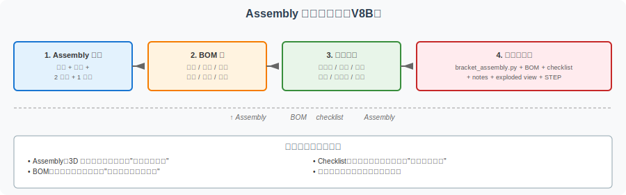
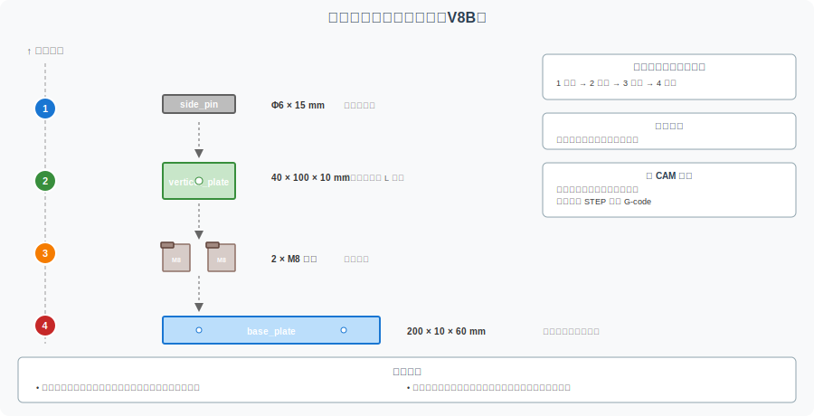

====================================================
CadQuery Assembly 进阶：BOM、爆炸图与装配检查清单
====================================================

本页是 :doc:`cadquery-assembly-intro` （V8A）的**进阶篇** 。V8A 演示了如何用 CadQuery ``Assembly`` 表达"多零件 + 空间位置关系"，但**装配体还需要被检查、拆解、归档** ，这就要用到三个工程概念：

- **BOM** （Bill of Materials，零件清单）
- **爆炸图** （Exploded View，教学性地拉开组件位置）
- **装配检查清单** （Assembly Checklist，结构化验证装配体是否完整）

本节不涉及真实装配动画、约束求解或工业级装配工程图，重点是**教学型表达**。

A. 本页解决什么问题
====================

V8A 解决了"怎么组织多零件"
--------------------------------------

V8A 演示了 `Assembly` 容器的用法：

- 多个独立零件用 `add()` 加入
- 每个零件用 `Location(Vector(x, y, z))` 显式定位
- 整个装配体用 `assembly.save()` 导出 STEP

V8B 解决"装配体如何被检查和归档"
------------------------------------------

真实的工程实践中，**仅有装配体代码还不够** 。还需要：

- **BOM** —— 让团队 / 评审者一眼看清"有哪些零件、多少个、什么材料"
- **爆炸图** —— 让团队 / 评审者一眼看清"零件怎么装、装在哪里"
- **检查清单** —— 让团队 / 评审者一眼验证"装配体是否完整、命名是否清晰"

本节把这三个概念用 V8A 的 ``bracket_assembly.py`` 演示。

教学边界
--------

- 不做真实装配动画
- 不追求工业级装配工程图
- 不涉及约束求解（如"两个圆柱面必须同轴"）
- 重点是让读者理解"装配体 ≠ 几个 union 起来的实体"

B. 从 Assembly 到 BOM
======================

``Assembly`` 和 **BOM** 是装配体的两种不同表达方式：

.. list-table:: Assembly vs BOM
   :header-rows: 1
   :widths: 20 35 35 10

   * - 维度
     - Assembly
     - BOM
     - 评分
   * - 关注点
     - 组件与空间位置
     - 组件清单与数量
     - 互补
   * - 表达方式
     - 3D 几何
     - 2D 表格
     - 互补
   * - 适合阅读
     - 视觉化理解
     - 文档化记录
     - 互补
   * - 适合检查
     - 几何关系
     - 完整性和数量
     - 互补
   * - 数据来源
     - 代码（`add()` 调用）
     - 表格（手工或半自动）
     - BOM 半自动
   * - 作品集
     - 截图
     - 表格 / Markdown
     - 互补

**关键认识**：BOM 应当从代码中**派生**而不是**完全独立**维护，否则容易出现"代码改了但 BOM 没改"的不一致。

C. 支架装配体 BOM 示例
======================

以 V8A 的 ``bracket_assembly.py`` 为例，整理 BOM：

BOM 表格
--------

.. list-table:: 简化支架装配体 BOM
   :header-rows: 1
   :widths: 6 22 8 22 15 18 9

   * - 编号
     - 组件名
     - 数量
     - 作用
     - 建议材料
     - 对应 CadQuery 函数
     - 检查要点
   * - 1
     - base_plate
     - 1
     - 装配体"地面"，承载其他组件
     - Q235 钢（教学示意）
     - ``make_base_plate()``
     - 孔位 / 尺寸
   * - 2
     - vertical_plate
     - 1
     - 装配体"立面"，与底板 L 型结合
     - Q235 钢（教学示意）
     - ``make_vertical_plate()``
     - 销钉孔 / 位置
   * - 3
     - mounting_bolt
     - 2
     - 把底板固定到外部设备
     - 8.8 级钢（教学示意）
     - ``make_bolt()``
     - 直径 / 长度
   * - 4
     - side_pin
     - 1
     - 立板与外部设备的定位
     - 45 钢（教学示意）
     - ``make_pin()``
     - 直径 / 长度
   * - -
     - 合计
     - 5
     - -
     - -
     - -
     - 数量必须 = 5

**教学声明**：

- 材料只是教学示意，**不可直接用于实际工程**
- 螺栓、销钉的等级和材料需要按 GB/T / ISO 标准选择
- 真实 BOM 还应包含表面处理、采购编号、单价等字段（本节简化）

D. 爆炸图如何帮助理解装配
==========================

什么是爆炸图
------------

**爆炸图** 是教学性表达——**不是** 把零件真的拆开，而是用箭头或间距表示：

- 装配顺序（哪个先装、哪个后装）
- 零件关系（哪个连哪个、怎么连）
- 紧固件位置（螺栓从哪边穿、销钉从哪边插）

**与 CAM 的关系**：

- 爆炸图用于**理解装配关系**，不直接用于加工
- 加工仍需要**回到单件**，每个零件单独生成 G-code
- 装配体 STEP 用于"理解"，单件 STEP 用于"加工"

E 节的教学爆炸图
----------------

本节的爆炸图（见 ``bracket-exploded-view.svg``）展示：

- 底板在最下方
- 立板在上方，垂直于底板
- 2 个螺栓从底板上方插入
- 1 个销钉从立板外侧插入

每个组件用箭头 / 间距表示拆解方向和距离。

E. 装配检查清单
================

下方是 V8B 的**装配体检查清单**（assembly checklist），用于系统验证装配体的完整性。

结构化检查项
------------

.. list-table:: 装配体检查清单
   :header-rows: 1
   :widths: 8 30 50 12

   * - #
     - 检查项
     - 验证方法
     - 必填
   * - 1
     - 能否识别所有组件
     - 打开 STEP，目视确认每个组件可见
     - ✅
   * - 2
     - 组件数量是否正确
     - 对比 BOM 表格，确认数量一致
     - ✅
   * - 3
     - 螺栓 / 销钉位置是否合理
     - 螺栓应穿过底板孔，销钉应穿过立板孔
     - ✅
   * - 4
     - 组件之间是否有明显干涉
     - 目视检查是否有重叠 / 穿模
     - ✅
   * - 5
     - 坐标系是否清楚
     - 所有组件的 Location 都以装配体原点为参考
     - ✅
   * - 6
     - 能否解释每个组件的作用
     - 团队 / 评审者能理解每个零件的功能
     - ✅
   * - 7
     - 知道哪些零件需要单独加工
     - 底板 / 立板加工，螺栓 / 销钉外购
     - ✅
   * - 8
     - 区分展示装配体和加工模型
     - 装配体用于展示，加工要回到单件
     - ✅

**使用建议**：

- 提交作品集前逐项检查
- 评审者（爸爸/团队）使用此清单验证
- 反复迭代：发现问题 → 修改代码 → 重新检查

完整模板下载
------------

完整模板可在 :file:`assets/bracket-capstone/assembly/assembly-checklist.md` 找到。

F. CadQuery 代码补充
====================

下方代码展示如何用结构化数据定义 BOM，让 BOM 与 Assembly 代码保持**一致性**。

.. code-block:: python

   """
   BOM 数据结构示例 — 与 V8A bracket_assembly.py 配套
   ===============================================

   本代码片段演示如何用 Python list/dict 定义 BOM 数据。
   实际工程中可序列化为 JSON、YAML、CSV 等格式。
   """

   # BOM 数据：每个组件 = 一个 dict
   BOM_DATA = [
       {
           "id": 1,
           "name": "base_plate",
           "quantity": 1,
           "role": "装配体地面，承载其他组件",
           "material": "Q235 钢（教学示意）",
           "function": "make_base_plate",
           "checks": ["孔位正确", "尺寸正确"],
       },
       {
           "id": 2,
           "name": "vertical_plate",
           "quantity": 1,
           "role": "装配体立面，与底板 L 型结合",
           "material": "Q235 钢（教学示意）",
           "function": "make_vertical_plate",
           "checks": ["销钉孔位置正确", "立板高度正确"],
       },
       {
           "id": 3,
           "name": "mounting_bolt",
           "quantity": 2,
           "role": "把底板固定到外部设备",
           "material": "8.8 级钢（教学示意）",
           "function": "make_bolt",
           "checks": ["直径 = 8mm", "长度足够"],
       },
       {
           "id": 4,
           "name": "side_pin",
           "quantity": 1,
           "role": "立板与外部设备的定位",
           "material": "45 钢（教学示意）",
           "function": "make_pin",
           "checks": ["直径 = 6mm", "长度足够"],
       },
   ]

   def total_quantity(bom):
       """计算 BOM 总数量。"""
       return sum(item["quantity"] for item in bom)

   def print_bom(bom):
       """打印 BOM 表格。"""
       print(f"{'ID':<4} {'Name':<18} {'Qty':<5} {'Role':<30}")
       print("-" * 60)
       for item in bom:
           print(f"{item['id']:<4} {item['name']:<18} "
                 f"{item['quantity']:<5} {item['role']:<30}")
       print("-" * 60)
       print(f"Total quantity: {total_quantity(bom)}")

   if __name__ == "__main__":
       print_bom(BOM_DATA)

代码解读
--------

**结构化数据**：

用 Python ``list`` of ``dict`` 表达 BOM，每个组件是一个 ``dict``，包含 id/name/quantity/role/material/function/checks。

**数据驱动**：

BOM 与 Assembly 共享 ``function`` 字段，理论上可以从 BOM 派生 Assembly 代码（高级用法，本节不实现）。

**导出格式**：

实际工程中可将 ``BOM_DATA`` 序列化为 JSON、YAML、Markdown 表格，方便与其他工具（Excel、PLM）交换。

完整代码
--------

完整代码已加入 :file:`code/cadquery/bracket_assembly.py`（轻量增加 ``BOM_DATA`` 部分，不改变核心几何逻辑）。

G. 装配体作品集归档
====================

推荐归档清单
------------

.. code-block:: text

   V8A 装配体作品集提交物（建议）：
   ├── bracket_assembly.py           # CadQuery 装配体代码
   ├── bracket_assembly.step          # 完整装配体 STEP（读者本地能导出）
   ├── components/                    # （可选）拆分后的单零件 STEP
   │   ├── base_plate.step
   │   ├── vertical_plate.step
   │   ├── bolt.step
   │   └── side_pin.step
   ├── assets/
   │   ├── assembly-bom-template.md   # BOM 模板
   │   ├── assembly-checklist.md      # 检查清单
   │   └── assembly-notes-template.md # 装配说明模板
   ├── images/
   │   ├── assembly_overview.png      # 装配体总览图
   │   ├── exploded_view.svg          # 教学爆炸图
   │   └── bom_table.png              # BOM 表格截图
   └── README.md                      # 装配体说明

资源包
------

本节提供的资源包在 :file:`assets/bracket-capstone/assembly/` 目录：

- ``assembly-bom-template.md`` —— BOM 模板
- ``assembly-checklist.md`` —— 检查清单
- ``assembly-notes-template.md`` —— 装配说明模板

相关页面
--------

- :doc:`cadquery-assembly-intro` — V8A Assembly 入门
- :doc:`cadquery-learning-path` — V7D CadQuery 学习路径
- :doc:`bracket-project-portfolio` — V6B 作品集模板
- :doc:`capstone-learning-path` — V6D 项目线总入口

H. 常见误区
===========

.. list-table:: V8B 常见误区
   :header-rows: 1
   :widths: 8 35 35 22

   * - #
     - 误区
     - 正确做法
     - 影响等级
   * - 1
     - 以为 BOM 是自动可靠生成的
     - BOM 至少需要人工核对，不依赖自动生成
     - ⭐⭐⭐
   * - 2
     - 组件命名不清
     - 用语义化命名（``base_plate`` 而非 ``part1``）
     - ⭐⭐⭐
   * - 3
     - 零件数量和代码不一致
     - BOM 与 Assembly 代码必须同步更新
     - ⭐⭐⭐
   * - 4
     - 螺栓 / 销钉只是装饰，没有装配意义
     - 每个紧固件都要有明确作用和定位
     - ⭐⭐
   * - 5
     - 爆炸图比例过大导致关系不清
     - 爆炸图要保持适度距离，便于看清关系
     - ⭐⭐
   * - 6
     - 把展示装配体当成加工模型
     - 加工仍要回到单件 STEP
     - ⭐⭐⭐
   * - 7
     - 没有保存检查清单
     - 装配体提交前必须用 checklist 验证
     - ⭐⭐
   * - 8
     - 忽略导出后的 STEP 检查
     - 用 FreeCAD 打开 STEP，目视验证
     - ⭐⭐

**前 3 个是 V8B 特有误区**，必须避免。

I. 教学声明
============

本页面是 **CAD/CAM 学习路径的辅助材料**：

- 教学示例不考虑工业级鲁棒性
- 螺栓 / 销钉 / 材料是教学示意值
- 不替代商业 CAD 装配设计工具
- 重点是让读者理解"装配体需要被检查和归档"

J. 相关页面
============

- :doc:`cadquery-assembly-intro` — V8A Assembly 入门
- :doc:`cadquery-learning-path` — V7D CadQuery 学习路径
- :doc:`cadquery-bracket-capstone` — V7C 支架 Capstone（单实体焊接）
- :doc:`bracket-project-portfolio` — V6B 作品集模板
- :doc:`capstone-learning-path` — V6D 项目线总入口