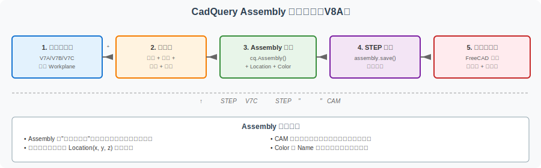
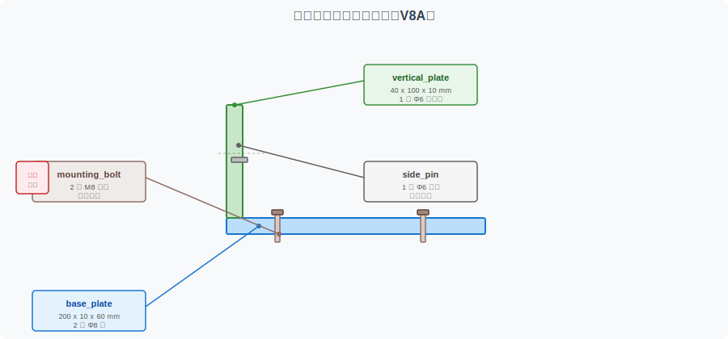

================================================
CadQuery Assembly 入门：从单零件到多零件装配体
================================================

本页是 V7 系列（单零件代码化建模）的**第一篇装配体入门**。V7A/V7B/V7C 演示了**单零件**的代码化建模（带孔板 / 圆角倒角 / 支架 Capstone），但真实产品几乎都是**多零件装配体**：底板 + 立板 + 螺栓 + 定位销等。

本页用 CadQuery 的 ``Assembly`` 概念，演示如何把多个零件组织为一个**完整装配体**，理解：

- 单零件模型与多零件装配体的区别
- ``Assembly``、``Component``、``Location``、``Color``、``Name`` 的基本概念
- 如何用代码表达"在哪个位置放置哪个零件"
- 装配体与 CAM 加工、作品集展示的关系

**教学定位**：本页是**教学示例**，不追求工业级装配设计：
- 不包含完整工程约束（配合公差、过盈/间隙计算等）
- 不替代商业 CAD 装配设计工具
- 重点是让读者理解"装配体不是简单合并"

A. 本页解决什么问题
====================

V7 系列已经讲完单零件代码化建模

.. list-table:: V7 单零件代码化建模成果
   :header-rows: 1
   :widths: 18 30 25 27

   * - 阶段
     - 内容
     - 对应版本
     - 单/多零件
   * - 入门
     - 带孔矩形板
     - V7A
     - 单零件
   * - 进阶
     - 圆角/倒角/孔阵列 + 简化支架
     - V7B
     - 单零件
   * - 综合
     - 完整 L 型支架 Capstone
     - V7C
     - 单零件（合并实体）
   * - 收口
     - V7 系列三步走
     - V7D
     - 收口页

V8A 进一步解释多零件装配体
--------------------------

V7C 里的 L 型支架虽然是组合结构（底板 + 立板），但 CadQuery 代码里**合并**成了一个实体（``base.union(vertical)``）。这种方式称为"单实体焊接"——所有特征都属于同一个 ``Workplane``。

真实产品的设计是**多零件**：

- 底板、立板、螺栓、螺母、定位销是**独立零件**
- 每个零件可以单独加工、检测、运输
- 最后通过螺栓、销钉、焊接等方式**装配**成完整产品

CadQuery 用 ``Assembly`` 表达这种**多零件关系**，本节演示其基本用法。

B. 单零件 vs 装配体
====================

下方对比两种建模方式的核心差异：

.. list-table:: 单零件模型 vs 装配体模型
   :header-rows: 1
   :widths: 20 35 35 10

   * - 维度
     - 单零件模型
     - 装配体模型
     - 评分
   * - 几何表达
     - 一个 ``Workplane`` （多个特征属于同一实体）
     - 多个 ``Workplane`` （每个零件独立）+ ``Assembly``
     - 互补
   * - 文件组织
     - 一个 .py 文件 / 一个 .step
     - 多个 .py 文件或一个 .py / 多个零件 .step 或一个总 .step
     - 装配体更多
   * - 修改方式
     - 改参数 → 重新生成单个 .step
     - 改参数 → 重新生成各零件 .step → 重新装配
     - 装配体更复杂
   * - 导出用途
     - 直接进 CAM / 3D 打印
     - 展示用，加工要拆分为单零件
     - 装配体更适合展示
   * - 作品集展示
     - 提交 .step + 截图
     - 提交装配体截图 + 零件分解
     - 装配体更丰富
   * - 工程意义
     - 焊接件 / 一体化零件
     - 装配产品 / 可拆解维护
     - 互补
   * - CadQuery 表达
     - ``Workplane.box()`` + ``.union()``
     - ``Assembly()`` + ``add(part, loc=Location(...))``
     - 完全不同

**关键区别**：单零件 = 一个实体；装配体 = 多个独立零件 + 空间位置关系。

C. Assembly 基本概念
====================

CadQuery 的 ``Assembly`` 用以下几个核心概念表达多零件关系：

.. list-table:: Assembly 核心概念
   :header-rows: 1
   :widths: 20 50 30

   * - 概念
     - 说明
     - CadQuery 表达
   * - ``Component`` / ``Part``
     - 一个独立的零件（用 ``Workplane`` 构造）
     - ``Workplane`` 对象
   * - ``Assembly``
     - 多个 Component 的容器
     - ``cq.Assembly()``
   * - ``Location``
     - 零件在装配体中的空间位置（平移 + 旋转）
     - ``cq.Location(cq.Vector(x, y, z))``
   * - ``Name``
     - 零件的名字（用于展示和检索）
     - ``assembly.add(part, name="base_plate")``
   * - ``Color``
     - 零件的颜色（用于可视化）
     - ``assembly.add(part, color=cq.Color(0.5, 0.5, 0.5, 1.0))``
   * - ``Constraint`` / ``Placement``
     - 通过 Location 显式放置（这是 CadQuery 的主要方式）
     - ``loc=...``
   * - ``Export``
     - 把整个装配体导出为单个 STEP
     - ``assembly.save("bracket_assembly.step")``
   * - BOM
     - 物料清单（概念性理解，本教学例不实现）
     - 手工记录或外部生成

**关键认识** ：CadQuery 的 ``Assembly`` 主要是"展示"和"导出"工具，**不** 包含完整的"约束求解"功能（如"两个圆柱面必须同轴"）。所有位置关系通过显式的 ``Location`` 数学表达。

D. 教学装配体设定
==================

本节用一个**简化"支架装配体"** 演示 Assembly 用法。

组件清单
--------

.. list-table:: 简化支架装配体组件
   :header-rows: 1
   :widths: 25 15 30 30

   * - 组件
     - 数量
     - 作用
     - 对应 V6A / V7C
   * - base_plate
     - 1
     - 底板（与 V6A/V7C 几何一致）
     - V7C 底板
   * - vertical_plate
     - 1
     - 立板（与 V6A/V7C 几何一致）
     - V7C 立板
   * - mounting_bolt
     - 2
     - 底板安装螺栓（教学示意）
     - 新增
   * - side_pin
     - 1
     - 立板定位销（教学示意）
     - 新增

教学声明
--------

- 这**不是**完整工业装配（工业装配涉及公差、配合、过盈/间隙、拧紧力矩等）
- 螺栓和销钉的尺寸是教学示意值，**不可直接用于实际设计**
- 重点是理解组件、位置、装配关系

E. CadQuery Assembly 示例代码
==============================

下方代码展示如何用 ``Assembly`` 构造一个"底板 + 立板 + 2 个螺栓 + 1 个销钉"的简化支架装配体。

完整代码
--------

.. code-block:: python

   """
   简化支架装配体 — CadQuery Assembly 教学示例 (V8A)
   ============================================

   本文件是 CAD-CAM-Technology-docs 项目的 V8A 教学示例，
   配合 examples/cadquery-assembly-intro.rst 使用。

   教学目的
   --------
   演示如何用 CadQuery 的 Assembly 表达"底板 + 立板 + 螺栓 + 销钉"的多零件关系。

   注意
   ----
   本文件是教学示例（teaching example），不作为工业生产模型（not for industrial production）：
   - 螺栓和销钉的尺寸是教学示意值，不可直接用于实际设计
   - 不包含工程约束（公差、配合、过盈/间隙等）
   - 不替代商业 CAD 装配设计工具
   - 真实工程中应根据需求选择合适的工具

   与 V7C 区别
   ----------
   - V7C bracket_capstone.py：底板 + 立板 union 成一个实体
   - V8A bracket_assembly.py：底板、立板、螺栓、销钉作为独立零件 + Assembly 容器

   依赖
   ----
   - cadquery >= 2.0
   - 安装：pip install cadquery
   - 运行：python bracket_assembly.py
   """

   import cadquery as cq

   # ============================================================
   # 参数集中区
   # ============================================================

   # 底板参数（与 V6A / V7C 一致）
   base_length = 200.0
   base_width = 60.0
   base_thickness = 10.0
   base_hole_diameter = 8.0
   base_hole_spacing = 100.0

   # 立板参数
   vertical_length = 40.0
   vertical_height = 100.0
   vertical_thickness = 10.0
   vertical_hole_diameter = 6.0
   vertical_hole_spacing = 50.0

   # 螺栓参数（教学示意）
   bolt_diameter = 8.0          # 螺栓直径（与底板孔匹配）
   bolt_head_diameter = 13.0    # 螺栓头直径
   bolt_head_height = 5.0       # 螺栓头高度
   bolt_length = 25.0           # 螺栓总长
   bolt_count = 2               # 螺栓数量

   # 销钉参数（教学示意）
   pin_diameter = 6.0           # 销钉直径（与立板孔匹配）
   pin_length = 15.0            # 销钉长度

   # 圆角
   fillet_radius = 3.0

   # 输出文件名
   output_step = "bracket_assembly.step"

   # ============================================================
   # 组件构造函数
   # ============================================================

   def make_base_plate():
       """构造底板（与 V7C 底板几何一致）。

       坐标系：以原点为底板底面中心，底板向 +Z 方向延伸。
       """
       plate = cq.Workplane("XY").box(
           base_length, base_thickness, base_width
       )

       # 2 个底板安装孔
       plate = (
           plate
           .faces(">Z")
           .workplane()
           .rect(base_hole_spacing, 0, forConstruction=True)
           .vertices()
           .hole(base_hole_diameter)
       )

       return plate

   def make_vertical_plate():
       """构造立板（与 V7C 立板几何一致）。

       坐标系：与底板相对定位。
       """
       vertical = (
           cq.Workplane("XY")
           .transformed(offset=(vertical_length / 2.0, 0, base_thickness + vertical_height / 2.0))
           .box(vertical_length, vertical_thickness, vertical_height)
       )

       # 1 个立板大孔（简化：销钉孔）
       vertical = (
           vertical
           .faces(">Z")
           .workplane()
           .hole(vertical_hole_diameter)
       )

       return vertical

   def make_bolt(head_diameter, head_height, shaft_diameter, shaft_length):
       """构造一个简化螺栓（教学示意）。

       螺栓结构：圆柱头 + 圆柱杆。
       注：实际工程中需要螺纹、退刀槽、扳手孔等细节。
       """
       # 头（圆柱体 + 顶部倒角简化）
       head = cq.Workplane("XY").circle(head_diameter / 2.0).extrude(head_height)

       # 杆（圆柱体）
       shaft = (
           cq.Workplane("XY")
           .workplane(offset=head_height)
           .circle(shaft_diameter / 2.0)
           .extrude(shaft_length - head_height)
       )

       # 合并
       bolt = head.union(shaft)
       return bolt

   def make_pin(diameter, length):
       """构造一个简化销钉（教学示意）。"""
       return cq.Workplane("XY").circle(diameter / 2.0).extrude(length)

   # ============================================================
   # 装配体构建
   # ============================================================

   def build_assembly():
       """构建完整的支架装配体。"""
       # 创建装配体容器
       assembly = cq.Assembly(name="bracket_assembly")

       # 1. 添加底板（位于装配体原点）
       base = make_base_plate()
       assembly.add(
           base,
           name="base_plate",
           color=cq.Color(0.7, 0.7, 0.8, 1.0),  # 浅蓝色
       )

       # 2. 添加立板（位于底板左端上方）
       vertical = make_vertical_plate()
       assembly.add(
           vertical,
           name="vertical_plate",
           loc=cq.Location(cq.Vector(0, 0, 0)),  # 立板坐标已通过 make_vertical_plate 定位
           color=cq.Color(0.7, 0.8, 0.7, 1.0),  # 浅绿色
       )

       # 3. 添加螺栓（2 个，位于底板安装孔位）
       #    螺栓头部朝上（+Y 方向），从底板上方插入
       bolt = make_bolt(
           head_diameter=bolt_head_diameter,
           head_height=bolt_head_height,
           shaft_diameter=bolt_diameter,
           shaft_length=bolt_length,
       )

       # 螺栓 1：左侧孔位
       assembly.add(
           bolt,
           name="bolt_left",
           loc=cq.Location(
               cq.Vector(
                   -base_hole_spacing / 2.0,                    # X 位置
                   base_thickness / 2.0,                        # Y 位置：板厚中心
                   base_thickness - bolt_length,                 # Z 位置：从板底穿出
               )
           ),
           color=cq.Color(0.8, 0.7, 0.5, 1.0),  # 棕色
       )

       # 螺栓 2：右侧孔位
       assembly.add(
           bolt,
           name="bolt_right",
           loc=cq.Location(
               cq.Vector(
                   base_hole_spacing / 2.0,
                   base_thickness / 2.0,
                   base_thickness - bolt_length,
               )
           ),
           color=cq.Color(0.8, 0.7, 0.5, 1.0),
       )

       # 4. 添加销钉（位于立板中心孔）
       pin = make_pin(pin_diameter, pin_length)
       assembly.add(
           pin,
           name="side_pin",
           loc=cq.Location(
               cq.Vector(
                   vertical_length / 2.0,                      # X：立板中心
                   vertical_thickness / 2.0,                   # Y：立板中心
                   base_thickness + vertical_height / 2.0 - pin_length / 2.0,  # Z：立板中心
               )
           ),
           color=cq.Color(0.6, 0.6, 0.6, 1.0),  # 灰色
       )

       return assembly

   # ============================================================
   # 主流程
   # ============================================================

   def main():
       print(f"=== CadQuery 支架装配体 (V8A) ===")
       print(f"组件清单：")
       print(f"  - 1 × base_plate ({base_length} x {base_thickness} x {base_width} mm)")
       print(f"  - 1 × vertical_plate ({vertical_length} x {vertical_thickness} x {vertical_height} mm)")
       print(f"  - {bolt_count} × mounting_bolt (M{bolt_diameter} 示意)")
       print(f"  - 1 × side_pin (Φ{pin_diameter} 示意)")

       # 构建装配体
       assembly = build_assembly()

       # 导出整个装配体为单个 STEP
       assembly.save(output_step)
       print(f"[OK] 装配体已导出: {output_step}")

   if __name__ == "__main__":
       main()

代码逐段解读
------------

**组件独立性**：

``make_base_plate()``、``make_vertical_plate()``、``make_bolt()``、``make_pin()`` 各自返回独立的 ``Workplane``，**不** 合并。

**装配体容器**：

``cq.Assembly(name="...")`` 创建一个装配体容器，所有零件都加到这里。

**位置表达**：

``cq.Location(cq.Vector(x, y, z))`` 表达"在 (x, y, z) 位置放置这个零件"。本例里螺栓和销钉的坐标都通过数学计算确定。

**颜色区分**：

``color=cq.Color(r, g, b, alpha)`` 给每个零件不同颜色，便于可视化（不影响几何）。

**导出**：

``assembly.save("xxx.step")`` 把整个装配体导出为单个 STEP 文件（包含所有零件）。

F. 组件与参数对照表
====================

下方汇总本节涉及的所有组件和参数：

.. list-table:: 组件与参数对照
   :header-rows: 1
   :widths: 15 25 18 22 20

   * - 组件
     - 关键参数
     - 在装配体中的作用
     - 与支架 Capstone 的关系
     - 常见风险
   * - base_plate
     - length/width/thickness
     - 装配体的"地面"
     - V7C 底板
     - 孔位错误
   * - vertical_plate
     - length/height/thickness
     - 装配体的"立面"
     - V7C 立板
     - 定位错位
   * - mounting_bolt
     - head_dia/shaft_dia/length
     - 连接底板到其他设备
     - 新增（V8A 教学）
     - 尺寸不匹配
   * - side_pin
     - diameter/length
     - 立板定位
     - 新增（V8A 教学）
     - 销钉过短
   * - assembly_origin
     - (0, 0, 0)
     - 装配体全局原点
     - 新概念
     - 原点混乱
   * - component_location
     - Location(Vector(...))
     - 零件相对原点的位置
     - 新概念
     - 坐标系翻转

G. 装配体与 CAM 的关系
======================

**关键认识**：CAM 通常**不直接加工装配体**，而是**先拆分到单零件**。

CAM 加工流程
------------

.. code-block:: text

   装配体 (.step, 多零件)
       ↓ 拆分（手动或半自动）
   单零件 (.step, 单实体)
       ↓ 工艺规划
   CAM 加工任务单 (worksheet)
       ↓ 刀具路径计算
   G-code

关键点
------

- **CAM 处理单零件**：Mastercam、Fusion 360 CAM、FreeCAD Path Workbench 等都是针对**单零件**进行刀具路径计算
- **装配体的作用**：用于理解零件关系、安装方向、干涉检查
- **加工前必须拆分**：把装配体 STEP 导入 CAM 软件后，选中**单个零件**生成 G-code
- **坐标系是重点**：单零件的"工件原点"决定 G-code 怎么写

相关页面
--------

- :doc:`freecad-to-cam-worksheet` — FreeCAD 到 CAM 加工任务单
- :doc:`freecad-path-workbench-intro` — FreeCAD Path Workbench 入门
- :doc:`gcode-toolpath-visualization` — G-code 逐行解释

H. 与作品集的关系
==================

V8A 装配体代码可以作为**作品集补充材料**提交。

推荐提交清单
------------

.. code-block:: text

   V8A 装配体作品集提交物（建议）：
   ├── bracket_assembly.py        # CadQuery 装配体代码
   ├── bracket_assembly.step       # 完整装配体 STEP
   ├── components/                 # （可选）拆分后的单零件 STEP
   │   ├── base_plate.step
   │   ├── vertical_plate.step
   │   ├── bolt.step
   │   └── side_pin.step
   ├── README.md                   # 装配体说明（组件、位置、导出）
   └── images/
       └── assembly_overview.png   # 装配体总览图

与已有作品集的关系
------------------

- :doc:`bracket-project-portfolio` — V6B 作品集模板（V8A 装配体可作为补充）
- :doc:`capstone-learning-path` — V6D Capstone 项目线总入口
- :doc:`cadquery-learning-path` — V7D CadQuery 学习路径（V8A 是 V7D 的延伸）

I. 常见误区
===========

.. list-table:: CadQuery Assembly 常见误区
   :header-rows: 1
   :widths: 8 35 35 22

   * - #
     - 误区
     - 正确做法
     - 影响等级
   * - 1
     - 以为装配体就是把实体 union 到一起
     - 装配体保留每个零件的独立性
     - ⭐⭐⭐
   * - 2
     - 忽略组件坐标系
     - 显式计算每个零件的 Location
     - ⭐⭐⭐
   * - 3
     - 参数命名混乱
     - 用语义化命名（bolt_length 而非 L）
     - ⭐⭐
   * - 4
     - 螺钉/定位件尺寸不合理
     - 螺栓直径 ≤ 孔径、销钉直径 ≤ 孔径
     - ⭐⭐
   * - 5
     - 不区分展示装配和加工模型
     - 展示用装配体、加工用单零件
     - ⭐⭐
   * - 6
     - 以为装配体 STEP 可直接变成 CNC 程序
     - 装配体 STEP 需要先拆分到单零件
     - ⭐⭐⭐
   * - 7
     - 忽略导出后检查
     - 用 FreeCAD 打开 STEP，目视检查每个零件位置
     - ⭐⭐
   * - 8
     - 螺栓/销钉缺少"过孔"考虑
     - 教学示例可不实现，但实际工程需要
     - ⭐

**前 3 个是 V8A 特有误区**，必须避免。后 5 个是 V7/V8 通用问题。

J. 教学声明
============

本页面是 **CAD/CAM 学习路径的辅助材料**：

- 教学示例不考虑工业级鲁棒性
- 螺栓、销钉的尺寸是教学示意值，**不可直接用于实际设计**
- 不替代商业 CAD 装配设计工具（SolidWorks、Fusion 360、Inventor）
- 重点是让读者理解"装配体不是简单合并"

K. 相关页面
============

- :doc:`cadquery-parametric-modeling` — V7A 入门
- :doc:`cadquery-advanced-features` — V7B 进阶
- :doc:`cadquery-bracket-capstone` — V7C 综合（单实体焊接版支架）
- :doc:`cadquery-learning-path` — V7D V7 系列收口
- :doc:`bracket-capstone-project` — V6A 图形化版支架 Capstone
- :doc:`bracket-project-portfolio` — V6B 作品集模板
- :doc:`capstone-learning-path` — V6D 项目线总入口
- :doc:`freecad-to-cam-worksheet` — V5C FreeCAD 到 CAM
- :doc:`freecad-path-workbench-intro` — V6C FreeCAD Path Workbench