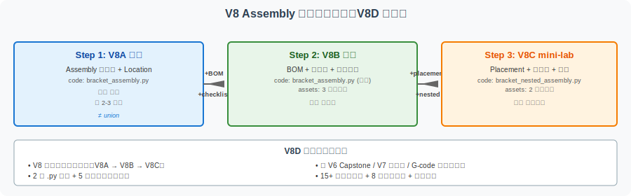
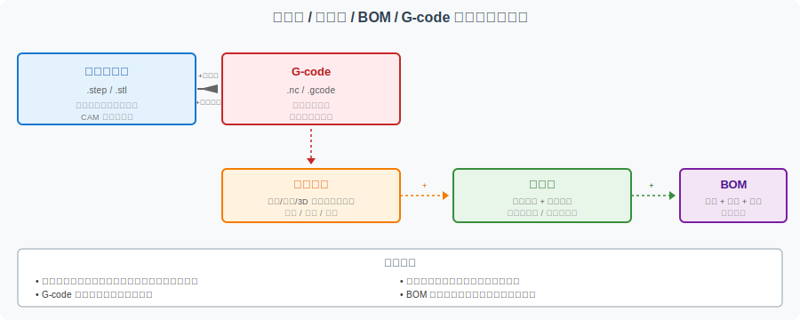

======================================================
CadQuery Assembly 学习路径：从多零件到装配检查
======================================================

本页是 V8 系列（CadQuery Assembly 多零件装配体）的**总入口和收口页** 。V8A → V8B → V8C 三步走构成了"代码化装配体理解"的完整学习闭环，本页提供：

- ** 三步学习路线图** （入门 → 进阶 → mini-lab）
- **Assembly 代码文件地图** （2 个 .py + 5 个资源包）
- **Assembly 与 Capstone 的关系**
- ** 单零件 / 装配体 / BOM / G-code 的数据层级关系**
- ** 完成标准** + ** 常见误区** + ** 后续扩展方向**

本页与 V7D（CadQuery 学习路径收口）形成完整对照：V7D 是"单零件代码化建模"收口，V8D 是"多零件装配体"收口。

A. 这条路线解决什么问题
========================

V8 系列已经完成三个阶段
-----------------------

.. list-table:: V8 Assembly 三阶段概览
   :header-rows: 1
   :widths: 12 30 25 33

   * - 阶段
     - 内容
     - 对应版本
     - 适合谁
   * - 入门
     - CadQuery Assembly 入门（多零件 + Location）
     - V8A
     - 想理解"装配体 ≠ union"
   * - 进阶
     - BOM + 爆炸图 + 装配检查清单
     - V8B
     - 想把装配体记录和归档
   * - mini-lab
     - Placement + 子装配 + 教学型干涉检查
     - V8C
     - 想精确放置和检查组件

V8D 解决"学完 V8 之后怎么办"
-----------------------------

学完 V8A + V8B + V8C 后，读者可能会问：

- 这三个阶段怎么衔接？应该按什么顺序看？
- 2 个 .py 代码文件 + 5 个资源包文件分别是什么角色？
- 装配体与 Capstone、V7 单零件、G-code 是什么关系？
- 学到什么程度算"完成 V8 系列"？
- 学完之后下一步可以做什么？

本页面系统回答这些问题，作为 V8 系列的收口。

B. 三步学习路线
================

Step 1：V8A 入门（约 2-3 小时）
----------------------------------

**目标** ：理解 CadQuery Assembly 容器，能独立读懂多零件装配体的代码。

**核心内容** ：

- 单零件 vs 装配体的区别
- `Assembly` / `Component` / `Location` / `Color` / `Name` 基本概念
- `bracket_assembly.py` 的 4 个组件函数
- 装配体如何导出 STEP

**配套页面** ：:doc:`cadquery-assembly-intro`

**配套代码** ：

- :file:`code/cadquery/bracket_assembly.py` —— 多零件装配体（底板+立板+2 螺栓+1 销钉）

**完成标志** ：

- [ ] 能读懂 ``assembly.add(part, loc=..., color=..., name=...)`` 的链式调用
- [ ] 能解释"为什么 Assembly 保留每个零件的独立性"
- [ ] 能区分 Assembly 与 V7C 单实体 union 的差异

Step 2：V8B 进阶（约 1-2 天）
-------------------------------

**目标** ：把装配体记录为 BOM、爆炸图、检查清单，作为可归档的作品集材料。

**核心内容** ：

- BOM（零件清单）：编号/名称/数量/材料/作用
- 爆炸图（Exploded View）：教学性拉开组件位置
- 装配检查清单：8 大类检查项
- `BOM_DATA` 结构化数据
- 作品集归档推荐

**配套页面** ：:doc:`cadquery-assembly-bom-checklist`

**配套代码** ：

- :file:`code/cadquery/bracket_assembly.py` 增强版（含 `BOM_DATA` + `print_bom()`）

**配套资源包** （3 个）：

- :file:`assets/bracket-capstone/assembly/assembly-bom-template.md`
- :file:`assets/bracket-capstone/assembly/assembly-checklist.md`
- :file:`assets/bracket-capstone/assembly/assembly-notes-template.md`

** 完成标志**：

- [ ] 能写出 4 组件的 BOM 表格
- [ ] 能解释爆炸图的"教学性"含义
- [ ] 能用 checklist 验证装配体
- [ ] 能把装配体作为作品集材料归档

Step 3：V8C mini-lab（约 2-3 天）
-----------------------------------

** 目标**：理解 Placement、Location、子装配、教学型干涉检查。

** 核心内容**：

- Placement/Location 的精确表达
- 全局 vs 局部坐标系
- Nested Assembly（bolt_pair 子装配）
- `PLACEMENT_TABLE` 结构化数据
- 教学型干涉检查（用结构化方法，不用 OCCT 仿真）

** 配套页面**：:doc:`cadquery-assembly-placement-mini-lab`

** 配套代码**：

- :file:`code/cadquery/bracket_nested_assembly.py` —— 嵌套装配体（bolt_pair 子装配 + PLACEMENT_TABLE）

** 配套资源包** （2 个）：

- :file:`assets/bracket-capstone/assembly/placement-checklist.md`
- :file:`assets/bracket-capstone/assembly/interference-check-notes-template.md`

** 完成标志**：

- [ ] 能用 `Location(Vector(x, y, z))` 精确表达组件位置
- [ ] 能区分 part local vs global 坐标系
- [ ] 能用 `build_xxx_subassembly()` 构造子装配
- [ ] 能用 `placement-checklist.md` 验证组件位置

C. Assembly 代码文件地图
========================

V8 系列共有 2 个 .py 代码文件 + 5 个资源包文件，每个都有明确的角色和定位。

文件清单与角色
--------------

.. list-table:: Assembly 代码文件地图
   :header-rows: 1
   :widths: 35 15 22 16 12

   * - 文件
     - 对应页面
     - 核心概念
     - 适合阅读阶段
     - 需要 CadQuery？
   * - :file:`code/cadquery/bracket_assembly.py`
     - V8A
     - 多零件 + Location
     - Step 1
     - 是
   * - :file:`code/cadquery/bracket_assembly.py` (BOM 增强)
     - V8B
     - BOM_DATA + print_bom
     - Step 2
     - 是
   * - :file:`code/cadquery/bracket_nested_assembly.py`
     - V8C
     - 子装配 + PLACEMENT_TABLE
     - Step 3
     - 是
   * - :file:`assets/bracket-capstone/assembly/assembly-bom-template.md`
     - V8B
     - BOM 模板
     - Step 2
     - 否
   * - :file:`assets/bracket-capstone/assembly/assembly-checklist.md`
     - V8B
     - 检查清单
     - Step 2
     - 否
   * - :file:`assets/bracket-capstone/assembly/assembly-notes-template.md`
     - V8B
     - 装配说明
     - Step 2
     - 否
   * - :file:`assets/bracket-capstone/assembly/placement-checklist.md`
     - V8C
     - Placement 检查
     - Step 3
     - 否
   * - :file:`assets/bracket-capstone/assembly/interference-check-notes-template.md`
     - V8C
     - 干涉检查记录
     - Step 3
     - 否

文件之间的关系
--------------

.. code-block:: text

   bracket_assembly.py (V8A 基础)
       ↓ + BOM_DATA
   bracket_assembly.py (V8B 增强)
       ↓ 引入 nested + PLACEMENT_TABLE
   bracket_nested_assembly.py (V8C)

.. list-table:: 文件演进的关键变化
   :header-rows: 1
   :widths: 35 35 30

   * - 文件
     - 相对前一文件新增的内容
     - 阅读建议
   * - bracket_assembly.py (V8A)
     - （基础：4 组件 + Location）
     - 第一个必读
   * - bracket_assembly.py (V8B 增强)
     - BOM_DATA + print_bom + total_bom_quantity
     - 看 V8B 教学页面对比
   * - bracket_nested_assembly.py
     - PLACEMENT_TABLE + 子装配 + Location
     - 重点理解全局 vs 局部坐标系

D. Assembly 与 Capstone 的关系
================================

V6 / V7 / V8 三条学习线
-------------------------

.. list-table:: V6 / V7 / V8 学习线对比
   :header-rows: 1
   :widths: 18 30 30 22

   * - 学习线
     - 主题
     - 核心交付
     - 对应版本
   * - V6 Capstone 项目线
     - 图形化项目制学习
     - FreeCAD 支架 Capstone + 作品集
     - V6A-V6D
   * - V7 CadQuery 单零件
     - 代码化单零件建模
     - 入门 + 进阶 + 综合
     - V7A-V7D
   * - V8 CadQuery 装配体
     - 代码化多零件装配体
     - Assembly + BOM + Placement
     - V8A-V8D

V8 与 V6 Capstone 作品集的关系
---------------------------------

V8 系列可以**作为 V6 Capstone 作品集的扩展材料** ：

- **V6A** 提供了 L 型支架的几何要求
- **V7C** 把 V6A 用代码重写（单实体焊接）
- **V8A/V8B/V8C** 把 V7C 进一步拆分为多零件（底板/立板/螺栓/销钉）+ BOM + 检查

作品集提交建议（V6 + V7 + V8 综合）：

.. code-block:: text

   综合作品集（建议）：
   ├── v6a/                          # V6A FreeCAD 原始
   │   ├── bracket.FCStd
   │   └── requirements.md
   ├── v7c/                          # V7C CadQuery 单实体版
   │   ├── bracket_capstone.py
   │   └── bracket_capstone.step
   └── v8/                           # V8 CadQuery 装配体版
       ├── bracket_assembly.py
       ├── bracket_nested_assembly.py
       ├── bracket_assembly.step
       ├── BOM.md
       ├── exploded_view.svg
       └── checklist.md

V8A/V8B/V8C 的价值
-------------------

- ** 理解组件关系**：V6 只有一个实体，V8 展示 5 个组件的关系
- ** 工程表达训练**：BOM、爆炸图、checklist 是工程实践基础功
- ** 作品集深度**：V6 作品集加入 V8 材料，深度和广度都提升

E. 单零件、装配体、BOM、G-code 的层级关系
==========================================

** 核心认识**：这四者** 不是同一层级的数据**，而是不同视角的工程表达。

.. list-table:: 四类数据层级对比
   :header-rows: 1
   :widths: 18 30 30 22

   * - 层级
     - 描述
     - 适用场景
     - 谁关心
   * - **单零件模型**
     - 一个可加工对象的几何
     - 加工 / 3D 打印 / CAE
     - CAM 工程师 / 编程员
   * - **装配体**
     - 多个零件 + 空间关系
     - 装配 / 维护 / 展示
     - 装配工程师 / 设计员
   * - **BOM**
     - 组件清单 + 数量 + 用途
     - 采购 / 成本 / 库存
     - 采购 / 生产管理
   * - **G-code**
     - 机床动作指令
     - CNC 加工
     - 机床操作员

四者的转换关系
--------------

.. code-block:: text

   单零件模型 (.step)
       ↓ 选工件、规划工序
   G-code
       ↓ 机床加工
   物理零件
       ↓ 与其他零件装配
   装配体
       ↓ 记录组件信息
   BOM

** 关键认识**：

- **G-code 来自单零件** ，不是装配体
- **装配体来自单零件集合** ，不是单实体
- **BOM 来自装配体** ，不是反过来
- **四者独立但相互引用**

F. 学习完成标准
================

学完 V8 系列后，你应该具备以下能力：

基础能力
--------

- [ ] 能解释 Assembly 与单实体 union 的区别
- [ ] 能读懂 `bracket_assembly.py` 的 4 个组件函数
- [ ] 能用 `Location(Vector(x, y, z))` 表达组件位置
- [ ] 能解释"为什么装配体保留每个零件的独立性"

进阶能力
--------

- [ ] 能解释 BOM_DATA 与 Assembly 组件的关系
- [ ] 能写出 4 组件的 BOM 表格
- [ ] 能用 explosion view 表达装配顺序
- [ ] 能区分教学型检查与工业级仿真

综合能力
--------

- [ ] 能说明 placement/location 的作用
- [ ] 能解释 nested assembly 的意义
- [ ] 能用子装配（bolt_pair）组织相关组件
- [ ] 能使用装配检查清单做自查
- [ ] 能把 Assembly 材料放入作品集归档
- [ ] 能用 FreeCAD 验证代码版与图形化版的 STEP 几何一致性

元能力
------

- [ ] 能根据项目需求选择"图形化 / 单零件代码化 / 装配体代码化"
- [ ] 能向团队解释"装配体 ≠ 几个 union 起来的实体"
- [ ] 能预判 V8 系列的常见误区

如果以上 15+ 项能力大部分满足，说明 V8 系列学习到位。

G. 常见误区
===========

.. list-table:: V8 系列常见误区
   :header-rows: 1
   :widths: 8 35 35 22

   * - #
     - 误区
     - 正确做法
     - 影响等级
   * - 1
     - 把 Assembly 当成简单几何合并
     - Assembly 保留每个零件的独立性
     - ⭐⭐⭐
   * - 2
     - 只看 BOM，不看组件位置
     - BOM 和位置关系都要检查
     - ⭐⭐⭐
   * - 3
     - 把爆炸图当成真实装配位置
     - 爆炸图是教学性拉开，真实位置是合拢
     - ⭐⭐
   * - 4
     - 忽略局部坐标系和全局坐标系
     - 显式区分 part local vs global
     - ⭐⭐
   * - 5
     - 把教学型干涉检查当成工业级仿真
     - 教学型 ≠ 工业级，真实仿真需要 OCCT 内核
     - ⭐⭐⭐
   * - 6
     - 认为装配体 STEP 可以直接生成安全 G-code
     - 装配体 STEP 需要先拆分到单零件
     - ⭐⭐⭐
   * - 7
     - 没有保存 BOM、检查清单和说明文件
     - 提交作品集前必须有完整归档
     - ⭐⭐
   * - 8
     - 把 V7 单实体 union 当成 V8 多零件装配体
     - V7C 是单实体焊接，V8A 是多零件表达
     - ⭐⭐

**前 3 个和 5/6/8 是 V8 系列特有误区** ，必须避免。

H. 后续扩展方向
================

完成 V8 系列后，下一步可以选：

代码化方向（V8 → V9+）
-----------------------

1. **V9** — 用 CadQuery 重做 bracket-capstone-project 全部零件（含 V7C + V8 装配体版本）
2. **V9** — CadQuery 装配体 API 进阶（约束、嵌套、动画演示）
3. **V9** — 用 CadQuery 重做 V4B mini-lab（参数化立方体/圆柱体对比）

图形化与代码化结合（V6 + V8 → V9+）
-------------------------------------

1. **V9** — 用 FreeCAD 打开 V8A/V8C 导出的 STEP，目视验证
2. **V9** — 真实软件截图（SolidWorks / FreeCAD / Fusion 360 装配视图）
3. **V9** — 第二 Capstone（带圆角/倒角/多特征的复杂零件）

教学方向（V9+）
----------------

1. **V9** — V6 作品集模板升级（加入 V8A/V8B/V8C 装配体补充）
2. **V9** — 录屏演示"装配体 STEP 拆分到单件加工"的全过程
3. **V9** — 邀请读者贡献更多装配体示例

工程方向（V10+）
----------------

1. **V10** — CadQuery 真实运行环境配置（OCCT 安装教程）
2. **V10** — 真实 STEP 装配体导出检查（OCCT 几何验证）
3. **V10** — V6 作品集模板加入 V8 装配体和 V10 真实导出检查

I. 教学声明
============

本页面是 **V8 系列（代码化装配体）的收口页** ：

- 不重写 V8A/V8B/V8C 的内容
- 不引入新代码或新特征
- 仅作为"路线图 + 完成标准 + 扩展方向"导航
- 真实工程中应根据团队技能选择建模方式

J. 相关页面
============

V8 系列（装配体）
------------------

- :doc:`cadquery-assembly-intro` — V8A 入门
- :doc:`cadquery-assembly-bom-checklist` — V8B 进阶
- :doc:`cadquery-assembly-placement-mini-lab` — V8C mini-lab

V7 系列（单零件代码化，对照参考）
------------------------------------

- :doc:`cadquery-parametric-modeling` — V7A 入门
- :doc:`cadquery-advanced-features` — V7B 进阶
- :doc:`cadquery-bracket-capstone` — V7C 综合
- :doc:`cadquery-learning-path` — V7D 收口

V6 系列（图形化项目制学习）
--------------------------------

- :doc:`bracket-capstone-project` — V6A 支架 Capstone
- :doc:`bracket-project-portfolio` — V6B 作品集
- :doc:`capstone-learning-path` — V6D 项目线收口

基础与工具
-----------

- :doc:`freecad-plate-modeling` — V5A FreeCAD 入门
- :doc:`step-stl-mini-lab` — V4B STEP/STL 格式对比
- :doc:`../workflow-roadmap` — 工作流总览

V9A 作品集升级
================

如果已完成 V6 Capstone 和 V8 Assembly 装配体，可以阅读 :doc:`capstone-portfolio-upgrade` 学习如何把 V6 + V8 的成果整合到 Capstone 作品集。