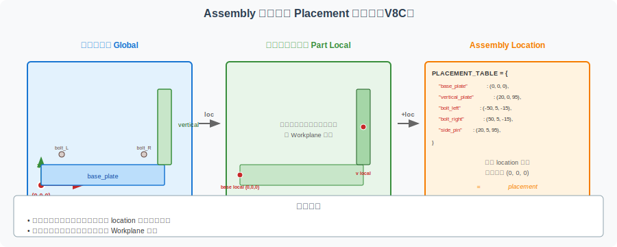
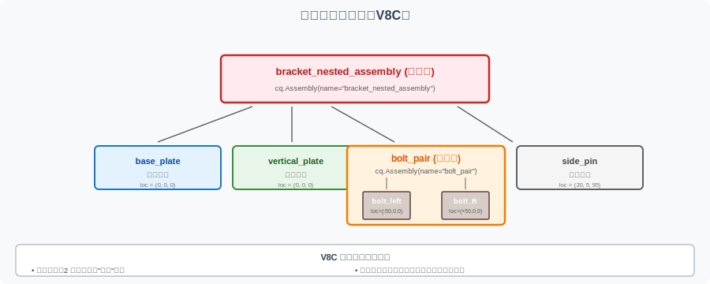

==========================================================
CadQuery Assembly 进阶：定位、子装配与干涉检查 mini-lab
==========================================================

本页是 V8A/V8B 的**第三篇** ：V8A 演示了 `Assembly` 容器如何组织多零件，V8B 演示了 BOM、爆炸图、检查清单如何**记录和归档** 装配体。本页（V8C）进一步解释：

- **Placement / Location** —— 组件如何被放在装配体的某个位置
- ** 全局坐标系 vs 局部坐标系** —— 不同坐标系的区别
- **Nested Assembly** —— 把相关组件组织成子装配
- ** 教学型干涉检查** —— 不做真实仿真，但用结构化方法判断装配关系

** 教学定位**：本页是** 教学 mini-lab**，不涉及真实工业约束求解、动画和仿真。

A. 本页解决什么问题
====================

V8A 解决了"怎么组织多零件"
---------------------------

V8A 演示了 `Assembly` + `add()` + `Location` 的基本用法，但** 只展示了最简单的"4 个零件"装配**。

V8B 解决了"装配体如何被记录和归档"
---------------------------------------

V8B 演示了 BOM 表格、爆炸图、检查清单，但** 只关注"装配体里有什么"和"如何检查"** 。

V8C 解决"组件如何被精确放置、组织和检查"
-------------------------------------------------

真实工程中，组件位置不能"差不多"，需要：

- 显式计算每个组件的 `Location` （不只是凭感觉）
- 用** 全局坐标系 vs 局部坐标系**理清"组件相对于什么"
- 把相关组件组织成** 子装配** （如 `bolt_pair` 作为一对螺栓）
- 用** 装配关系检查表**教学型地判断是否有干涉 / 错位

B. Placement / Location 是什么
==============================

**Placement** （或 `Location`）是 CadQuery 的核心概念之一：

- ** 单个零件有自己的局部坐标系** （由 ``Workplane("XY")`` 等定义）
- ** 放入装配体时** ，需要指定它** 在装配体中的位置和方向**
- Placement ** 不改变零件本身的几何** ，只改变它在装配体中的姿态
- ** 错误的 Placement** 会导致错位、穿插或装配关系不清

位置表达（Location）
----------------------------------

``Location`` 是数学表达，包括：

- ** 平移** （Translation）：`Location(Vector(x, y, z))`
- ** 旋转** （Rotation）：`Location(Vector(...), Vector(axis_x, axis_y, axis_z))`

本节 V8A 已用平移表达位置，V8C 引入"局部坐标系"概念来更清晰表达。

C. 全局坐标系 vs 局部坐标系
============================

** 核心区分**：

- ** 全局坐标系** （Global Origin）：装配体的原点 `(0, 0, 0)`，所有组件位置都以此为参考
- ** 局部坐标系** （Part Local Origin）：每个零件自己的原点，由 `Workplane` 定义

.. list-table:: 全局 vs 局部坐标系
   :header-rows: 1
   :widths: 20 30 30 20

   * - 坐标系类型
     - 作用
     - 在支架装配中的例子
     - 常见错误
   * - **global origin**
     - 装配体的 `(0, 0, 0)` 基准
     - base_plate 的左下角放在 (0, 0, 0)
     - 与零件局部原点混淆
   * - **part local origin**
     - 零件 Workplane 的原点
     - base_plate.box() 默认在自身中心
     - 假设局部原点 = 全局原点
   * - **assembly location**
     - 零件放入装配体时的位置
     - vertical_plate 的 `Location(Vector(20, 0, 95))`
     - 计算错误导致错位
   * - **bolt location**
     - 螺栓的位置（要穿到底板孔）
     - 螺栓 `Location(Vector(-50, 5, -15))`
     - 螺栓没穿入孔
   * - **pin location**
     - 销钉的位置（要穿入立板孔）
     - 销钉 `Location(Vector(20, 5, 95))`
     - 销钉没穿入孔

D. Nested Assembly / 子装配
============================

**Nested Assembly** 是 CadQuery 提供的高级特性：

- ** 子装配** = 把相关组件先组织成一个小组合
- ** 主装配** = 把所有子装配和单独零件组合起来

支架装配体的子装配组织
------------------------

.. code-block:: text

   bracket_assembly (主装配)
   ├── base_plate (单独零件)
   ├── vertical_plate (单独零件)
   ├── bolt_pair (子装配：2 个螺栓)
   │   ├── bolt_left
   │   └── bolt_right
   └── side_pin (单独零件)

** 子装配的好处**：

- ** 逻辑清晰**：2 个螺栓属于"一对"，便于理解
- ** 复用性强**：子装配可以独立保存、命名、定位
- **BOM 友好** ：子装配的 `quantity=1`，但子装配内的零件可以单独计数

V8C 的子装配示例
----------------

下方代码（见 E 节）演示：

- `bolt_pair` 是 2 个螺栓组成的子装配
- 主装配 = base + vertical + bolt_pair + side_pin

E. 教学型代码示例
==================

下方代码展示如何用 `Assembly` + `Location` + 子装配组织支架装配体。

完整代码
--------

.. code-block:: python

   """
   嵌套装配体 — CadQuery 教学示例 (V8C)
   ===================================

   本文件是 CAD-CAM-Technology-docs 项目的 V8C 教学示例，
   配合 examples/cadquery-assembly-placement-mini-lab.rst 使用。

   教学目的
   --------
   演示如何用：
   1. 显式 Location 表达组件位置
   2. 局部 vs 全局坐标系的区别
   3. 子装配（bolt_pair）的组织
   4. 教学型 placement 数据结构

   注意
   ----
   - 本文件是教学示例（teaching example）
   - 不作为工业生产模型（not for industrial production）
   - 不是真实干涉求解器（not a real interference solver）
   - 螺栓/销钉尺寸是教学示意值

   依赖
   ----
   - cadquery >= 2.0
   - 运行：python bracket_nested_assembly.py
   """

   import cadquery as cq

   # ============================================================
   # 参数集中区
   # ============================================================

   # 底板参数
   base_length = 200.0
   base_width = 60.0
   base_thickness = 10.0
   base_hole_diameter = 8.0
   base_hole_spacing = 100.0

   # 立板参数
   vertical_length = 40.0
   vertical_height = 100.0
   vertical_thickness = 10.0
   vertical_hole_diameter = 6.0
   vertical_hole_spacing = 50.0

   # 螺栓参数
   bolt_diameter = 8.0
   bolt_head_diameter = 13.0
   bolt_head_height = 5.0
   bolt_length = 25.0

   # 销钉参数
   pin_diameter = 6.0
   pin_length = 15.0

   # ============================================================
   # Placement 数据结构
   # ============================================================

   # 教学型 placement 表：定义每个组件的"放置语义"
   # 实际工程中可序列化为 JSON / YAML
   PLACEMENT_TABLE = {
       "base_plate": {
           "type": "main_part",
           "location": (0.0, 0.0, 0.0),
           "rotates": False,
           "purpose": "装配体地面",
       },
       "vertical_plate": {
           "type": "main_part",
           "location": (vertical_length / 2.0, 0.0, base_thickness + vertical_height / 2.0),
           "rotates": False,
           "purpose": "装配体立面",
       },
       "bolt_left": {
           "type": "fastener",
           "location": (-base_hole_spacing / 2.0, base_thickness / 2.0, base_thickness - bolt_length),
           "rotates": False,
           "purpose": "左侧底板固定",
       },
       "bolt_right": {
           "type": "fastener",
           "location": (base_hole_spacing / 2.0, base_thickness / 2.0, base_thickness - bolt_length),
           "rotates": False,
           "purpose": "右侧底板固定",
       },
       "side_pin": {
           "type": "fastener",
           "location": (
               vertical_length / 2.0,
               vertical_thickness / 2.0,
               base_thickness + vertical_height / 2.0 - pin_length / 2.0,
           ),
           "rotates": False,
           "purpose": "立板定位",
       },
   }

   # ============================================================
   # 组件构造函数（与 V8A 类似）
   # ============================================================

   def make_base_plate():
       plate = cq.Workplane("XY").box(base_length, base_thickness, base_width)
       plate = (
           plate
           .faces(">Z")
           .workplane()
           .rect(base_hole_spacing, 0, forConstruction=True)
           .vertices()
           .hole(base_hole_diameter)
       )
       return plate

   def make_vertical_plate():
       vertical = (
           cq.Workplane("XY")
           .transformed(offset=(vertical_length / 2.0, 0, base_thickness + vertical_height / 2.0))
           .box(vertical_length, vertical_thickness, vertical_height)
       )
       vertical = (
           vertical
           .faces(">Z")
           .workplane()
           .hole(vertical_hole_diameter)
       )
       return vertical

   def make_bolt():
       head = cq.Workplane("XY").circle(bolt_head_diameter / 2.0).extrude(bolt_head_height)
       shaft = (
           cq.Workplane("XY")
           .workplane(offset=bolt_head_height)
           .circle(bolt_diameter / 2.0)
           .extrude(bolt_length - bolt_head_height)
       )
       return head.union(shaft)

   def make_pin():
       return cq.Workplane("XY").circle(pin_diameter / 2.0).extrude(pin_length)

   # ============================================================
   # 子装配：bolt_pair
   # ============================================================

   def build_bolt_pair_subassembly():
       """构造螺栓对子装配。

       子装配 = 2 个螺栓 + 共享定位参考。
       """
       subasm = cq.Assembly(name="bolt_pair")

       bolt = make_bolt()

       # 螺栓 1：相对子装配的局部坐标
       subasm.add(
           bolt,
           name="bolt_left",
           loc=cq.Location(cq.Vector(-base_hole_spacing / 2.0, 0, 0)),
           color=cq.Color(0.8, 0.7, 0.5, 1.0),
       )

       # 螺栓 2：相对子装配的局部坐标
       subasm.add(
           bolt,
           name="bolt_right",
           loc=cq.Location(cq.Vector(base_hole_spacing / 2.0, 0, 0)),
           color=cq.Color(0.8, 0.7, 0.5, 1.0),
       )

       return subasm

   # ============================================================
   # 主装配
   # ============================================================

   def build_nested_assembly():
       """构建完整的支架装配体（带子装配）。"""
       assembly = cq.Assembly(name="bracket_nested_assembly")

       # 1. 底板
       base = make_base_plate()
       assembly.add(
           base,
           name="base_plate",
           loc=cq.Location(cq.Vector(0, 0, 0)),
           color=cq.Color(0.7, 0.7, 0.8, 1.0),
       )

       # 2. 立板
       vertical = make_vertical_plate()
       assembly.add(
           vertical,
           name="vertical_plate",
           loc=cq.Location(cq.Vector(0, 0, 0)),
           color=cq.Color(0.7, 0.8, 0.7, 1.0),
       )

       # 3. 螺栓对子装配
       bolt_pair = build_bolt_pair_subassembly()
       # 子装配作为整体加入主装配
       # 位置：螺栓对在底板上方，Y 方向位于板厚中心
       assembly.add(
           bolt_pair,
           name="bolt_pair",
           loc=cq.Location(
               cq.Vector(0, base_thickness / 2.0, base_thickness - bolt_length)
           ),
           color=cq.Color(1.0, 0.0, 0.0, 1.0),  # 红色 - 子装配标记
       )

       # 4. 销钉
       pin = make_pin()
       assembly.add(
           pin,
           name="side_pin",
           loc=cq.Location(
               cq.Vector(
                   vertical_length / 2.0,
                   vertical_thickness / 2.0,
                   base_thickness + vertical_height / 2.0 - pin_length / 2.0,
               )
           ),
           color=cq.Color(0.6, 0.6, 0.6, 1.0),
       )

       return assembly

   # ============================================================
   # 主流程
   # ============================================================

   def main():
       print("=== CadQuery 嵌套装配体 (V8C) ===")
       print("组件结构：")
       print("  bracket_nested_assembly (主装配)")
       print("  ├── base_plate")
       print("  ├── vertical_plate")
       print("  ├── bolt_pair (子装配)")
       print("  │   ├── bolt_left")
       print("  │   └── bolt_right")
       print("  └── side_pin")
       print()
       print("Placement 数据：")
       for name, info in PLACEMENT_TABLE.items():
           print(f"  {name}: {info['location']} ({info['purpose']})")
       print()

       assembly = build_nested_assembly()
       assembly.save("bracket_nested_assembly.step")
       print("[OK] 嵌套装配体已导出: bracket_nested_assembly.step")

   if __name__ == "__main__":
       main()

F. 干涉检查与间隙检查的概念
============================

**干涉（Interference）** ：两个组件占据同一空间。

**间隙（Clearance）** ：组件之间需要留出的空间。

教学型判断方法
---------------

本项目**不做真实几何布尔检测** （需要 OCCT 几何内核），而是用** 结构化方法**判断：

- ** 位置表**：每个组件的坐标是否合理
- **BOM 对照** ：组件数量是否正确
- **爆炸图** ：目视检查组件是否重叠
- **checklist** ：逐项打勾验证

为什么不真实运行 CadQuery 做检查
---------------------------------

- **环境限制** ：本环境缺 OCCT 依赖，CadQuery 不能真实运行
- **教学简化** ：真实干涉求解器（CAD 内核）很复杂，超出教学范围
- **结构化方法更通用** ：检查表、位置表的方法适用于任何建模工具

G. 装配关系检查表
==================

.. list-table:: 装配关系检查表
   :header-rows: 1
   :widths: 18 22 22 18 20

   * - 检查项
     - 正常表现
     - 错误表现
     - 可能原因
     - 修正建议
   * - 螺栓位置
     - 螺栓穿过底板安装孔
     - 螺栓穿入底板实体
     - `Location(x, y, z)` 计算错误
     - 检查 `base_hole_spacing` 参数
   * - 立板位置
     - 立板与底板 L 型结合
     - 立板悬空或重叠
     - `vertical_offset` 错误
     - 检查 `base_height + vertical_height/2`
   * - 销钉位置
     - 销钉穿过立板中心孔
     - 销钉错位
     - `pin_location` 错误
     - 检查 `vertical_thickness/2`
   * - 原点设置
     - 装配体原点 = 底板底面中心
     - 原点偏离
     - 第一个 `add()` 没设 loc
     - 显式 `loc=Location(Vector(0, 0, 0))`
   * - 子装配命名
     - `bolt_pair`、`fastener_group` 等
     - 命名为 `sub1`、`asm1`
     - 命名混乱
     - 用语义化命名
   * - 组件数量
     - 5（1+1+2+1）
     - 数量不对
     - `add()` 调用次数错误
     - 对照 BOM 表格
   * - 组件间隙
     - 螺栓/销钉留有足够间隙
     - 螺栓/销钉顶到底板或立板
     - `bolt_length` 过短
     - 检查 `bolt_length` 和 `base_thickness`

H. 与 V8A/V8B 的关系
======================

V8A：多零件表达
---------------

- 演示 `Assembly` 容器的基本用法
- 4 个零件：底板 + 立板 + 2 螺栓 + 1 销钉
- 重点是"如何把多个独立零件放进一个容器"

V8B：BOM 与归档
---------------

- 演示 BOM 表格、爆炸图、检查清单
- 重点是"装配体如何被记录、拆解、归档"
- 不涉及组件如何被精确放置

V8C：定位、子装配与干涉检查
----------------------------

- 演示 `Location` 精确计算、局部 vs 全局坐标系、子装配
- 重点是"组件如何被精确放置、组织和检查"
- 教学型干涉检查（不真实运行）

**V8A → V8B → V8C 是递进关系** ：

- V8A：能组织多零件
- V8B：能记录和归档
- V8C：能精确放置和检查

相关页面
--------

- :doc:`cadquery-assembly-intro` — V8A 多零件装配体
- :doc:`cadquery-assembly-bom-checklist` — V8B BOM + 检查清单
- :doc:`cadquery-learning-path` — V7D CadQuery 学习路径
- :doc:`bracket-project-portfolio` — V6B 作品集模板

I. 常见误区
===========

.. list-table:: V8C 常见误区
   :header-rows: 1
   :widths: 8 35 35 22

   * - #
     - 误区
     - 正确做法
     - 影响等级
   * - 1
     - 以为移动组件就是修改零件几何
     - Location 只改位置，不改几何
     - ⭐⭐⭐
   * - 2
     - 忽略局部坐标系
     - 显式区分 part local vs global
     - ⭐⭐⭐
   * - 3
     - 子装配命名不清
     - 用语义化命名（`bolt_pair` 而非 `sub1`）
     - ⭐⭐
   * - 4
     - 把展示爆炸图当成真实装配位置
     - 爆炸图是教学性拉开，真实位置是合拢
     - ⭐⭐
   * - 5
     - 只检查 BOM，不检查位置关系
     - BOM 和位置关系都要检查
     - ⭐⭐⭐
   * - 6
     - 认为没有真实运行就不能学习装配逻辑
     - 阅读代码 + 结构化方法足以学习
     - ⭐⭐
   * - 7
     - 把教学型干涉检查当成工业级仿真
     - 教学型 ≠ 工业级，真实仿真需要 OCCT 内核
     - ⭐⭐⭐
   * - 8
     - 子装配的 Location 错乱
     - 子装配的 Location 是相对主装配，子装配内零件是相对子装配
     - ⭐⭐

**前 3 个和 5/7/8 是 V8C 特有误区** ，必须避免。

J. 教学声明
============

本页面是 **CAD/CAM 学习路径的辅助材料** ：

- 教学示例不考虑工业级鲁棒性
- 螺栓 / 销钉 / 材料是教学示意值
- 不替代商业 CAD 装配设计工具
- 教学型干涉检查 ≠ 真实干涉求解

K. 相关页面
============

- :doc:`cadquery-assembly-intro` — V8A
- :doc:`cadquery-assembly-bom-checklist` — V8B
- :doc:`cadquery-learning-path` — V7D
- :doc:`bracket-project-portfolio` — V6B 作品集
- :doc:`capstone-learning-path` — V6D 项目线总入口