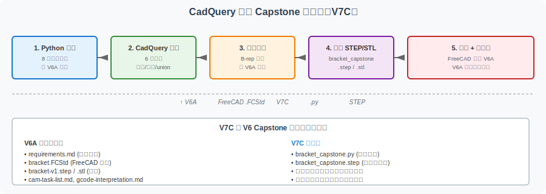
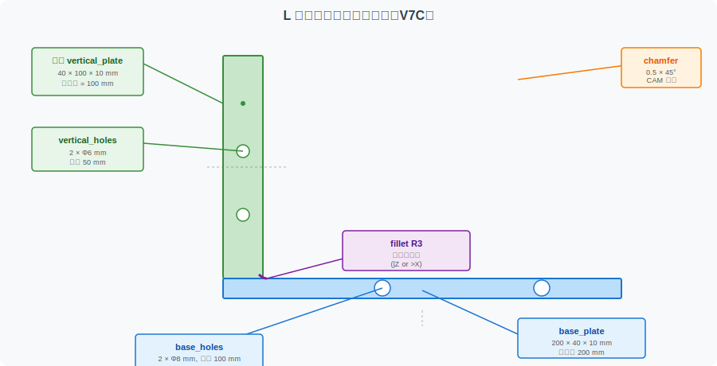

==========================================
CadQuery 支架 Capstone：用代码生成完整支架
==========================================

本页用 Python + CadQuery 代码**重写** :doc:`bracket-capstone-project` （V6A）的 L 型支架，把图形化建模转译为参数化代码。这是 V7A（入门）→ V7B（进阶）→ **V7C（综合）** 三步走的最后一步。

完成本页后，你应该能够：

- 独立读懂一份"用代码建模真实零件"的完整流程
- 把 V6A 项目的图形化参数转译为 CadQuery 参数
- 理解 V6 Capstone 作品集如何与代码模型互相印证
- 用代码完成 V6A 项目里所有几何特征（底板、立板、孔、圆角、倒角）

A. 本页解决什么问题
====================

V6A 的支架 Capstone 是图形化建模的综合项目
-------------------------------------------

V6A 的 :doc:`bracket-capstone-project` 用 FreeCAD 完成了 L 型支架的完整建模。该项目覆盖了 5 个阶段、20 个评分项，是 V5-V6 系列的最终综合验证。

V7C 用代码重写同一个支架
------------------------

V6A 的支架参数是固定值（200×140×10 mm 等）。V7C 把这些参数**转译为代码变量**，并演示如何用 CadQuery 实现所有几何特征。

**对比**：

- V6A：用鼠标操作 100+ 次完成建模，结果是 .FCStd 文件
- V7C：用 80+ 行 Python 代码完成建模，结果是 .py 文件 + STEP/STL

两者最终产出的 STEP 文件**完全等价**——这是 V6A 提出的"FreeCAD 做的支架 vs CadQuery 做的支架，验证几何一致性"的具体实现。

V7A → V7B → V7C 路径
---------------------

.. list-table:: CadQuery 学习路径
   :header-rows: 1
   :widths: 15 35 50

   * - 阶段
     - 内容
     - 适合谁
   * - V7A
     - 带孔矩形板（基础）
     - 完全没接触过 CadQuery
   * - V7B
     - 圆角/倒角/孔阵列/简化支架
     - 已了解基础，想看更多特征
   * - **V7C**
     - **完整支架 Capstone（综合）**
     - **想看"完整零件"如何在代码里组织**

B. 支架项目参数表
==================

V7C 使用与 :doc:`bracket-capstone-project` 完全相同的参数（这是 V6A 的要求：保持几何一致性）。

.. list-table:: L 型支架参数表
   :header-rows: 1
   :widths: 30 25 45

   * - 参数
     - 值
     - 说明
   * - ``outer_length``
     - 200 mm
     - 整体长度（X 方向）
   * - ``outer_height``
     - 140 mm
     - 整体高度（Z 方向）
   * - ``thickness``
     - 10 mm
     - 板厚（Y 方向）
   * - ``base_length``
     - 200 mm
     - 底板长度（X 方向）
   * - ``base_height``
     - 40 mm
     - 底板高度（Z 方向）
   * - ``vertical_length``
     - 40 mm
     - 立板厚度（X 方向）
   * - ``vertical_height``
     - 100 mm
     - 立板高度（Z 方向）
   * - ``base_hole_diameter``
     - 8 mm
     - 底板安装孔
   * - ``base_hole_count``
     - 2
     - 底板安装孔数量
   * - ``base_hole_spacing``
     - 100 mm
     - 底板安装孔间距
   * - ``vertical_hole_diameter``
     - 6 mm
     - 立板安装孔
   * - ``vertical_hole_count``
     - 2
     - 立板安装孔数量
   * - ``vertical_hole_spacing``
     - 50 mm
     - 立板安装孔间距
   * - ``fillet_radius``
     - 3 mm
     - 内棱边圆角
   * - ``chamfer_size``
     - 0.5 mm
     - 外棱边倒角（CAM 友好）

C. 建模分解
============

完整建模流程分 6 步：

1. **底板**：矩形 box，200×40×10
2. **立板**：矩形 box，40×100×10，定位在底板左侧上方
3. **合并**：union
4. **底板安装孔**：2 个 Ø8 孔，孔距 100
5. **立板安装孔**：2 个 Ø6 孔，孔距 50
6. **后处理**：圆角（fillet）+ 倒角（chamfer）

每步对应 V6A 的一个建模阶段，但用代码表达后，**参数化、可重复、可版本管理**。

D. 完整 CadQuery Python 示例
============================

下方代码是与 V6A FreeCAD 建模**几何等价**的 CadQuery 实现。

.. code-block:: python

   """
   L 型支架 Capstone — CadQuery 代码化建模
   ======================================

   本文件是 CAD-CAM-Technology-docs 项目的 V7C 教学示例，
   配合 examples/cadquery-bracket-capstone.rst 使用。

   目标：用 CadQuery 重写 V6A FreeCAD 支架 Capstone。
   关键约束：与 bracket-capstone-project 的几何参数完全一致。

   注意
   ----
   本文件是教学示例，重在清晰度和可读性：
   - 不追求工业级鲁棒性
   - 不做参数验证、异常处理、单元测试
   - 不考虑装配体、五轴加工等高级特性
   - 真实工程中应根据需求选择工具

   依赖
   ----
   - cadquery >= 2.0
   - 安装：pip install cadquery
   - 运行：python bracket_capstone.py

   输出
   ----
   bracket_capstone.step
   bracket_capstone.stl
   """

   import cadquery as cq

   # ============================================================
   # 参数集中区
   # ============================================================

   # 整体尺寸
   outer_length = 200.0      # X 方向
   outer_height = 140.0      # Z 方向
   thickness = 10.0          # Y 方向（板厚）

   # 底板参数
   base_length = 200.0       # 与 outer_length 相同
   base_height = 40.0        # 底板在 Z 方向高度
   # 注：底板厚度（Y 方向）= thickness

   # 立板参数
   vertical_length = 40.0    # 立板 X 方向厚度
   vertical_height = 100.0   # 立板在 Z 方向高度（140-40=100）
   # 注：立板厚度（Y 方向）= thickness

   # 底板安装孔
   base_hole_diameter = 8.0
   base_hole_count = 2
   base_hole_spacing = 100.0  # 两个孔中心间距

   # 立板安装孔
   vertical_hole_diameter = 6.0
   vertical_hole_count = 2
   vertical_hole_spacing = 50.0

   # 圆角 / 倒角
   fillet_radius = 3.0        # 内棱边圆角
   chamfer_size = 0.5         # 外棱边倒角（CAM 友好，便于入刀）

   # 输出文件名
   output_step = "bracket_capstone.step"
   output_stl = "bracket_capstone.stl"

   # ============================================================
   # 几何建模
   # ============================================================

   def build_base_plate():
       """构造底板（含 2 个安装孔）。

       底板坐标系：以原点为底板底面中心，底板向 +Z 方向延伸。
       """
       # 基础底板
       base = cq.Workplane("XY").box(
           base_length,
           thickness,        # Y 方向
           base_height,      # Z 方向
       )

       # 2 个底板安装孔（在底板顶面，X 方向上均匀分布）
       # 孔位中心：X 在 ±base_hole_spacing/2，Y 在板中心，Z 在底板顶面
       if base_hole_count >= 2:
           # 构造矩形：用于定位孔位
           # 矩形的 X 跨度 = 孔间距，Y 跨度 = 0（即孔在 X 方向两端）
           base = (
               base
               .faces(">Z")                    # 底板顶面
               .workplane()
               .rect(base_hole_spacing, 0, forConstruction=True)  # 构造矩形
               .vertices()                                       # 2 个顶点
               .hole(base_hole_diameter)                         # 每个顶点打孔
           )

       return base

   def build_vertical_plate():
       """构造立板（含 2 个安装孔）。

       立板定位：在底板左侧上方，垂直于底板。
       - X：底板左端 → 立板中心 → 立板厚度 40
       - Y：与底板同厚
       - Z：从底板顶面（40）→ 立板顶面（140）
       """
       # 立板的中心位置
       # 底板占据 Z=[0, 40]，立板从 Z=40 开始
       # X 方向：底板中心在 X=0，立板中心应在 X=vertical_length/2 - 0 = 20
       #   （即立板左端紧贴底板左端，立板占据 X=[0, 40]）
       vertical_offset_x = vertical_length / 2.0
       vertical_offset_z = base_height + vertical_height / 2.0

       # 基础立板
       vertical = (
           cq.Workplane("XY")
           .transformed(offset=(vertical_offset_x, 0, vertical_offset_z))
           .box(vertical_length, thickness, vertical_height)
       )

       # 2 个立板安装孔
       if vertical_hole_count >= 2:
           # 在立板外侧（X 最小的那一面，即 -X 方向）打孔
           # 孔位中心：Z 在 ±vertical_hole_spacing/2 附近
           vertical = (
               vertical
               .faces("<X")                    # 立板左侧（朝外）
               .workplane()
               .rect(0, vertical_hole_spacing, forConstruction=True)  # Z 方向两端
               .vertices()
               .hole(vertical_hole_diameter)
           )

       return vertical

   def build_bracket():
       """组装 L 型支架：底板 + 立板 + 圆角 + 倒角。"""
       # 分别构造底板和立板
       base = build_base_plate()
       vertical = build_vertical_plate()

       # 合并为一个实体
       bracket = base.union(vertical)

       # 内棱边圆角（底板和立板连接处的内角）
       # 选择条件：|Z（竖直棱边）OR >X（X+方向的最外侧棱边）
       # 注意：fillet 必须在所有 hole 之后
       bracket = bracket.edges("|Z or >X").fillet(fillet_radius)

       # 外棱边倒角（CAM 友好，便于刀具入料）
       # 选择条件：底板和立板外侧的所有非内角棱边
       # 简化版：对所有 >X 的外棱边做倒角
       # 注：完整倒角需要更复杂的选择器，本例仅演示 CAM 友好倒角
       try:
           outer_edges = (
               bracket
               .edges(">X")                    # X+方向外棱边
               .edges("not <X")                # 排除 X-方向
           )
           if outer_edges.size() > 0:
               bracket = bracket.edges(">X").chamfer(chamfer_size)
       except Exception:
           # 如果倒角选择器失败，跳过倒角（教学容错）
           pass

       return bracket

   # ============================================================
   # 主流程
   # ============================================================

   def main():
       """主流程：构建 + 导出。"""
       print(f"=== CadQuery 支架 Capstone (V7C) ===")
       print(f"整体尺寸: {outer_length} x {thickness} x {outer_height} mm")
       print(f"底板: {base_length} x {thickness} x {base_height} mm")
       print(f"立板: {vertical_length} x {thickness} x {vertical_height} mm")
       print(f"底板安装孔: {base_hole_count} x Φ{base_hole_diameter} mm"
             f" (间距 {base_hole_spacing} mm)")
       print(f"立板安装孔: {vertical_hole_count} x Φ{vertical_hole_diameter} mm"
             f" (间距 {vertical_hole_spacing} mm)")
       print(f"圆角 R{fillet_radius} mm, 倒角 {chamfer_size} mm")

       # 构建支架
       bracket = build_bracket()

       # 导出 STEP 和 STL
       cq.exporters.export(bracket, output_step)
       cq.exporters.export(bracket, output_stl)
       print(f"[OK] 已导出: {output_step}, {output_stl}")

   if __name__ == "__main__":
       main()

代码逐段解读
------------

**底板与立板坐标系**：

- 底板中心在 (0, 0, base_height/2)
- 立板中心在 (vertical_length/2, 0, base_height + vertical_height/2)
- 两者用 `union` 合并为一个实体

**孔的位置**：

- 底板孔：在顶面 (Z=base_height)，X 方向 ±spacing/2
- 立板孔：在左面 (X=0)，Z 方向 ±spacing/2

**特征顺序**：

.. code-block:: text

   底板 + 立板 → union → 圆角 → 倒角

必须先 union 再圆角——否则两个独立实体的圆角无法合并到 union 后的实体上。

**倒角的容错处理**：

本例对 `chamfer` 操作加了 try/except 包裹，因为复杂选择器可能在某些 CadQuery 版本上失败。这是教学容错，不影响主体建模逻辑。

E. FreeCAD 图形化模型 vs CadQuery 代码模型
===========================================

下方对比 V6A（FreeCAD）和 V7C（CadQuery）在支架 Capstone 上的实现差异。

.. list-table:: FreeCAD 图形化 vs CadQuery 代码化
   :header-rows: 1
   :widths: 18 35 35 12

   * - 维度
     - FreeCAD 图形化 (V6A)
     - CadQuery 代码化 (V7C)
     - 评分
   * - 建模动作数
     - 100+ 次鼠标操作
     - 1 次代码运行
     - CadQuery 更少
   * - 参数修改
     - 双击约束、改数字
     - 改 Python 变量
     - 相当
   * - 参数可读性
     - 隐藏在草图约束里
     - 显式命名变量
     - CadQuery 更直观
   * - 几何一致性
     - 依赖操作员
     - 同一份代码 = 同一结果
     - CadQuery 更可重复
   * - 版本管理
     - .FCStd 二进制 diff 不可读
     - .py 文本 diff 完全可读
     - CadQuery 显著优
   * - 几何等价性
     - 取决于操作准确性
     - 由代码保证
     - CadQuery 更可靠
   * - STEP/STL 导出
     - 都支持
     - 都支持
     - 相当
   * - 教学价值
     - 几何直觉、所见即所得
     - 参数化思维、版本管理
     - 互补
   * - 工业应用
     - 工程师设计原型
     - 自动化生成、产品族
     - 互补
   * - 适合场景
     - 1 个零件、1 个工程师
     - 100 个零件变体、团队协作
     - 互补

**关键结论**：V6A 和 V7C 不是竞争关系，而是**互补**：

- 用 FreeCAD 建原型 → 用 CadQuery 生成参数族
- 用 V6A 学几何 → 用 V7C 学参数化
- 用 V6A 评估作品集 → 用 V7C 验证几何一致性

F. 与 V6 Capstone 作品集提交的关系
====================================

V6A 提交流程（5 个阶段）
------------------------

V6A 要求提交：

1. ``requirements.md`` — 需求文档
2. ``bracket.FCStd`` — FreeCAD 模型
3. ``bracket-v1.step`` / ``bracket-v1.stl`` — 导出文件
4. ``cam-task-list.md`` — CAM 任务列表
5. ``gcode-interpretation.md`` — G-code 解读

V7C 在 V6A 中的位置
-------------------

V7C 的代码文件 ``bracket_capstone.py`` 可以在 V6A 流程的**阶段 2**作为**补充材料**提交：

.. code-block:: text

   V6A 阶段 2 提交物：
   ├── bracket.FCStd          (FreeCAD 原始模型)
   ├── bracket-v1.step        (FreeCAD 导出的 STEP)
   └── bracket_capstone.py    (V7C 代码模型，可选)

**作品集新增条目**：

- "项目参数表"：从 V7C 的 Python 参数集中区直接生成
- "几何一致性证明"：FreeCAD 导出的 STEP 与 CadQuery 导出的 STEP 在 FreeCAD 中可对比验证
- "代码化建模版本"：V7C 的 .py 文件 + 导出的 STEP/STL

V6D 项目线学习路径中 V7C 的位置
---------------------------------

V7C 是 V7 系列（代码化建模）的**综合阶段**，与 V6D（项目线总入口）形成完整闭环：

.. list-table:: V6D 项目线 + V7 系列
   :header-rows: 1
   :widths: 20 40 40

   * - 阶段
     - 图形化路径
     - 代码化路径
   * - 入门
     - V5A FreeCAD 实操
     - V7A CadQuery 基础
   * - 进阶
     - V5B/V5C/V5D
     - V7B CadQuery 进阶
   * - 综合
     - **V6A 支架 Capstone**
     - **V7C 支架 Capstone 代码版**
   * - 评估
     - V6B 作品集 + V6B 评分表
     - （代码化评估待补）
   * - 收口
     - V6D 项目线总入口
     - V7 系列合集（建议 V8 添加 V7-closure 页）

G. 常见误区
===========

.. list-table:: CadQuery 支架 Capstone 常见误区
   :header-rows: 1
   :widths: 8 35 35 22

   * - #
     - 误区
     - 正确做法
     - 影响等级
   * - 1
     - 复制粘贴 V7B 的简化支架代码直接当 V7C
     - 重新设计支架结构，按 V6A 参数实现
     - ⭐⭐⭐
   * - 2
     - 忽略 V6A 参数约束，随意修改尺寸
     - 严格保持与 V6A 的几何一致性
     - ⭐⭐⭐
   * - 3
     - 圆角放在 union 之前，导致 union 后圆角失效
     - 先 union，再圆角，最后倒角
     - ⭐⭐
   * - 4
     - 立板坐标系错位（X 方向位置错误）
     - 仔细算立板中心位置（X=vertical_length/2）
     - ⭐⭐
   * - 5
     - 孔位选择器用错（faces(">X") 而不是 faces("<X")）
     - 立板孔应在朝外的面（"\<X"），不是朝内
     - ⭐⭐
   * - 6
     - 倒角选择器太复杂，导致 CadQuery 报错
     - 简化倒角选择器或加 try/except 容错
     - ⭐
   * - 7
     - 导出 STL 后以为仍保留 V6A 的草图特征
     - STL 只是网格外壳，特征信息全部丢失
     - ⭐⭐⭐
   * - 8
     - 没有把 V7C 作为 V6A 作品集的补充
     - 把代码模型加入 V6A 提包，双版本验证
     - ⭐⭐

**前 3 个是 V7C 特有误区，必须避免**。后 5 个是 V7 系列通用问题。

H. 下一步学习建议
==================

完成 V7C 后，你已经用代码实现了 V6A 的所有几何特征。

**对比验证** （推荐）：

1. 用 FreeCAD 打开 V7C 导出的 ``bracket_capstone.step``
2. 与 V6A 的 ``bracket-v1.step`` 视觉对比
3. 用 FreeCAD 的"测量"工具验证关键尺寸
4. 在 FreeCAD 中数孔的数量和位置

**扩展方向**：

1. **参数族生成**：用 for 循环生成 5 个不同尺寸的支架变体
2. **装配体**：用 CadQuery Assembly 把支架 + 螺栓 + 螺母组合成完整装配
3. **CAM 对接**：把 V7C 导出的 STEP 导入 FreeCAD Path Workbench，生成 G-code
4. **教学视频**：录屏演示"参数修改 → 几何变化"的实时效果

**下一篇（V8 建议）**：

- V8 — 真实软件截图（SolidWorks / FreeCAD / Fusion 360 界面）
- V8 — 用 CadQuery 装配体 API 重做 L 型支架 + 螺栓
- V8 — 第二 Capstone（带圆角/倒角/多特征的复杂零件）

I. 教学声明
============

本页面是 **CAD/CAM 学习路径的辅助材料**：

- 教学示例不考虑工业级鲁棒性
- 不要求读者立即安装 CadQuery
- 与 :doc:`bracket-capstone-project` （V6A）几何一致，但实现方式不同
- 真实工程中应根据团队技能选择建模工具
- V7C 的目的是**展示代码化建模的完整能力** ，不是替代 V6A

J. 相关页面
============

- :doc:`cadquery-parametric-modeling` — V7A 入门
- :doc:`cadquery-advanced-features` — V7B 进阶
- :doc:`bracket-capstone-project` — V6A 图形化版支架 Capstone
- :doc:`bracket-project-portfolio` — V6B 作品集模板
- :doc:`bracket-assessment-rubric` — V6B 评分表
- :doc:`capstone-learning-path` — V6D 项目线总入口
- :doc:`step-stl-mini-lab` — V4B STEP/STL 格式对比
- :doc:`freecad-export-checklist` — V5B 导出检查清单
- :doc:`../workflow-roadmap` — 工作流总览