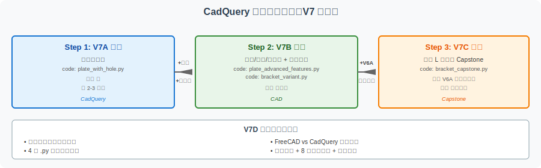
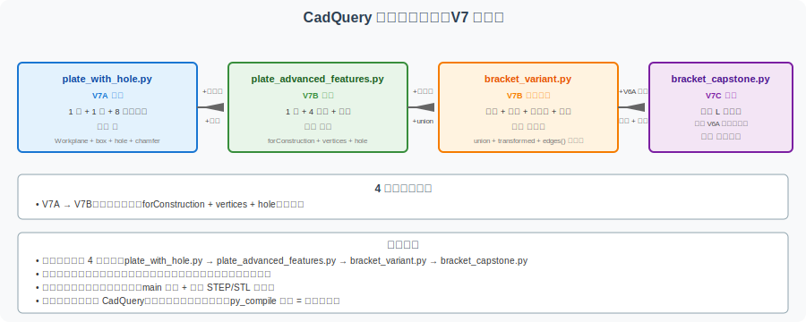

==========================================
CadQuery 学习路径：从入门到 Capstone 收口
==========================================

本页是 V7 系列（代码化建模）的**总入口和收口页**。V7A → V7B → V7C 三步走构成了"代码化 CAD 建模"的完整学习闭环，本页提供：

- **三步学习路线图** （入门 → 进阶 → 综合）
- **代码文件地图** （4 个 .py 文件的角色与关系）
- **FreeCAD vs CadQuery 路线对比** （图形化与代码化的双路径）
- **完成标准** （学完 V7 系列后应该具备的能力）
- **常见误区与扩展方向**

本页面与 V6D（Capstone 项目线学习路径）形成完整对照：V6D 是图形化路径收口，V7D 是代码化路径收口。

A. 本页解决什么问题
====================

V7 系列已经完成三个阶段
-----------------------

.. list-table:: V7 系列三阶段概览
   :header-rows: 1
   :widths: 12 30 25 33

   * - 阶段
     - 内容
     - 对应版本
     - 适合谁
   * - 入门
     - 带孔矩形板（参数化 + STEP/STL 导出）
     - V7A
     - 完全没接触过 CadQuery
   * - 进阶
     - 圆角/倒角/孔阵列 + 简化支架变体
     - V7B
     - 已了解基础，想看更多特征
   * - 综合
     - 完整 L 型支架 Capstone（与 V6A 几何一致）
     - V7C
     - 想看"完整零件"如何在代码里组织

V7D 解决"学完 V7 之后怎么办"
-----------------------------

学完 V7A + V7B + V7C 后，读者可能会问：

- 这三个阶段怎么衔接？我应该按什么顺序看？
- 4 个 .py 代码文件之间是什么关系？
- V7 代码化路径和 V6 图形化路径如何选择？
- 学到什么程度算"完成 V7 系列"？
- 学完之后下一步可以做什么？

本页面系统回答这些问题，作为 V7 系列的收口。

B. 三步学习路线
================

Step 1：V7A 入门（约 2-3 小时）
--------------------------------

**目标**：理解 CadQuery 基本概念，能独立读懂带孔矩形板的代码。

**核心内容**：

- Python + CadQuery 的工作方式
- 参数化建模的核心思想
- STEP / STL 导出的意义
- 与 FreeCAD 图形化工作流的对比

**配套页面**：:doc:`cadquery-parametric-modeling`

**配套代码**：

- :file:`code/cadquery/plate_with_hole.py` —— 带孔矩形板（80×50×8 mm + Φ20 中心孔 + 8 条棱边倒角）

**完成标志**：

- [ ] 能读懂 ``Workplane("XY").box(...)`` 这种链式调用
- [ ] 能解释为什么用代码建模比手动画图更适合参数化
- [ ] 能区分 STEP 和 STL 两种格式的用途

Step 2：V7B 进阶（约 1-2 天）
------------------------------

**目标**：掌握圆角、倒角、孔阵列等真实 CAD 建模常见特征。

**核心内容**：

- 圆角（fillet）vs 倒角（chamfer）的使用场景
- 孔阵列（``forConstruction + vertices + hole`` 三件套）
- 简化 L 型支架的代码化建模
- 8 条常见误区和 8 行特征与参数对照表

**配套页面**：:doc:`cadquery-advanced-features`

**配套代码**：

- :file:`code/cadquery/plate_advanced_features.py` —— 带 4 角孔 + 圆角的板
- :file:`code/cadquery/bracket_variant.py` —— 简化 L 型支架变体

**完成标志**：

- [ ] 能写出带 4 角孔的矩形板代码
- [ ] 能用 union 把两个 Workplane 合并为 L 型支架
- [ ] 理解圆角必须在打孔之后的特征顺序问题
- [ ] 能列举 3 个以上 V7B 教学过的特征

Step 3：V7C 综合（约 2-3 天）
------------------------------

**目标**：用代码完成与 V6A FreeCAD 几何一致的完整支架 Capstone。

**核心内容**：

- 完整的 L 型支架（200×140×10 mm + 4 孔 + 圆角 + 倒角）
- 6 步建模流程（底板/立板/union/孔/圆角/倒角）
- 几何一致性验证（与 V6A 对比）
- 作为 V6 作品集代码化补充材料

**配套页面**：:doc:`cadquery-bracket-capstone`

**配套代码**：

- :file:`code/cadquery/bracket_capstone.py` —— 完整 L 型支架（与 V6A 几何一致）

**完成标志**：

- [ ] 能用 CadQuery 写出与 V6A 参数完全一致的支架
- [ ] 理解 6 步建模流程的每一步在做什么
- [ ] 能把 bracket_capstone.py 作为 V6A 提包的代码化补充
- [ ] 能用 FreeCAD 验证代码版与 V6A 版的 STEP 几何一致性

C. 代码文件地图
================

V7 系列共有 4 个 .py 代码文件，每个都有明确的角色和定位。

文件清单与角色
--------------

.. list-table:: CadQuery 代码文件地图
   :header-rows: 1
   :widths: 30 18 25 27

   * - 文件
     - 角色
     - 核心特征
     - 难度
   * - :file:`plate_with_hole.py`
     - 入门示例
     - 1 板 + 1 孔 + 8 棱边倒角
     - ⭐
   * - :file:`plate_advanced_features.py`
     - 进阶特征示例
     - 1 板 + 4 角孔 + 棱边圆角
     - ⭐⭐
   * - :file:`bracket_variant.py`
     - 简化支架示例
     - 底板 + 立板 + 多种孔 + 圆角
     - ⭐⭐⭐
   * - :file:`bracket_capstone.py`
     - 完整 Capstone
     - 与 V6A 几何一致的完整 L 型支架
     - ⭐⭐⭐⭐

文件之间的关系
--------------

.. code-block:: text

   plate_with_hole.py (V7A)
       ↓ 引入圆角 + 孔阵列
   plate_advanced_features.py (V7B)
       ↓ 引入 union + 多实体
   bracket_variant.py (V7B)
       ↓ 引入 V6A 完整参数
   bracket_capstone.py (V7C)

.. list-table:: 文件演进的关键变化
   :header-rows: 1
   :widths: 30 35 35

   * - 文件
     - 相对前一文件新增的内容
     - 阅读建议
   * - plate_with_hole.py
     - （基础）
     - 第一个必读
   * - plate_advanced_features.py
     - ``forConstruction`` + ``vertices`` + 边距检查
     - 重点理解孔阵列的三件套
   * - bracket_variant.py
     - 多个 Workplane + ``union`` + 复合选择器
     - 重点理解多实体组合
   * - bracket_capstone.py
     - 完整 V6A 参数 + 坐标系变换 + 倒角容错
     - 重点理解 V6A → V7C 的参数转译

**学习建议**：

- 按时间顺序读 4 个文件
- 每个文件重点关注**相对前一文件新增的内容**
- 不要试图一次读懂所有细节，先看整体结构

D. FreeCAD vs CadQuery 路线对比
================================

V7 代码化路径和 V6 图形化路径是 CAD/CAM 学习的**两条平行路径**，目标都是"做出能用的零件并理解整个流程"。

完整对照
--------

.. list-table:: FreeCAD 图形化路径 vs CadQuery 代码化路径
   :header-rows: 1
   :widths: 18 35 35 12

   * - 维度
     - FreeCAD 图形化路径
     - CadQuery 代码化路径
     - 评分
   * - 学习起点
     - V5A 带孔板
     - V7A 带孔板
     - 相当
   * - 入门门槛
     - GUI 操作（低）
     - Python 基础（中）
     - 取决于基础
   * - 几何直觉
     - 强（所见即所得）
     - 弱（需想象）
     - FreeCAD 优
   * - 参数化能力
     - 中（草图约束）
     - 强（代码变量）
     - CadQuery 优
   * - 版本管理
     - 二进制 diff 不可读
     - 文本 diff 可读
     - CadQuery 显著优
   * - 批量生成
     - 手动复制
     - for 循环
     - CadQuery 优
   * - 团队协作
     - 不友好
     - Git 友好
     - CadQuery 优
   * - 工业应用
     - 工程师原型
     - 自动化/参数族
     - 互补
   * - 教学价值
     - 几何直觉
     - 参数化思维
     - 互补
   * - 输出格式
     - STEP / STL
     - STEP / STL（完全相同）
     - 相当
   * - 下游工具链
     - CAM 加工 / 3D 打印
     - CAM 加工 / 3D 打印
     - 相同
   * - 综合项目
     - V6A 支架 Capstone
     - V7C 支架 Capstone（V6A 的代码版）
     - 镜像

选择建议
--------

.. list-table:: 路径选择决策
   :header-rows: 1
   :widths: 30 35 35

   * - 你的情况
     - 推荐路径
     - 理由
   * - 完全没接触过 CAD
     - 先 FreeCAD 再 CadQuery
     - 几何直觉优先
   * - 不会 Python
     - FreeCAD
     - GUI 友好
   * - 会 Python 但没用过 CAD
     - CadQuery
     - 直接进入参数化
   * - 团队需要协作
     - CadQuery
     - Git 友好
   * - 学术研究/可重复
     - CadQuery
     - 代码可发表
   * - 工业原型设计
     - FreeCAD
     - 工业工具链成熟
   * - 教学演示
     - 两者结合
     - 互补展示
   * - **推荐：完整学习**
     - **V5 → V6 → V7 全学**
     - **建立完整认知**

**关键结论**：两条路径**不互斥**，而**互补**：

- 用 FreeCAD 建原型 → 用 CadQuery 生成参数族
- 用 V6 学几何 → 用 V7 学参数化
- 用 V6A 评估作品集 → 用 V7C 验证几何一致性

E. 完成标准
============

学完 V7 系列后，你应该具备以下能力：

基础能力
--------

- [ ] 能读懂 V7A/V7B/V7C 的所有代码示例
- [ ] 能用 Python + CadQuery 写一个带孔矩形板
- [ ] 能解释 STEP 和 STL 两种格式的本质差异
- [ ] 能在 4 个 .py 代码文件中指出每个文件的核心特征

进阶能力
--------

- [ ] 能用 forConstruction + vertices + hole 实现孔阵列
- [ ] 能用 union 把多个 Workplane 合并为复合零件
- [ ] 能选择合适的圆角半径（理解半径过大导致的建模失败）
- [ ] 能区分圆角和倒角的使用场景（应力 vs 装配）
- [ ] 能写出带 4 个安装孔的底板代码

综合能力
--------

- [ ] 能用 CadQuery 写出与 V6A 几何一致的完整 L 型支架
- [ ] 能理解 V6A 图形化与 V7C 代码化的"等价性"——两者 STEP 文件相同
- [ ] 能把 V7C 代码作为 V6 作品集的代码化补充材料
- [ ] 能在 V6 作品集和 V7 代码之间做"双版本对比验证"

元能力
------

- [ ] 能根据任务选择 FreeCAD 或 CadQuery（或两者结合）
- [ ] 能向团队解释"代码化 CAD 建模"的价值（参数化、版本管理、批量生成）
- [ ] 能预判 CadQuery 的常见误区（圆角顺序、孔边距、单位、特征顺序等）

如果以上 15+ 项能力大部分满足，说明 V7 系列学习到位。

F. 常见误区
===========

.. list-table:: V7 系列常见误区
   :header-rows: 1
   :widths: 8 35 35 22

   * - #
     - 误区
     - 正确做法
     - 影响等级
   * - 1
     - 只看 V7A，跳过 V7B/V7C
     - 三步走必须按顺序
     - ⭐⭐⭐
   * - 2
     - 一开始就尝试读懂全部 4 个 .py 文件
     - 按顺序读，每个文件只看相对前一个新增的内容
     - ⭐⭐
   * - 3
     - 试图本地安装 CadQuery 并运行
     - 阅读代码即可，环境受限不阻塞
     - ⭐⭐
   * - 4
     - 把 V7C 当成"V6A 的替代"
     - V7C 是 V6A 的**代码化补充**，不是替代
     - ⭐⭐⭐
   * - 5
     - 期待 V7C 和 V6A 的 STEP 在字节级别完全一致
     - 几何一致即可，B-rep 表示可能有微小差异
     - ⭐
   * - 6
     - 修改 V7C 参数后，担心破坏 V6A 几何一致性
     - V7C 是独立文件，修改不影响 V6A
     - ⭐
   * - 7
     - 把 V7 系列当成"必须装 CadQuery 才能学"
     - 阅读代码、阅读文档、阅读 RST 即可完成学习
     - ⭐⭐⭐
   * - 8
     - 学完 V7 后没把代码加入 V6 作品集
     - 至少把 V7C 加入 V6A 提包作为代码化补充
     - ⭐⭐

**前 3 个是 V7 系列特有误区，必须避免**。后 5 个是 V6/V7 通用问题。

G. 扩展方向
===========

完成 V7 系列后，下一步可以选：

代码化方向（V7 → V8+）
----------------------

1. **V7-closure / V8** — V7 系列合集页（本页面就是收口）
2. **V8** — CadQuery 装配体 API（多零件 + 螺栓 + 螺母）
3. **V8** — 用 CadQuery 重做 V4B mini-lab（参数化立方体/圆柱体对比）
4. **V8** — CadQuery 异步生成（用 Python 多进程批量生成零件族）

图形化与代码化结合（V6 + V7 → V8+）
-------------------------------------

1. **V8** — 用 FreeCAD 打开 V7C 的 STEP，验证与 V6A 几何一致性
2. **V8** — 用 CadQuery 生成的 STEP 导入 FreeCAD Path Workbench 生成 G-code
3. **V8** — 真实软件截图（SolidWorks / Fusion 360）做三方对比
4. **V8** — 第二 Capstone（带圆角/倒角/多特征的复杂零件）

教学方向（V8+）
----------------

1. **V8** — 录屏演示"参数修改 → 几何变化"的实时效果
2. **V8** — 为 V7 系列录制讲解视频
3. **V8** — 邀请读者贡献更多参数化示例

H. 教学声明
============

本页面是 **V7 系列（代码化 CAD 建模）的收口页**：

- 不重写 V7A/V7B/V7C 的内容
- 不引入新代码或新特征
- 仅作为"路线图 + 完成标准 + 扩展方向"的导航页
- 真实工程中应根据团队技能选择建模方式

I. 相关页面
============

V7 系列（代码化路径）
---------------------

- :doc:`cadquery-parametric-modeling` — V7A 入门
- :doc:`cadquery-advanced-features` — V7B 进阶
- :doc:`cadquery-bracket-capstone` — V7C 综合

V6 系列（图形化路径，对照参考）
--------------------------------

- :doc:`bracket-capstone-project` — V6A 支架 Capstone（V7C 的图形化对照）
- :doc:`capstone-learning-path` — V6D 项目线学习路径（V7D 的对照收口页）

基础与工具
-----------

- :doc:`freecad-plate-modeling` — V5A FreeCAD 入门
- :doc:`step-stl-mini-lab` — V4B STEP/STL 格式对比
- :doc:`../workflow-roadmap` — 工作流总览