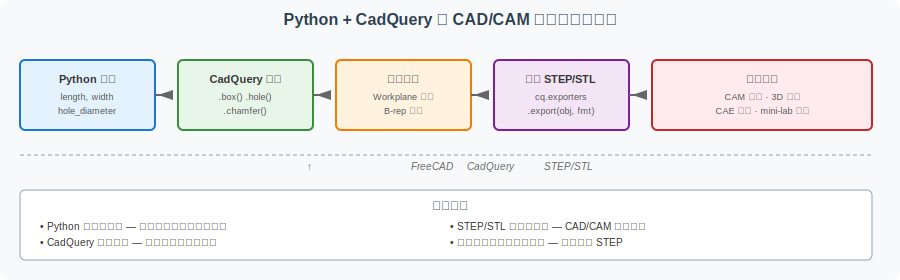
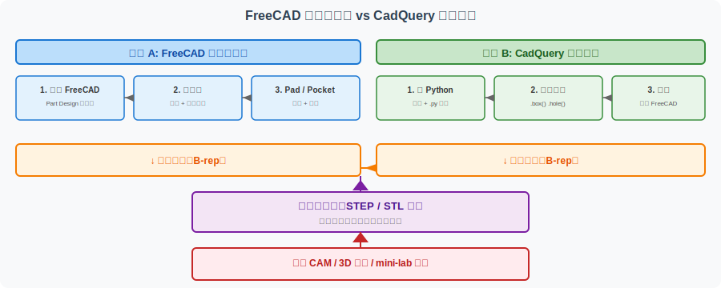

========================================
Python + CadQuery：用代码生成参数化零件
========================================

本页用 Python + CadQuery 演示如何用代码生成参数化 CAD 模型。它与 :doc:`freecad-plate-modeling` 是同一目标（建立第一个 CAD 零件）的两种不同路径：**FreeCAD 走图形化界面**，**CadQuery 走 Python 代码**。

本页面是 FreeCAD 图形化工作流的**补充**，不是替代。读者在阅读本页之前，建议先完成 :doc:`freecad-plate-modeling` 或 :doc:`freecad-workflow-index`，建立"几何建模 → STEP/STL 导出"的基本认知。

A. 本页解决什么问题
====================

FreeCAD 是图形化 CAD 工作流
----------------------------

在 :doc:`freecad-plate-modeling` 中，你用鼠标和菜单完成：

- 画矩形草图
- 标注尺寸约束
- 拉伸成实体
- 打孔

整个流程是**所见即所得**，每次修改都需要打开 FreeCAD、点击按钮。

CadQuery 是代码化参数建模方式
-----------------------------

CadQuery 是一个 Python 库，它让你用代码描述几何形状：

.. code-block:: python

   length = 80
   width = 50
   thickness = 8

   plate = cq.Workplane("XY").box(length, width, thickness)

上面 3 行代码就创建了一个 80×50×8 的矩形板。修改 `length` 变量值，零件尺寸随之改变。

同一个零件的两种表达方式
------------------------

下面用一张表对比 FreeCAD 和 CadQuery 的表达思路：

.. list-table:: 同一种零件的两种建模方式
   :header-rows: 1
   :widths: 30 35 35

   * - 操作
     - FreeCAD（图形化）
     - CadQuery（代码化）
   * - 创建矩形板
     - 画草图 → 拉伸 Pad
     - ``Workplane.box(length, width, thickness)``
   * - 在中心打孔
     - 草图 → Pocket
     - ``.faces(">Z").workplane().hole(diameter)``
   * - 修改尺寸
     - 打开模型、双击约束、改数字
     - 改 Python 变量值、重新运行
   * - 版本管理
     - 保存 ``.FCStd`` 文件
     - 保存 ``.py`` 文件
   * - 批量生成多个尺寸
     - 手动复制多份
     - ``for length in [60, 80, 100]: ...``

代码化建模特别适合：

- **重复生成**：同一类零件、不同尺寸
- **参数调整**：快速修改并比较
- **版本管理**：模型和代码一起进 Git
- **教学场景**：每个建模步骤对应一行代码，逻辑清晰

B. CadQuery 在 CAD/CAM 学习中的位置
====================================

本页介绍的 CadQuery 不是用来"替代 FreeCAD"，而是用来补全你理解工具链的一环。

完整的数据流转链路：

.. code-block:: text

   Python 参数（length, hole_diameter, ...）
       ↓
   CadQuery 几何建模（.box, .hole, .fillet, ...）
       ↓
   生成实体（Workplane 对象）
       ↓
   导出 STEP / STL
       ↓
   STEP/STL mini-lab（格式验证）
       ↓
   CAM worksheet（freecad-to-cam-worksheet）
       ↓
   G-code 理解（gcode-toolpath-visualization）

理解这条链路的关键点：

- **Python 参数是源头**：所有几何特征都由变量驱动
- **CadQuery 是转换器**：把参数变成几何实体
- **STEP/STL 是桥接格式**：和 FreeCAD、Fusion 360、CAM 软件的共同语言
- **下游工具不关心建模方式**：无论是 FreeCAD 还是 CadQuery，只要能正确导出 STEP/STL 即可

C. 第一个示例：带孔矩形板
==========================

下面用与 :doc:`freecad-plate-modeling` 中相似但略有不同的尺寸，建一个带孔矩形板。

零件规格
--------

.. list-table:: 带孔矩形板参数
   :header-rows: 1
   :widths: 30 25 45

   * - 参数
     - 数值
     - 说明
   * - ``length``
     - 80 mm
     - 板的长度（X 方向）
   * - ``width``
     - 50 mm
     - 板的宽度（Y 方向）
   * - ``thickness``
     - 8 mm
     - 板的厚度（Z 方向）
   * - ``hole_diameter``
     - 20 mm
     - 中心通孔直径

完整代码
--------

下方代码展示了用 CadQuery 创建此零件、添加倒角、并导出 STEP/STL 的完整流程。

.. code-block:: python

   """
   带孔矩形板 — CadQuery 参数化建模示例

   本文件是 CAD-CAM-Technology-docs 项目的教学示例，
   配合 examples/cadquery-parametric-modeling.rst 使用。

   依赖：cadquery
   安装：pip install cadquery
   运行：python plate_with_hole.py
   """

   import cadquery as cq

   # ---------- 参数集中区 ----------
   # 改这里就能生成不同尺寸的零件
   length = 80.0          # 板的长度 (X)
   width = 50.0           # 板的宽度 (Y)
   thickness = 8.0        # 板的厚度 (Z)
   hole_diameter = 20.0   # 中心通孔直径
   chamfer_size = 1.0     # 倒角尺寸（可选）

   # ---------- 几何建模 ----------
   # 1. 创建基础矩形板
   plate = cq.Workplane("XY").box(length, width, thickness)

   # 2. 在板中心打一个通孔
   plate = (
       plate
       .faces(">Z")                       # 选择顶面
       .workplane()                       # 进入草图平面
       .hole(hole_diameter)               # 打孔
   )

   # 3. 在 8 个竖直棱边上添加倒角
   plate = plate.edges("|Z").chamfer(chamfer_size)

   # ---------- 导出 ----------
   # STEP 文件保留完整几何，适合后续 CAD/CAM/CAE
   cq.exporters.export(plate, "plate_with_hole.step")

   # STL 文件是三角网格，适合 3D 打印
   cq.exporters.export(plate, "plate_with_hole.stl")

   print("导出完成：plate_with_hole.step, plate_with_hole.stl")

代码逐段解读
------------

**参数集中区**：

``length``、``width``、``thickness``、``hole_diameter`` 四个变量决定整个零件的尺寸。改一个数字，整套几何随之变化。这是 CadQuery 与 FreeCAD 最大的区别——**参数显式可见**。

**创建基础矩形板**：

``cq.Workplane("XY")`` 创建一个工作平面，"XY" 表示工作平面是 XY 平面（Z=0）。``.box(length, width, thickness)`` 在该平面上创建一个长方体，结果是一个中心在原点的盒子。

**中心打孔**：

``.faces(">Z")`` 选择零件顶面（Z 正方向最大值的面）。``.workplane()`` 在该面上新建工作平面。``.hole(diameter)`` 在工作平面原点打一个贯穿零件的孔。

**倒角**：

``.edges("|Z")`` 选中所有与 Z 轴平行的棱边（也就是 4 条顶面边和 4 条底面边，共 8 条）。``.chamfer(chamfer_size)`` 在每条边上做指定尺寸的倒角。

**导出**：

- ``cq.exporters.export(plate, "plate_with_hole.step")`` 导出 STEP，保留 B-rep 完整几何。
- ``cq.exporters.export(plate, "plate_with_hole.stl")`` 导出 STL，转为三角网格（注意：会丢失圆孔的精确表示，详见 :doc:`step-stl-mini-lab`）。

D. 参数化的意义
================

CadQuery 的核心价值不是"写代码比点鼠标酷"，而是**参数化**。

尺寸修改的本质
--------------

想象你需要为不同客户生产同一类零件，只是长度不同：

.. code-block:: python

   for length in [60, 80, 100, 120]:
       plate = cq.Workplane("XY").box(length, 50, 8).faces(">Z").workplane().hole(20)
       cq.exporters.export(plate, f"plate_L{length}.step")

4 行代码生成 4 个不同长度的零件。在 FreeCAD 里，你需要复制 4 次文件、每个文件手工改尺寸。

参数命名 vs 直接画图
--------------------

.. list-table:: 参数命名 vs 直接画图
   :header-rows: 1
   :widths: 30 35 35

   * - 维度
     - FreeCAD 草图尺寸
     - CadQuery 变量
   * - 表达形式
     - 数字（带单位 mm）
     - 变量名 + 值
   * - 复用性
     - 同一文件可改，不能批量
     - 函数参数，跨文件可调用
   * - 可读性
     - 数字即含义
     - 变量名即文档
   * - 版本管理
     - 数字变化看不出意图
     - 变量名变化可读出意图
   * - 文档同步
     - 容易忘记更新文档
     - 变量名就是文档

代码模型与 Git 协作
--------------------

``.py`` 文件天然适合用 Git 管理：

- **diff 直观**：``length: 80 → 100`` 一眼能看出"长度从 80 改成 100"
- **review 友好**：PR 中能 review 几何设计变更
- **分支实验**：在分支里改参数、对比结果，不会污染主分支

相比之下，``.FCStd`` 文件是 FreeCAD 的二进制格式，diff 不可读、PR 几乎无法 review 几何变更。

E. 与 FreeCAD 工作流对比
========================

下面从 7 个维度对比 FreeCAD 图形化建模和 CadQuery 代码建模：

.. list-table:: FreeCAD vs CadQuery 工作流对比
   :header-rows: 1
   :widths: 18 32 32 18

   * - 维度
     - FreeCAD 图形化建模
     - CadQuery 代码建模
     - 适合场景 / 初学者注意点
   * - 学习门槛
     - 中等：需要熟悉 GUI 操作
     - 中等偏高：需要 Python 基础
     - 不会 Python 选 FreeCAD，会 Python 选 CadQuery
   * - 可视化程度
     - 高：实时预览
     - 中：需要运行后查看
     - CadQuery 适合配合 FreeCAD 预览
   * - 参数修改
     - 双击约束、改数字
     - 改变量、重新运行
     - 一次改大量参数，CadQuery 更快
   * - 版本管理
     - 二进制 FCStd，diff 不可读
     - 纯文本 .py，diff 完全可读
     - 团队协作 / Git 选 CadQuery
   * - 批量生成
     - 手动复制
     - for 循环
     - 同一类多尺寸零件选 CadQuery
   * - 导出 STEP/STL
     - 都支持
     - 都支持
     - 两者导出能力相当
   * - 与 CAM 连接
     - STEP/STL 即可
     - STEP/STL 即可
     - 下游工具不关心建模方式

选择建议：

- **初学者**：建议先用 FreeCAD 建立几何直觉，再学 CadQuery
- **会 Python 的工程师**：CadQuery 更高效
- **团队项目**：CadQuery 代码模型更易于协作
- **一次性快速原型**：FreeCAD 更快
- **参数族/尺寸族**：CadQuery 显著优于 FreeCAD

F. 导出与检查
=============

CadQuery 导出的 STEP/STL 与 FreeCAD 导出文件**没有本质区别**。导出后仍然要走 :doc:`freecad-export-checklist` 的检查清单。

导出格式选择
------------

.. list-table:: CadQuery 导出格式选择
   :header-rows: 1
   :widths: 18 30 30 22

   * - 格式
     - CadQuery 调用
     - 适用场景
     - 文件大小（参考）
   * - STEP
     - ``cq.exporters.export(obj, "x.step")``
     - 后续 CAD / CAM / CAE，保留 B-rep
     - 几十 KB
   * - STL
     - ``cq.exporters.export(obj, "x.stl")``
     - 3D 打印、CAM 后处理
     - 几百 KB ~ 几 MB

关键提示：

- **STL 只是网格外壳**：打孔、倒角等特征在 STL 中全部变成三角面片，圆孔变成多边形
- **STEP 更适合后续 CAD/CAM/CAE**：完整 B-rep 表示，可被任何 CAD 软件读取
- **导出后必须检查**：无论用 FreeCAD 还是 CadQuery 导出，都要走 :doc:`freecad-export-checklist`

导出检查流程
------------

完整流程参考 :doc:`freecad-export-checklist`，关键检查点：

1. **STEP 文件**：用文本编辑器打开，确认单位（``#143=...`` 行附近标注 ``SI_UNIT(.MILLI.,...)`` 表示毫米）
2. **STL 文件**：三角面片数量合理（约 1k ~ 100k 面片，零件越大面片越多）
3. **几何验证**：把导出的 STEP 文件重新导入 FreeCAD 或 Viewer（如 `FreeCAD Viewer <https://viewer.freecad.org/>`_），目视确认形状正确

与下游工作流的衔接
------------------

导出的 STEP 文件可以：

- 导入 FreeCAD 做进一步编辑（与 CadQuery 代码协同）
- 导入 :doc:`freecad-path-workbench-intro` 介绍过的 FreeCAD Path Workbench 生成 G-code
- 作为 :doc:`bracket-capstone-project` 综合项目的零件输入

G. 第二个示例：简化支架参数结构
================================

真实 Capstone 项目（如 :doc:`bracket-capstone-project` 中的 L 型支架）涉及更多参数。下表展示从"带孔板"扩展到"支架"的参数结构：

.. list-table:: L 型支架参数结构
   :header-rows: 1
   :widths: 30 25 45

   * - 参数
     - 典型值
     - 说明
   * - ``base_length``
     - 100 mm
     - 底板长度
   * - ``base_width``
     - 60 mm
     - 底板宽度
   * - ``base_thickness``
     - 10 mm
     - 底板厚度
   * - ``vertical_height``
     - 80 mm
     - 立板高度
   * - ``vertical_thickness``
     - 10 mm
     - 立板厚度
   * - ``hole_diameter``
     - 20 mm
     - 底板通孔直径
   * - ``fillet_radius``
     - 3 mm
     - 内圆角半径（缓解应力集中）

从带孔板到支架的扩展思路
------------------------

.. code-block:: python

   # 1. 创建底板（与带孔板类似）
   base = cq.Workplane("XY").box(base_length, base_width, base_thickness)
   base = base.faces(">Z").workplane().hole(hole_diameter)

   # 2. 创建立板（定位在底板一侧）
   vertical = (
       cq.Workplane("XY")
       .transformed(offset=(base_length/2, 0, base_thickness))
       .box(vertical_thickness, base_width, vertical_height)
   )

   # 3. 合并两个实体
   bracket = base.union(vertical)

   # 4. 添加内圆角（缓解应力集中）
   bracket = bracket.edges("|Z or >X").fillet(fillet_radius)

   # 5. 导出
   cq.exporters.export(bracket, "bracket.step")

**学习路径建议**：

1. 先用代码完成 :doc:`freecad-plate-modeling` 同样的带孔矩形板
2. 再用代码生成 L 型支架（参数化版）
3. 最后对比：FreeCAD 做的支架 vs CadQuery 做的支架，验证几何一致性

H. 常见误区
===========

.. list-table:: CadQuery 学习常见误区
   :header-rows: 1
   :widths: 8 35 35 22

   * - #
     - 误区
     - 正确做法
     - 影响等级
   * - 1
     - 以为代码建模不需要几何理解
     - 仍然需要理解草图、特征、布尔运算等概念
     - ⭐⭐⭐
   * - 2
     - 参数命名混乱（``a, b, c, d``）
     - 用语义化命名（``length, width, hole_diameter``）
     - ⭐⭐
   * - 3
     - 单位假设不明确（毫米 vs 英寸）
     - 顶部明确标注 ``# 单位：毫米`` 或使用变量 ``UNIT = "mm"``
     - ⭐⭐⭐
   * - 4
     - 导出 STL 后以为仍保留特征
     - STL 只是三角网格，特征信息全部丢失
     - ⭐⭐⭐
   * - 5
     - 过早追求复杂模型
     - 先完成带孔板，再扩到支架，最后考虑装配体
     - ⭐⭐
   * - 6
     - 没有保存导出检查记录
     - 记录导出文件名、单位、面片数、STEP 文件大小
     - ⭐⭐
   * - 7
     - 复制粘贴代码不做参数化
     - 把可变的部分抽成函数参数
     - ⭐⭐
   * - 8
     - 在 CadQuery 里写大量业务逻辑
     - CadQuery 只负责几何，业务逻辑放外部脚本
     - ⭐

**前 6 个误区是初学者最容易犯的，必须避免。后 2 个是进阶问题，等熟悉 CadQuery 后再考虑。**

I. 与已有页面的关系
====================

CadQuery 页面不是孤立的，它与以下页面形成完整闭环：

- :doc:`freecad-plate-modeling` — FreeCAD 图形化版带孔板（与本页面同一目标）
- :doc:`freecad-export-checklist` — 导出检查清单（CadQuery 导出后同样适用）
- :doc:`step-stl-mini-lab` — STEP/STL 格式对比（理解为什么要选对格式）
- :doc:`freecad-to-cam-worksheet` — 从模型到 CAM 加工任务（导出 STEP 后继续）
- :doc:`../workflow-roadmap` — CAD/CAM 全流程总览（本页面在 CAD 建模阶段的补充）
- :doc:`bracket-capstone-project` — L 型支架 Capstone（从带孔板到支架的扩展）
- :doc:`capstone-learning-path` — Capstone 项目线学习路径

J. 下一步学习建议
==================

**最小路径** （约 2-3 小时）：

1. 阅读本页面 B ~ E 节，理解 CadQuery 在工具链中的位置
2. 复制 :file:`code/cadquery/plate_with_hole.py` 到本地（不需要立刻安装 CadQuery）
3. 在文本编辑器中通读代码，理解每行的几何含义
4. 阅读 :doc:`freecad-export-checklist`，理解导出后如何验证

**完整路径** （约 1-2 天）：

1. 在本地安装 CadQuery：``pip install cadquery``
2. 运行 :file:`code/cadquery/plate_with_hole.py`，生成 STEP 和 STL
3. 把生成的 STEP 文件导入 FreeCAD，目视检查几何
4. 修改参数（``length=120``, ``hole_diameter=30``），重新生成，对比结果
5. 扩展到 L 型支架，参考 G 节的参数表和代码片段

**进阶路径** （约 1 周+）：

1. 把 :doc:`bracket-capstone-project` 中的支架用 CadQuery 重写
2. 配合 :doc:`freecad-path-workbench-intro`，从 CadQuery 生成的 STEP 进入 CAM 流程
3. 学习 CadQuery 的装配体 API，处理多零件装配

K. 教学声明
============

本页面是 **CAD/CAM 学习路径的辅助材料**，不是生产环境指南。

- 教学示例不考虑工业级鲁棒性
- 不要求读者立刻安装 CadQuery，本页以阅读代码为主
- 不替代 :doc:`freecad-plate-modeling`，两者是同一目标的两种路径
- 真实工程中应根据团队技能选择建模方式