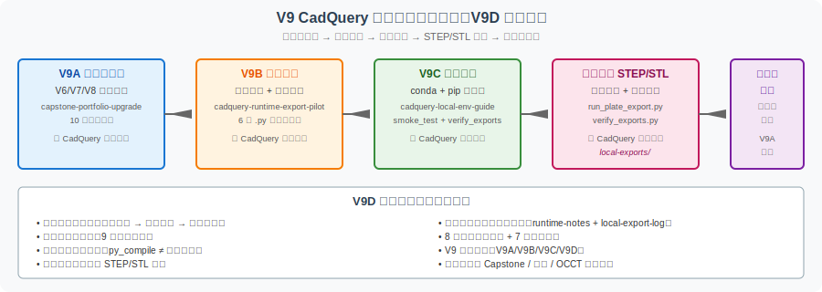
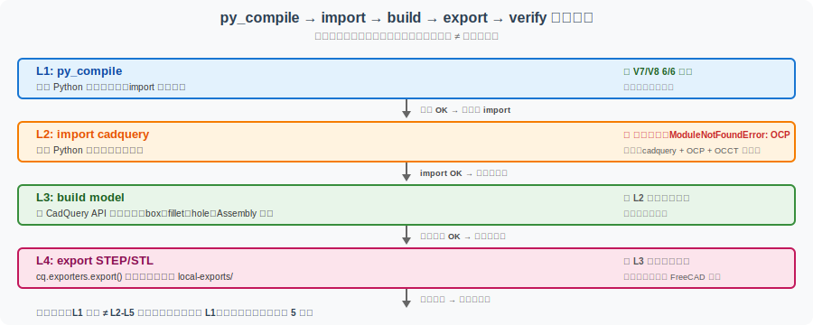

==========================================
CadQuery 运行与作品集路线（V9D）
==========================================

本页是 V9A/V9B/V9C 的**总入口与发布收口**。前三个页面分别解决了"如何把成果合并提交""云端环境能否真实运行""读者本地如何配置"，本页把它们串成一条完整路线，并说明如何把"代码 + 运行记录"纳入作品集。

本页是 V9A/V9B/V9C 的**总入口与发布收口**。前三个页面分别解决了"如何把成果合并提交""云端环境能否真实运行""读者本地如何配置"，本页把它们串成一条完整路线，并说明如何把"代码 + 运行记录"纳入作品集。

**关键定位** ：

- V9A 是**作品集提交结构** —— 把 V6/V7/V8 合并成一份可提交作品集
- V9B 是**运行诊断** —— 真实环境能否跑 CadQuery，结果如何记录
- V9C 是**本地环境配置** —— 读者如何在本地完成 STEP/STL 导出
- **V9D（本页）是路线图与发布收口** —— 把上述三者整合成一条可发布的学习闭环

A. 这条路线解决什么问题
=======================

V9 系列负责把已有学习成果整合成可提交作品集
--------------------------------------------

学完 V6 Capstone 项目线 + V7 CadQuery 单零件 + V8 CadQuery Assembly 装配体后，读者需要：

- 把三条线的成果**合并提交** ：不能各放各的，需要一份统一的作品集
- 给出**运行诊断** ：说明哪些代码是仅语法通过，哪些是真实生成
- 提供**本地运行方案** ：让感兴趣的读者能复制运行结果
- 解释**诚信边界** ：不伪造不可验证的 STEP/STL 文件

为什么需要这条路线
------------------

.. list-table:: V9 系列分工
   :header-rows: 1
   :widths: 12 25 30 33

   * - 版本
     - 主题
     - 解决的具体问题
     - 与其他版本的关系
   * - V9A
     - 作品集升级
     - 如何把 V6/V7/V8 整合成一份作品集
     - 输入：V6/V7/V8 成果；输出：合并提交流程
   * - V9B
     - 运行诊断
     - 服务器端环境能否真实运行 CadQuery
     - 输入：6 个 .py 文件；输出：环境诊断报告
   * - V9C
     - 本地环境配置
     - 读者本地如何配置环境、生成 STEP/STL
     - 输入：V9B 的诊断结论；输出：本地配置指南
   * - V9D
     - 路线总入口与发布收口
     - 把 V9A/V9B/V9C 串成完整路线
     - 输入：前三者的成果；输出：可发布学习闭环

教学诚信说明
------------

本路线**不伪造不可验证的导出文件** ：

- 服务器端不假装运行 CadQuery，不生成假 STEP/STL
- 所有"运行结果"必须可追溯：要么是 py_compile，要么是本地真实验证
- 读者作品集应保留**运行记录**而非只保留代码本身

B. 三步学习路线
===============

按以下顺序阅读三步路线，逐步完成 V9 系列：

第 1 步：作品集升级
--------------------

**目标**：把 V6/V7/V8 三条学习线的成果合并成一份可提交 Capstone 作品集。

**对应页面**：:doc:`capstone-portfolio-upgrade` （V9A）

**对应文件/脚本**：

- 无新增代码文件
- 复用 :file:`code/cadquery/*.py` （V7A-V8C 的 6 个文件）
- 复用 :file:`code/freecad/*` 等 V6 资源

**产出物**：

- 升级版作品集结构（cad-freecad/ + exports/ + cadquery/ + assembly/ + notes/）
- 自评升级清单（10 项检查）

**完成标准**：

- 作品集 README.md 串联 V6/V7/V8 三条线
- 9-10 个升级项至少达成 8 项
- 必选模块（FreeCAD 模型、STEP、CAM、G-code、Assembly）全部包含

第 2 步：运行诊断
------------------

**目标**：在当前云端环境真实尝试运行 CadQuery，记录环境状态与运行结果。

**对应页面**：:doc:`cadquery-runtime-export-pilot` （V9B）

**对应文件/脚本**：

- :file:`scripts/cadquery/smoke_test.py` （旧版环境验证）
- 6 个 :file:`code/cadquery/*.py` （V7/V8 代码文件）
- :file:`assets/cadquery-exports/README.md` （运行状态说明）

**产出物**：

- 环境诊断表（OS / Python / pip / CadQuery / OCP）
- 6 个 .py 实际运行结果表（py_compile ✅、import ❌）
- 失败原因分析（OCCT 不可用）
- 不创建假 STEP/STL 的教学声明

**完成标准**：

- 6 个 .py py_compile 全部通过
- 真实运行结果（成功/失败）明确记录
- 解释为什么环境受限不影响作品集提交
- 给出读者本地可尝试的方案

第 3 步：本地导出
------------------

**目标**：帮助读者在自己的机器上配置 CadQuery 环境，运行 V7/V8 示例，导出 STEP/STL。

**对应页面**：:doc:`cadquery-local-environment-guide` （V9C）

**对应文件/脚本**：

- :file:`scripts/cadquery/smoke_test_cadquery.py` （新最小验证脚本）
- :file:`scripts/cadquery/run_plate_export.py` （导出 plate_with_hole）
- :file:`scripts/cadquery/verify_exports.py` （验证导出文件格式）
- :file:`scripts/cadquery/README.md` （脚本使用说明）
- :file:`environment-cadquery.yml` （conda 环境配置示例）

**产出物**：

- 2 条本地环境路线（Python venv + Conda）
- smoke test 最小验证代码
- 6 个 .py 推荐运行顺序
- 8 项导出后检查清单
- 9 条常见错误与解决方法

**完成标准**：

- 读者能用任一路线在本地安装 CadQuery
- 能成功运行 smoke_test_cadquery.py
- 能导出 V7/V8 示例的 STEP/STL
- 能用 verify_exports.py 验证导出文件

C. 文件与脚本地图
==================

下方表格列出 V9 系列涉及的所有文件与脚本：

.. list-table:: V9 系列文件与脚本地图
   :header-rows: 1
   :widths: 30 25 22 13 10

   * - 文件
     - 用途
     - 对应页面
     - 需要 CadQuery 环境
     - 适合使用阶段
   * - :file:`examples/capstone-portfolio-upgrade.rst`
     - 作品集升级指南（V9A）
     - V9A
     - 否
     - 第 1 步
   * - :file:`examples/cadquery-runtime-export-pilot.rst`
     - 运行诊断报告（V9B）
     - V9B
     - 否（仅记录）
     - 第 2 步
   * - :file:`examples/cadquery-local-environment-guide.rst`
     - 本地环境配置（V9C）
     - V9C
     - 否（仅阅读）
     - 第 3 步
   * - :file:`examples/cadquery-runtime-portfolio-path.rst`
     - V9 总入口（本页 V9D）
     - V9D
     - 否
     - 路线总览
   * - :file:`scripts/cadquery/smoke_test_cadquery.py`
     - 最小环境验证
     - V9C
     - 是
     - 第 3 步
   * - :file:`scripts/cadquery/run_plate_export.py`
     - 导出 plate_with_hole
     - V9C
     - 是
     - 第 3 步
   * - :file:`scripts/cadquery/verify_exports.py`
     - 验证 STEP/STL 格式
     - V9C
     - 否（标准库）
     - 第 3 步
   * - :file:`environment-cadquery.yml`
     - Conda 环境配置示例
     - V9C
     - 否（配置文件）
     - 第 3 步
   * - :file:`assets/cadquery-exports/README.md`
     - 运行状态说明
     - V9B
     - 否
     - 第 2/3 步

地图说明
--------

- **不需要 CadQuery 环境** ：阅读类页面，任何人都可以看
- **需要 CadQuery 环境** ：脚本类，必须在本地配置完成后才能运行
- **适合使用阶段** ：标明该文件在路线中的位置

D. 真实运行状态说明
====================

V9B/V9C 的核心结论（截至 2026-06-30）
----------------------------------------

py_compile 能证明语法通过
--------------------------

- V7/V8 共 6 个 .py 文件：**全部通过** py_compile 语法检查
- 这只能证明**Python 语法正确**，不能证明几何生成成功

CadQuery 真实运行需要 cadquery + OCP/OCCT
------------------------------------------

- CadQuery 是基于 OCCT（OpenCascade Technology）C++ 几何内核的 Python 绑定
- 需要 OCCT 共享库 + OCP（Python wrapper）+ CadQuery 本体
- 任何一层缺失都会导致运行失败

当前云端环境无法完成真实导出
------------------------------

- Python 3.10.12（CadQuery 2.8 需要 3.11+）
- OCP 在 PyPI mirror 不可用
- pythonocc-core 也不可用
- **结论** ：本服务器不能跑 CadQuery

不创建假 STEP/STL 是正确策略
------------------------------

- 假的导出文件会误导读者
- STEP 应是真实几何，否则后续 FreeCAD 验证会失败
- 教学诚信优先于"看起来完成"

读者可以按 V9C 在本地尝试生成
------------------------------

- 使用 conda（推荐）自动处理 OCCT 依赖
- 或 pip + Python 3.11+ + OCP（手动）
- 详细步骤见 :doc:`cadquery-local-environment-guide`

E. 作品集提交建议
====================

升级后的作品集可包含
---------------------

按 V9A 的作品集结构（:doc:`capstone-portfolio-upgrade`），升级后的 Capstone 作品集应包含：

.. list-table:: 升级版作品集可包含的模块
   :header-rows: 1
   :widths: 30 30 25 15

   * - 模块
     - 推荐文件
     - 来源
     - 必选
   * - FreeCAD 模型
     - :file:`bracket.FCStd` + 截图
     - V6A
     - ✅
   * - STEP/STL 导出
     - :file:`bracket-v1.step` / :file:`*.stl`
     - V6A + V5B
     - ✅
   * - CAM worksheet
     - :file:`cam-task-list.md` + :file:`tool-list.csv`
     - V6A + V5C
     - ✅
   * - G-code notes
     - :file:`gcode-interpretation.md`
     - V6A + V4A
     - ✅
   * - CadQuery 代码模型
     - :file:`plate_with_hole.py` 等 6 个
     - V7A-V8C
     - ✅
   * - Assembly 代码与 BOM
     - :file:`bracket_assembly.py` + :file:`BOM.md`
     - V8A-V8B
     - ✅
   * - **CadQuery runtime 记录**
     - :file:`runtime-notes.md` （V9B 诊断摘要）
     - **V9B**
     - ⭐
   * - **本地导出记录**
     - :file:`local-export-log.md` （V9C 本地尝试）
     - **V9C**
     - ⭐

新增的"运行记录"模块
----------------------

V9 系列的特殊价值在于加入了**运行记录** ：

- **CadQuery runtime 记录** ：解释哪些代码仅通过 py_compile、哪些真实运行过
- **本地导出记录** ：读者本地运行后的实际结果（导出文件 + 检查截图）
- 这些记录**比纯代码**更能说明作品集的可信度

F. 学习完成标准
=================

学完 V9 系列后，你应该能够：

.. list-table:: V9 系列学习完成标准
   :header-rows: 1
   :widths: 8 35 35 22

   * - #
     - 标准
     - 验证方法
     - 必填
   * - 1
     - 能说明 V6/V7/V8/V9 的关系
     - 口头复述或写一段说明
     - ✅
   * - 2
     - 能说明 py_compile 与真实运行的区别
     - 用 V9B 诊断表解释
     - ✅
   * - 3
     - 能解释为什么不提交假 STEP/STL
     - 引用 V9B "教学诚信"声明
     - ✅
   * - 4
     - 能按本地环境指南尝试运行 smoke test
     - 在自己机器运行 :file:`scripts/cadquery/smoke_test_cadquery.py`
     - ⭐
   * - 5
     - 能把运行记录纳入作品集说明
     - 提交作品集时附 runtime-notes / local-export-log
     - ⭐
   * - 6
     - 能选择本地环境路线（Python venv 或 Conda）
     - 说明选择理由
     - ⭐
   * - 7
     - 能运行至少一个 V7/V8 示例并导出 STEP/STL
     - 提供导出文件 + 截图
     - ⭐
   * - 8
     - 能用 verify_exports.py 验证导出文件格式
     - 输出检查报告
     - ⭐

G. 常见误区
============

V9 系列常见误区：

.. list-table:: V9 系列常见误区
   :header-rows: 1
   :widths: 8 35 35 22

   * - #
     - 误区
     - 正确做法
     - 影响等级
   * - 1
     - 把 py_compile 语法通过当成模型生成成功
     - py_compile 只检查语法；必须真实运行才算生成
     - ⭐⭐⭐
   * - 2
     - 把无法云端运行当成代码一定错误
     - 环境受限不等于代码错误；读者本地可运行
     - ⭐⭐⭐
   * - 3
     - 伪造 STEP/STL 文件
     - 不创建假的导出文件；说明环境限制即可
     - ⭐⭐⭐
   * - 4
     - 不记录环境版本（Python / CadQuery / OCP）
     - 在 runtime-notes 里明确版本信息
     - ⭐⭐
   * - 5
     - 不检查导出文件就直接提交
     - 用 :file:`scripts/cadquery/verify_exports.py` 验证
     - ⭐⭐
   * - 6
     - 忽略 OCP/OCCT 依赖
     - 用 conda-forge 自动处理；pip 路线需要手动处理
     - ⭐⭐⭐
   * - 7
     - 只提交代码，不提交运行说明
     - 必须附 runtime-notes + 本地导出记录
     - ⭐⭐⭐

H. 教学声明
============

本页面是 **V9 系列的总入口与发布收口** ：

- 不重写 V9A/V9B/V9C 的具体内容
- 仅作为路线导航与发布说明
- 不引入新代码或新脚本
- 不创建假的 STEP/STL 文件
- 优先教学诚信

I. 相关页面
============

V9 系列
--------

- :doc:`capstone-portfolio-upgrade` — V9A 作品集升级
- :doc:`cadquery-runtime-export-pilot` — V9B 运行诊断
- :doc:`cadquery-local-environment-guide` — V9C 本地环境配置

V8 Assembly
------------

- :doc:`cadquery-assembly-learning-path` — V8D 系列收口

V7 CadQuery 单零件
------------------

- :doc:`cadquery-learning-path` — V7D 系列收口
- :doc:`cadquery-bracket-capstone` — V7C 支架代码模型

V6 Capstone
-------------

- :doc:`bracket-capstone-project` — V6A 支架 Capstone
- :doc:`bracket-project-portfolio` — V6B 作品集模板
- :doc:`capstone-learning-path` — V6D 项目线收口

工具链对照
-----------

- :doc:`step-stl-mini-lab` — STEP vs STL 格式对比
- :doc:`freecad-export-checklist` — FreeCAD 导出检查

J. 相关脚本与资源
=================

- :file:`scripts/cadquery/smoke_test_cadquery.py` — 最小环境验证（V9C）
- :file:`scripts/cadquery/run_plate_export.py` — 导出 plate_with_hole（V9C）
- :file:`scripts/cadquery/verify_exports.py` — 验证导出文件格式（V9C）
- :file:`scripts/cadquery/README.md` — 脚本使用说明
- :file:`environment-cadquery.yml` — Conda 环境配置示例
- :file:`assets/cadquery-exports/README.md` — 运行状态说明（V9B）

下一步：V9 系列封版
=====================

V9D 完成 V9 系列发布收口：

- ✅ V9A 作品集升级
- ✅ V9B 运行诊断
- ✅ V9C 本地环境配置
- ✅ V9D 路线总入口与发布收口（本页）

V9 系列封版后，作品集线形成完整闭环：

- V6A-V6D（图形化 Capstone 项目线）
- V7A-V7D（代码化建模线）
- V8A-V8D（装配体表达线）
- V9A-V9D（运行、作品集、环境、收口）

后续可考虑：

- 第二 Capstone（带圆角/倒角/多特征）
- 录屏演示完整作品集提交流程
- 真实 OCCT 环境配置详细教程