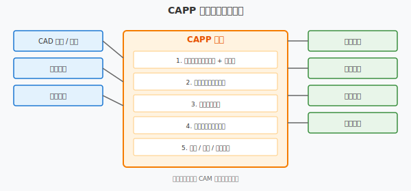

=========================
案例 C：CAPP 工艺路线设计
=========================

本案例通过一个简单轴类零件的工艺规划，展示 CAPP（计算机辅助工艺过程设计）的完整工作流程。

场景设定
========

**零件** ： 阶梯轴

**材料** ： 45# 钢（调质处理 HB 220~250）

**毛坯** ： Φ55mm × 155mm 圆钢棒料

**加工要求** ： 

+----------+-------------+------+------------+
| 部位     | 尺寸        | 公差 | 表面粗糙度 |
+==========+=============+======+============+
| 左端轴颈 | Φ40 × 50    | h6   | Ra 1.6     |
| 中间轴肩 | Φ55 × 20    | 自由 | Ra 3.2     |
| 右端轴颈 | Φ35 × 60    | h7   | Ra 1.6     |
| 中心孔   | 两端 B2.5/8 | 自由 | Ra 6.3     |
+----------+-------------+------+------------+

工艺路线设计
============



1. 毛坯选择
------------

**选择依据** ： 

- 零件为轴类，长径比 ≈ 3:1，适合棒料
- 产量小（单件/小批），不采用模锻
- 45# 钢是常用中碳钢，切削性能良好

**毛坯尺寸** ： 

- 直径：Φ55mm（最大直径 + 加工余量）
- 长度：155mm（总长 + 两端切断余量）

2. 定位基准
------------

**粗基准** ： 外圆表面（毛坯面）

- 第一道工序用三爪卡盘夹持外圆
- 加工端面和中心孔

**精基准** ： 两端中心孔

- 中心孔是轴类零件最常用的精基准
- 符合"基准统一"原则
- 可保证各轴颈的同轴度

3. 工序顺序
------------

**工序 10：下料**

- 设备：弓锯床 / 带锯床
- 内容：将 Φ55 圆钢切断至 155mm
- 注意：留 2~3mm 加工余量

**工序 20：车端面、钻中心孔**

- 设备：普通车床
- 装夹：三爪卡盘夹持外圆，伸出长度 80mm
- 内容：
  1. 车平端面（保证端面与轴线垂直）
  2. 钻中心孔 B2.5/8（GB/T 145）
  3. 调头，车另一端面，保证总长 150mm
  4. 钻另一端中心孔

**工序 30：粗车各外圆**

- 设备：普通车床（两顶尖装夹）
- 内容：
  1. 粗车 Φ40 轴颈至 Φ42，长 50
  2. 粗车 Φ55 轴肩（毛坯已是 Φ55，只需车端面）
  3. 粗车 Φ35 轴颈至 Φ37，长 60
- 余量：单边留 1~1.5mm

**工序 40：调质热处理**

- 内容：淬火 + 高温回火
- 硬度：HB 220~250
- 目的：改善切削性能，提高综合力学性能

**工序 50：半精车各外圆**

- 设备：数控车床
- 内容：
  1. 半精车 Φ40 至 Φ40.5，长 50
  2. 半精车 Φ55 轴肩端面
  3. 半精车 Φ35 至 Φ35.5，长 60
- 余量：单边留 0.2~0.3mm

**工序 60：精车各外圆**

- 设备：数控车床
- 内容：
  1. 精车 Φ40h6，长 50，Ra 1.6
  2. 精车 Φ55 轴肩端面，Ra 3.2
  3. 精车 Φ35h7，长 60，Ra 1.6
- 注意：使用刀片半径补偿（G42）

**工序 70：铣键槽** （ 假设需要）

- 设备：铣床
- 内容：在 Φ40 轴颈上铣键槽
- 注意：键槽对称度要求

**工序 80：去毛刺**

- 内容：去除所有锐边和毛刺
- 工具：倒角刀、砂纸

**工序 90：检验**

- 内容：
  1. 各轴颈直径（千分尺）
  2. 长度尺寸（游标卡尺）
  3. 同轴度（偏摆仪）
  4. 表面粗糙度（粗糙度仪）

4. 机床选择
------------

+---------------+----------+----------+--------------------+
| 工序          | 设备     | 型号示例 | 选择理由           |
+===============+==========+==========+====================+
| 下料          | 带锯床   | GZ4028   | 效率高，切口平整   |
| 车端面/中心孔 | 普通车床 | CA6140   | 通用性强，成本低   |
| 粗车/半精车   | 数控车床 | CK6140   | 效率高，精度稳定   |
| 精车          | 数控车床 | CK6140   | 保证 h6/h7 精度    |
| 检验          | 偏摆仪   | —        | 轴类零件同轴度检测 |
+---------------+----------+----------+--------------------+

5. 刀具与夹具
--------------

**刀具清单** ： 

+----------+---------------+------+------------+
| 工序     | 刀具          | 材料 | 备注       |
+==========+===============+======+============+
| 车端面   | 45° 弯头车刀  | YT15 | 主偏角 45° |
| 钻中心孔 | 中心钻 B2.5/8 | HSS  | GB/T 6078  |
| 粗车外圆 | 75° 偏刀      | YT5  | 主偏角 75° |
| 精车外圆 | 93° 偏刀      | YT30 | 陶瓷刀片   |
| 切槽     | 切刀          | YT15 | 宽 3mm     |
+----------+---------------+------+------------+

**夹具清单** ： 

+--------+-------------------+------------------+
| 工序   | 夹具              | 说明             |
+========+===================+==================+
| 车端面 | 三爪卡盘          | 通用夹具         |
| 车外圆 | 两顶尖 + 拨盘     | 轴类零件标准装夹 |
| 精车   | 两顶尖 + 弹簧夹头 | 减小夹紧变形     |
+--------+-------------------+------------------+

6. 检验要求
------------

+-------------------+---------------+-----------------+-----------------+
| 检测项            | 方法          | 工具            | 标准            |
+===================+===============+=================+=================+
| 直径 Φ40h6        | 两点法        | 外径千分尺      | 40(-0.016/-0.0) |
| 直径 Φ35h7        | 两点法        | 外径千分尺      | 35(-0.025/-0.0) |
| 长度 50/60/20     | 绝对测量      | 游标卡尺        | ±0.1            |
| 同轴度            | 打表法        | 偏摆仪 + 百分表 | ≤ 0.02          |
| 圆度              | 两点法        | 千分尺多点测量  | ≤ 0.01          |
| 表面粗糙度 Ra 1.6 | 比较法/仪器法 | 粗糙度仪        | Ra ≤ 1.6        |
+-------------------+---------------+-----------------+-----------------+

工艺卡片示例
============

.. list-table:: 工艺卡片（简化）
   :header-rows: 1
   :widths: 8 15 20 20 20 17

   * - 工序号
     - 工序名称
     - 设备
     - 装夹
     - 加工内容
     - 刀具
   * - 10
     - 下料
     - 带锯床
     - 台虎钳
     - 切断 Φ55×155
     - 锯条
   * - 20
     - 车端面钻中心孔
     - 车床 CA6140
     - 三爪卡盘
     - 端面、中心孔
     - 45°车刀、中心钻
   * - 30
     - 粗车外圆
     - 车床 CA6140
     - 两顶尖
     - 各外圆留余量
     - 75°偏刀
   * - 40
     - 调质
     - 热处理炉
     - —
     - HB 220~250
     - —
   * - 50
     - 半精车外圆
     - 数控车床
     - 两顶尖
     - 各外圆留 0.2~0.3
     - 硬质合金刀
   * - 60
     - 精车外圆
     - 数控车床
     - 两顶尖
     - Φ40h6、Φ35h7
     - 陶瓷刀片
   * - 90
     - 检验
     - 检验台
     - V 形铁
     - 全尺寸
     - 量具

与 CAD/CAM 集成的关系
======================

**传统 CAPP** ： 

- 工艺员根据经验和标准手册设计工艺
- 手工填写工艺卡片
- 效率低，一致性差

**集成化 CAPP** ： 

- CAD 模型直接导入 CAPP 系统
- 自动特征识别（孔、槽、台阶）
- 基于规则库自动推荐工艺路线
- 工艺卡片自动生成
- 与 CAM 系统联动，直接生成数控程序

**数据流** ： 

```
CAD 模型 → 特征识别 → 工艺决策 → 工序设计 → 工艺卡片 → CAM 编程
```

与课程章节的关联
================

+-------------+----------+-------------------------+
| 知识点      | 对应章节 | 说明                    |
+=============+==========+=========================+
| 成组技术    | unit6    | 轴类零件的工艺标准化    |
| 派生式 CAPP | unit6    | 基于典型轴类工艺修改    |
| 生成式 CAPP | unit6    | 自动选择加工方法和参数  |
| 数控编程    | unit7    | 精车工序的 G-code 生成  |
| 数据交换    | unit8    | CAD 特征如何传递到 CAPP |
| PDM/PLM     | unit8    | 工艺卡片的版本管理      |
+-------------+----------+-------------------------+