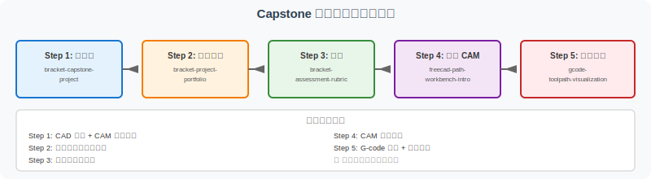
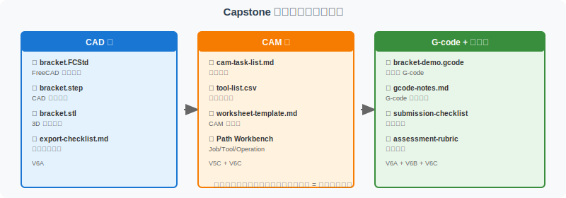

============================================
Capstone 项目线：从支架零件到作品集提交
============================================

本页面是 V6 Capstone 项目线的总入口和收口页，整合 V6A（Capstone Project）、V6B（作品集与评分）、V6C（Path Workbench），形成完整的项目制学习闭环。

A. 这条项目线解决什么问题
==========================

学完 unit1-unit8 后，你可能面临以下困惑：

- 知道 CAD 建模但不知道如何从模型到作品
- 知道 G-code 但不知道如何在真实项目中应用
- 学了很多分散的知识但没有形成可展示的项目

本项目线通过一个完整项目（支架零件），让你从需求分析到 G-code 理解形成完整闭环，并整理为可提交的作品集。

通过 V6 项目线，你可以完成：

- 一个支架零件项目（CAD + CAM + G-code）
- 一套 CAD/CAM 项目提交材料
- 一份自评与评分量规
- 一次 CAM/Path Workbench 概念理解
- 一段教学型 G-code 阅读练习

B. 五步项目制学习路线
======================

Step 1：做项目（V6A）
----------------------

- **对应页面**：:doc:`bracket-capstone-project`
- **学习目标**：理解 L 型支架的建模、导出、CAM 规划、G-code 理解完整流程
- **产出物**：
  - bracket.FCStd
  - bracket-v1.step, bracket-v1.stl
  - export-checklist.md
  - cam-task-list.md, tool-list.csv, worksheet-template.md
  - bracket.gcode, gcode-notes.md
  - reflection.md
- **完成标准**：
  - 能独立完成 5 个阶段
  - 所有必需文件齐全
  - 能解释每个文件的用途

Step 2：整理成果（V6B）
------------------------

- **对应页面**：:doc:`bracket-project-portfolio`
- **学习目标**：将零散的项目文件整理为结构化作品集
- **产出物**：
  - 9 大类项目内容
  - 完整目录结构
  - 作品集说明文档
- **完成标准**：
  - 按推荐目录结构整理项目
  - 填写项目档案模板
  - 准备可提交的作品集

Step 3：自评（V6B）
--------------------

- **对应页面**：:doc:`bracket-assessment-rubric`
- **学习目标**：用统一标准评估项目完成质量
- **产出物**：
  - 完成度自评（40 分）
  - 深度自评（35 分）
  - 创新自评（25 分）
  - 总分和等级
- **完成标准**：
  - 逐项对照评分标准
  - 给出具体分数
  - 识别改进方向

Step 4：理解 CAM（V6C）
------------------------

- **对应页面**：:doc:`freecad-path-workbench-intro`
- **学习目标**：理解 FreeCAD Path Workbench 的核心概念和数据流转
- **产出物**：
  - Job/Tool/Operation/Toolpath/Post 概念理解
  - 教学型 G-code 样例（bracket-demo-teaching.gcode）
- **完成标准**：
  - 能解释 6 个核心概念
  - 能读懂教学 G-code 的关键行
  - 理解 G-code 不可直接用于真实机床

Step 5：归档与扩展（V4A + 后续）
----------------------------------

- **对应页面**：:doc:`gcode-toolpath-visualization`
- **学习目标**：归档项目，规划后续学习
- **产出物**：
  - 完整项目档案
  - 个人作品集（GitHub、云盘）
  - 后续学习计划
- **完成标准**：
  - 项目文件已归档备份
  - 能讲解项目的关键决策
  - 明确下一步学习方向

C. 项目制产出物清单
=====================

.. list-table:: Capstone 项目产出物
   :header-rows: 1
   :widths: 18 25 20 20 17

   * - 阶段
     - 推荐产出物
     - 文件类型
     - 用途
     - 对应页面
   * - CAD 建模
     - bracket.FCStd
     - .FCStd
     - FreeCAD 原生文件
     - V6A
   * - CAD 建模
     - bracket-v1.step
     - .step
     - CAD 交换
     - V6A + V5B
   * - CAD 建模
     - bracket-v1.stl
     - .stl
     - 3D 打印
     - V6A + V5B
   * - 导出检查
     - export-checklist.md
     - .md
     - 导出检查记录
     - V6A + V5B
   * - CAM 规划
     - cam-task-list.md
     - .md
     - 工序列表
     - V6A + V5C
   * - CAM 规划
     - tool-list.csv
     - .csv
     - 刀具参数表
     - V6A + V5C
   * - CAM 规划
     - worksheet-template.md
     - .md
     - CAM 工作单
     - V6A + V5C
   * - G-code
     - bracket-demo-teaching.gcode
     - .gcode
     - 教学型 G-code
     - V6C
   * - G-code
     - gcode-notes.md
     - .md
     - G-code 解读笔记
     - V6A + V4A
   * - 作品集
     - submission-checklist.md
     - .md
     - 提交检查
     - V6B
   * - 作品集
     - assessment-rubric
     - .md
     - 评分量规
     - V6B
   * - 反思
     - reflection.md
     - .md
     - 反思笔记
     - V6A

D. Capstone 完成标准
=====================

完成本项目线后，你应该能达到以下标准：

知识理解
--------

- [ ] 能说明支架零件结构（底板、立板、孔）
- [ ] 能说明建模与导出流程（Part Design → STEP/STL）
- [ ] 能解释 STEP/STL/G-code 的层级差异
  - STEP：精确几何，CAD/CAM 交换
  - STL：三角网格，3D 打印
  - G-code：动作指令，机床执行

技能掌握
--------

- [ ] 能拆解 CAM 工序（粗加工→精加工→孔加工→倒角）
- [ ] 能选择合适的刀具和参数
- [ ] 能读懂教学型 G-code 的关键行
- [ ] 能解释 G00/G01/G81/M03/M30 的作用

项目管理
--------

- [ ] 能按作品集模板整理项目
- [ ] 能用评分量规做自评
- [ ] 能反思学习过程并记录
- [ ] 能规划后续学习方向

E. 常见学习误区
=================

在 Capstone 项目线中，初学者容易陷入以下误区：

误区 1：只完成页面阅读，没有整理作品集
-------------------------------------------

❌ **错误**：读完 V6A/V6B/V6C 页面，但没有实际整理项目文件。

✅ **正确**：完成项目后，用 :doc:`bracket-project-portfolio` 的模板整理为作品集。

误区 2：只保存模型文件，没有保存导出和检查记录
-----------------------------------------------

❌ **错误**：只保存 .FCStd 文件，不保存 STEP/STL/检查清单。

✅ **正确**：按 V6B 的目录结构保存所有必需文件。

误区 3：把 STEP/STL/G-code 混为一类文件
-----------------------------------------

❌ **错误**：认为它们都是"模型文件"，可以互相替代。

✅ **正确**：理解 STEP 用于 CAD 交换、STL 用于 3D 打印、G-code 用于机床执行，三者用途完全不同。

误区 4：忽略 CAM worksheet
---------------------------

❌ **错误**：只关注最终 G-code，不理解 CAM 规划过程。

✅ **正确**：用 :doc:`freecad-to-cam-worksheet` 认真规划每个工序的参数。

误区 5：把教学型 G-code 当成可运行生产程序
-------------------------------------------

❌ **错误**：直接把 ``bracket-demo-teaching.gcode`` 拷贝到机床运行。

✅ **正确**：理解这是教学示例，所有参数为假设值，必须经过 CAM 工程师审核才能用于实际加工。

误区 6：没有做自评和复盘
---------------------------

❌ **错误**：完成项目后就结束，没有回头看。

✅ **正确**：用 :doc:`bracket-assessment-rubric` 给自己打分，写反思笔记，规划后续学习。

F. 后续扩展方向
================

完成本项目线后，可以继续深入以下方向：

- **第二个复杂零件 Capstone**：带圆角、倒角、更多特征的零件
- **FreeCAD Path Workbench 实操截图**：为 V6C 页面补充真实操作截图
- **CadQuery 代码建模**：用 Python 代码生成 STEP 模型
- **Fusion 360 / SolidWorks / Mastercam 对照**：学习商业 CAM 软件
- **教学视频脚本**：为 Capstone 项目录制分步骤视频教程
- **真实加工验证**：在小型 CNC 上实际加工，验证教学参数

G. 与已有页面的关系
======================

本页面是 V6 项目线的总入口，链接以下页面：

- :doc:`bracket-capstone-project`：V6A 主项目页面
- :doc:`bracket-project-portfolio`：V6B 作品集提交指南
- :doc:`bracket-assessment-rubric`：V6B 评分量规
- :doc:`freecad-path-workbench-intro`：V6C Path Workbench 入门
- :doc:`gcode-toolpath-visualization`：V4A G-code 逐行解释
- :doc:`freecad-to-cam-worksheet`：V5C CAM 任务规划
- :doc:`freecad-workflow-index`：V5D 五步学习路线总览
- :doc:`../workflow-roadmap`：工具链总览

H. 推荐学习节奏
=================

.. list-table:: 推荐时间安排
   :header-rows: 1
   :widths: 20 30 50

   * - 阶段
     - 建议时长
     - 说明
   * - Step 1
     - 8-12 小时
     - 完成 5 阶段支架项目
   * - Step 2
     - 2-3 小时
     - 整理项目文件
   * - Step 3
     - 1-2 小时
     - 自评打分
   * - Step 4
     - 2-3 小时
     - 理解 Path Workbench
   * - Step 5
     - 1-2 小时
     - 归档与规划
   * - **总计**
     - **14-22 小时**
     - 分 2-3 周完成

I. 教学声明
============

本项目线是教学项目，尺寸、参数、工艺仅用于学习目的：

- 所有加工参数为教学假设值
- 所有 G-code 样例**不可直接用于真实机床**
- 实际加工必须经过 CAM 工程师审核
- 实际加工必须遵守机床操作安全规程

J. V7/V8 高级扩展
==================

V7（CadQuery 代码化建模）和 V8（Assembly 装配体）可以作为本项目线的高级扩展：

- V7C 提供了与 V6A 几何一致的代码化版本
- V8A/V8B/V8C 提供了多零件装配体的工程表达

如果已完成 V7/V8，可以阅读 :doc:`capstone-portfolio-upgrade` 学习如何把 V6/V7/V8 三条线的成果整合为一个更完整的 Capstone 作品集。
