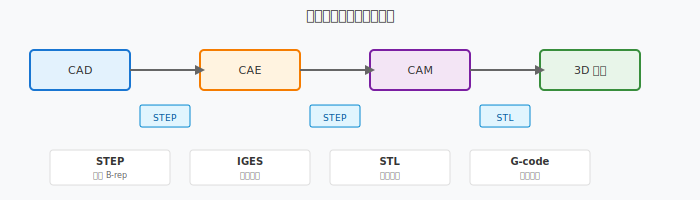

================================
案例 B：数据交换格式与跨系统协作
================================

本案例通过一个产品模型在不同系统间的流转，展示 STEP、STL、IGES、DXF 等数据交换格式的特点和使用场景。

场景设定
========

**产品** ： 无人机机臂连接件

**流转路径** ： 

1. **CAD 设计** （ SolidWorks / CATIA）→ 原始模型
2. **CAE 分析** （ ANSYS / Abaqus）→ 有限元分析
3. **CAM 编程** （ Mastercam / Fusion 360）→ 数控加工
4. **3D 打印** （ Cura / PrusaSlicer）→ 快速原型
5. **质量检测** （ Geomagic / PolyWorks）→ 逆向检测

不同格式的用途对比
====================

.. list-table:: 数据交换格式对比
   :header-rows: 1
   :widths: 15 20 20 25 20

   * - 格式
     - 全称
     - 数据结构
     - 主要用途
     - 优缺点
   * - STEP
     - ISO 10303
     - 边界表示（B-rep）
     - CAD 间精确几何交换
     - 保真度高，文件大
   * - IGES
     - Initial Graphics Exchange Specification
     - 曲线/曲面/实体
     - 历史遗留格式
     - 兼容性好，曲面易损
   * - STL
     - Stereolithography
     - 三角网格
     - 3D 打印、CAM
     - 简单通用，精度有限
   * - DXF/DWG
     - Drawing Exchange Format
     - 二维矢量
     - 二维图、激光切割
     - 轻量，无三维信息
   * - G-code
     - 无（ISO 6983）
     - 刀具路径指令
     - CNC 加工
     - 非几何，是加工指令

一个模型的流转过程
====================

步骤 1：CAD 设计（STEP / 原生格式）
------------------------------------

- 在 SolidWorks 中设计机臂连接件
- 保存为原生格式（.sldprt）
- 导出为 STEP（.stp）用于跨系统交换

**为什么选择 STEP？**

- 保留精确的 B-rep 几何信息
- 支持参数历史和特征（AP214/AP242）
- 无 vendor lock-in

步骤 2：CAE 分析（STEP → ANSYS）
----------------------------------

- ANSYS 导入 STEP 文件
- 提取几何用于网格划分
- 进行结构强度分析

**可能遇到的问题** ： 

- 小特征（倒角、圆角）导致网格过密
- 解决方案：导入前简化模型，抑制非关键特征

步骤 3：CAM 编程（STEP → Mastercam）
-------------------------------------

- Mastercam 导入 STEP 文件
- 识别加工特征（平面、孔、轮廓）
- 生成刀具路径

**STEP vs IGES 在 CAM 中的区别** ： 

+----------+----------+-----------------------------------+
| 场景     | 推荐格式 | 原因                              |
+==========+==========+===================================+
| 实体模型 | STEP     | 保留完整拓扑，特征识别更准确      |
| 复杂曲面 | IGES     | 某些老旧 CAM 系统 IGES 兼容性更好 |
| 曲面修补 | STEP     | B-rep 更精确，避免曲面缝隙        |
+----------+----------+-----------------------------------+

步骤 4：3D 打印（STL）
-----------------------

- 将 CAD 模型导出为 STL
- 在 Cura 中切片生成 G-code
- 使用 FDM 打印机制造原型

**STL 的特点** ： 

- 将曲面离散化为三角网格
- 文件简单，几乎所有 3D 打印软件都支持
- **关键参数** ： 网格分辨率（Chord Tolerance）
  - 太粗：表面呈现多边形
  - 太细：文件过大，切片慢

步骤 5：质量检测（STL / 点云）
--------------------------------

- 用三维扫描仪获取实物点云
- 导出为 STL 或点云格式
- 在 Geomagic 中与 CAD 模型对比
- 生成色差图（Deviation Map）

常见问题与解决方案
==================

单位丢失
--------

**现象** ： 导入后模型尺寸放大 25.4 倍或缩小。

**原因** ： 英寸（inch）与毫米（mm）单位混淆。

**解决** ： 

- 导出时明确指定单位
- 导入时检查单位设置
- STEP AP242 支持在单位属性中嵌入单位信息

曲面破损
--------

**现象** ： 曲面出现缝隙、重叠或丢失。

**原因** ： 

- IGES 曲面拼接精度不足
- 不同系统的容差设置不同
- 复杂曲面转换时控制点丢失

**解决** ： 

- 优先使用 STEP 而非 IGES
- 在目标系统中使用"缝合"（Stitch/Heal）功能
- 严重时需要重新建模

网格过粗
--------

**现象** ： 3D 打印件表面呈明显多边形。

**原因** ： STL 导出时 Chord Tolerance 设置过大。

**解决** ： 

- 减小 Chord Tolerance（通常 0.01mm ~ 0.05mm）
- 使用自适应细分（Adaptive Refinement）
- 对关键曲面区域局部加密

特征丢失
--------

**现象** ： 导入后孔、倒角、螺纹等特征消失。

**原因** ： 

- 格式不支持特征信息（如 STL 只有三角网格）
- 历史树丢失（STEP 不保留参数化历史）

**解决** ： 

- 需要特征识别（Feature Recognition）功能
- 使用支持 PMI（Product Manufacturing Information）的 STEP AP242
- 在目标系统中重新定义特征

后处理器不匹配
----------------

**现象** ： CAM 生成的 G-code 在某台机床上报错。

**原因** ： 

- 不同机床的 G-code 方言不同（如 Fanuc vs Siemens vs Heidenhain）
- 坐标系设置不一致
- M 代码功能不同

**解决** ： 

- 使用正确的后处理器（Post Processor）
- 在机床上进行程序验证
- 参考机床手册调整 G-code

格式选择决策树
================

.. code-block:: text

   需要交换几何数据？
   ├── 是 → 需要精确曲面/实体？
   │       ├── 是 → 使用 STEP
   │       └── 否 → 只需要三角网格？
   │               ├── 是 → 使用 STL
   │               └── 否 → 使用 IGES（遗留系统）
   └── 否 → 是加工指令？
           ├── 是 → G-code（注意后处理器）
           └── 否 → 二维图纸 → DXF/DWG

与课程章节的关联
================

+------------------+----------+------------------------------+
| 知识点           | 对应章节 | 说明                         |
+==================+==========+==============================+
| STEP / IGES 标准 | unit8    | CAD/CAM 集成的数据交换基础   |
| STL 三角网格     | unit4    | 几何模型的离散化表示         |
| G-code 后处理    | unit7    | 数控编程的最终输出           |
| 特征识别         | unit6    | CAPP 的工艺特征提取          |
| 参数化设计       | unit4    | 为什么原生格式比交换格式更好 |
+------------------+----------+------------------------------+

深入理解
========

如果想进一步理解 STEP 与 STL 的底层结构差异，可以阅读 :doc:`step-stl-mini-lab` —— 通过立方体和圆柱体对比实验，直观感受 B-rep 与三角网格的本质区别。