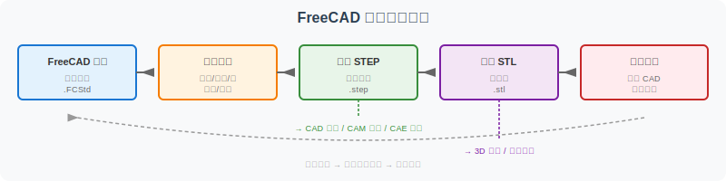
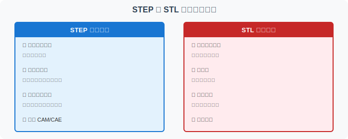

========================================
FreeCAD 导出 STEP/STL 检查清单
========================================

完成建模只是第一步，正确的导出才能确保后续流程（CAM 编程、3D 打印、CAE 分析）顺利进行。本检查清单帮助你系统验证导出结果。

为什么需要导出检查？
================================

CAD 建模成功不代表导出成功。常见误区：

- "模型看起来是对的，导出的文件就一定是对的" — 实际上单位错误、法向反转、网格过粗等问题在视图中可能不明显
- "STEP 和 STL 只是格式不同，内容一样" — 实际上它们的几何表达完全不同，适用场景也不同
- "导出一次就够了" — 实际上修改模型后需要重新导出，旧文件可能已经过期

正确理解：导出是把你的设计转换为特定下游工具能使用的数据格式，这个转换过程可能引入误差或丢失信息。

导出检查流程
================================

导出前检查
================================

.. list-table:: 导出前检查清单
   :header-rows: 1
   :widths: 20 10 35 35

   * - 检查项
     - 重要性
     - 检查方法
     - 常见问题
   * - 单位是否为毫米
     - ⭐⭐⭐
     - 查看右下角单位显示或 Edit → Preferences → General → Units
     - 误设为英寸导致尺寸放大 25.4 倍
   * - 零件尺寸是否正确
     - ⭐⭐⭐
     - 模型树中双击 Sketch 查看约束尺寸
     - 草图约束错误导致尺寸偏差
   * - 草图是否充分约束
     - ⭐⭐⭐
     - Sketcher 中查看约束图标（绿色=完全约束）
     - 欠约束会导致模型不稳定
   * - 孔是否贯穿
     - ⭐⭐⭐
     - 检查 Hole/Pocket 的 Depth 设置是否为 Through all
     - 深度不足导致盲孔而非通孔
   * - 圆角是否生成
     - ⭐⭐
     - 模型树中检查 Chamfer/Fillet 特征是否存在
     - 特征失败或参数错误
   * - 模型是否为单一实体
     - ⭐⭐
     - 查看模型树 Body 下是否只有一个 Solid
     - 多实体可能导致导出异常
   * - 原点与坐标方向
     - ⭐⭐
     - 检查草图是否以原点为中心对称
     - 坐标偏移导致后续装配困难

STEP 导出检查
================================

.. list-table:: STEP 导出验证表
   :header-rows: 1
   :widths: 22 28 25 25

   * - 检查项
     - 为什么重要
     - 正常表现
     - 常见错误
   * - 能在其他 CAD 打开
     - 验证跨系统兼容性
     - 在 FreeCAD/Blender/Fusion 中可正常显示
     - 文件损坏、版本不兼容
   * - 保留实体边界
     - STEP 的核心价值是精确几何
     - 边缘清晰、曲面光滑
     - 边缘碎化、曲面退化
   * - 保留圆柱孔/圆角曲面
     - 这些特征需要精确表达
     - 孔为完美圆柱面、圆角为平滑过渡
     - 孔变成多边形近似
   * - 适合 CAM/CAE
     - 后续加工/分析需要
     - 无自由边、无间隙、实体闭合
     - 存在破洞、面片缺失
   * - 单位正确
     - 尺寸错误会导致加工失败
     - 100 mm 的板在其他软件中仍显示 100 mm
     - 英寸/毫米混淆

STL 导出检查
================================

.. list-table:: STL 导出验证表
   :header-rows: 1
   :widths: 22 28 25 25

   * - 检查项
     - 为什么重要
     - 正常表现
     - 常见错误
   * - 网格是否过粗
     - 影响 3D 打印质量和文件大小
     - 曲面看起来平滑、圆角过渡自然
     - 圆角明显呈多边形、曲面有折线
   * - 是否存在破洞
     - 破洞会导致切片失败
     - 模型完全闭合、无红色高亮边界
     - 存在开放边界、法向不一致
   * - 法向是否反转
     - 反转面会导致打印错误
     - 所有面朝向一致（外部朝外）
     - 部分面显示为透明或颜色异常
   * - 曲面是否明显折线化
     - 影响外观和功能
     - 圆柱面近似为多边形但可接受
     - 多边形数量过少、形状失真
   * - 文件尺寸是否异常
     - 过大的文件不便传输和处理
     - 简单零件的 STL 通常在 1-10 MB
     - 精细网格导致文件超过 50 MB
   * - 是否适合 3D 打印切片
     - 最终用于打印
     - Cura/PrusaSlicer 可正常打开和切片
     - 切片报错、模型显示不完整

STEP 与 STL 验证重点对比
================================

文件命名建议
================================

推荐格式
--------

::

    <零件名>-<版本>-<精度>.<扩展名>

命名示例
--------

.. list-table:: 文件命名示例
   :header-rows: 1
   :widths: 40 60

   * - 文件名
     - 说明
   * - ``freecad-plate.FCStd``
     - FreeCAD 原生文件，无版本号（始终最新）
   * - ``freecad-plate-v1.step``
     - STEP 版本 1
   * - ``freecad-plate-v1-fine.stl``
     - 精细网格 STL（deviation 0.01 mm）
   * - ``freecad-plate-v1-coarse.stl``
     - 粗网格 STL（deviation 0.1 mm）
   * - ``freecad-plate-v1-notes.md``
     - 练习记录

命名规则
--------

- **版本号**：修改模型后递增（v1 → v2 → v3）
- **精度标记**：
  - ``fine`` = 精细网格（0.001-0.01 mm）
  - ``coarse`` = 粗网格（0.05-0.1 mm）
  - ``medium`` = 中等网格（0.02-0.05 mm）
- **避免使用**：``final``、``latest``、``ok`` 等模糊命名

导出后验证建议
================================

1. **重新打开 STEP 文件**
   - 在 FreeCAD 中重新导入，检查尺寸和形状
   - 确认关键特征（孔、圆角）是否保留

2. **用文本编辑器查看 STL**
   - 确认文件头为 ``solid ...``
   - 包含 ``facet`` 和 ``vertex`` 定义
   - 以 ``endsolid ...`` 结尾

3. **尝试切片**
   - 用 Cura 或 PrusaSlicer 打开 STL
   - 验证是否能正常切片
   - 检查切片预览是否有异常

4. **测量检查**
   - 在 FreeCAD 中测量关键尺寸
   - 确认导出未改变几何

常见错误排查
================================

错误 1：STEP 在其他 CAD 中打不开
--------------------------------------

**可能原因**：FreeCAD 版本较新，使用了其他软件不支持的新 STEP 实体

**解决方法**：尝试导出为 IGES 格式作为备选

错误 2：STL 文件太大
----------------------

**可能原因**：Surface deviation 设置过小，网格过于精细

**解决方法**：增大 deviation（如从 0.001 mm 改为 0.01 mm），重新导出

错误 3：孔在 STL 中变成多边形
--------------------------------

**可能原因**：这是正常现象，STL 用三角面片近似圆柱面

**解决方法**：如需更圆的孔，减小 deviation；如需精确圆柱，使用 STEP 格式

错误 4：导出后单位变了
------------------------

**可能原因**：FreeCAD 默认单位与目标软件不一致

**解决方法**：确保 FreeCAD 和目标软件都使用毫米（mm）

错误 5：模型在切片软件中显示为空心
--------------------------------------

**可能原因**：模型存在反向面（法向反转）或破洞

**解决方法**：在 FreeCAD 中检查模型是否为闭合实体，或使用 Mesh 修复工具

错误 6：圆角在导出后消失
----------------------------

**可能原因**：圆角特征失败或导出时未包含

**解决方法**：检查模型树中 Chamfer/Fillet 特征是否显示绿色对勾（成功状态）

导出后如何继续学习
================================

带着导出的 STEP 和 STL 文件，你可以继续：

- :doc:`freecad-plate-modeling`：回顾建模过程，检查是否有遗漏
- :doc:`step-stl-mini-lab`：深入对比 STEP 与 STL 的文件结构和本质差异
- :doc:`../workflow-roadmap`：了解这个练习在整个 CAD/CAM 工具链中的位置
- :doc:`gcode-toolpath-visualization`：了解从模型到加工代码的转换

资源包
================================

本仓库提供了配套的教学资源包：

- ``assets/freecad-plate/README.md`` — 资源包说明
- ``assets/freecad-plate/export-checklist.md`` — 完整导出检查清单（可打印）
- ``assets/freecad-plate/file-manifest.md`` — 建议文件清单
- ``assets/freecad-plate/notes-template.md`` — 练习记录模板

使用建议：打印 ``export-checklist.md``，在每次导出前逐项勾选。
