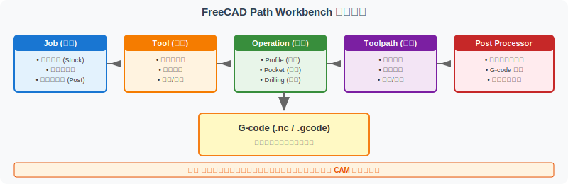
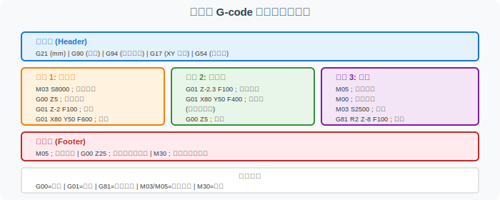

==============================================
FreeCAD Path Workbench 入门：从 Job 到 G-code
==============================================

本页面介绍 FreeCAD Path Workbench（CAM 模块）的基本概念和工作流程，帮助你理解从 CAD 模型到 G-code 输出的完整数据流转路径。

A. 什么是 Path Workbench
=========================

FreeCAD Path Workbench 是 FreeCAD 内置的 CAM（计算机辅助制造）模块。它接收你已经建好的 Part Design 3D 模型，让你在 FreeCAD 内部完成 CAM 规划，最终输出机床可识别的 G-code。

它和独立 CAM 软件（如 Mastercam、Fusion 360 CAM）的区别：

- **优点**：免费、开源、与 FreeCAD 无缝集成
- **缺点**：功能相对简单，适合教学和小批量，不适合复杂工业场景
- **定位**：学习 CAM 概念的入门工具，不是生产工具

B. Path Workbench 的核心概念
=============================

B.1 Job（任务）
---------------

Job 是 Path Workbench 中所有 CAM 操作的容器。

**创建 Job 时需要设置**：

- **毛坯（Stock）**：定义被加工件的初始尺寸（如 80×50×8 mm 板料）
- **基准面（Base）**：选择加工的参考面（通常是底面）
- **后处理输出（Post Processor Output）**：选择 G-code 输出格式

**教学示例**：

- 毛坯尺寸：80 × 50 × 8 mm
- 基准面：模型底面
- 后处理器：grbl（教学用）

B.2 Tool（刀具）
-----------------

Tool 定义加工用的刀具，包括：

- **几何参数**：直径、长度、刃数
- **切削参数**：主轴转速、进给速度
- **类型**：平底铣刀、球头铣刀、钻头、倒角刀等

**教学示例**：

- T1：Ø8 mm 平底立铣刀，2 刃
- T2：Ø12 mm 钻头

B.3 Operation（工序）
----------------------

Operation 定义具体的加工动作。常见类型：

- **Profile（轮廓铣削）**：沿外轮廓走刀
- **Pocket（型腔铣削）**：挖空内部区域
- **Drilling（钻孔）**：钻一个或多个孔
- **Face Milling（面铣）**：加工一个大面
- **Adaptive（自适应）**：高效粗加工

**教学示例**：本项目使用 Profile（外轮廓）和 Drilling（钻孔）

B.4 Toolpath（刀路）
--------------------

Toolpath 是 Operation 计算出来的刀具运动轨迹。

**参数**：

- **步距（Step Over）**：相邻刀路之间的距离
- **切削深度（Step Down）**：每层下刀的深度
- **进退刀方式**：如何进入和离开切削区域
- **安全高度（Safe Height）**：刀具快速移动的高度

**教学示例**：步距 2 mm，切削深度 1 mm/层，安全高度 5 mm

B.5 Post Processor（后处理器）
---------------------------------

Post Processor 把 FreeCAD 内部的刀路转换为特定机床能识别的 G-code 格式。

**常见后处理器**：

- **grbl**：适用于 GRBL 控制器（小型 CNC、雕刻机）
- **linuxcnc**：适用于 LinuxCNC 系统
- **smoothie**：适用于 Smoothieware 控制器
- ** Haas、Fanuc、Siemens**：工业机床专用

**教学示例**：选择 grbl 后处理器

B.6 G-code（数控代码）
-----------------------

G-code 是机床最终识别的指令序列。详细解释见 :doc:`gcode-toolpath-visualization`。

C. 工作流程示例
================

以 L 型支架底板为例：

**步骤 1：准备 CAD 模型**

确保你已经有 FreeCAD Part Design 创建的 3D 模型（参考 :doc:`bracket-capstone-project`）。

**步骤 2：切换到 Path Workbench**

在 FreeCAD 下拉菜单中选择 "Path" 工作区。

**步骤 3：创建 Job**

点击工具栏的 "Job" 按钮，设置：

- Stock：80 × 50 × 8 mm（毛坯尺寸）
- Base：模型底面

**步骤 4：添加刀具**

通过 Tool 编辑器创建：

- T1：Ø8 mm 平底立铣刀
- T2：Ø12 mm 钻头

**步骤 5：创建 Operation**

- Operation 1：Profile（外轮廓）
  - 使用 T1
  - 切削深度：8 mm（全厚）
  - 步距：2 mm
- Operation 2：Drilling（中心孔）
  - 使用 T2
  - 位置：(40, 25)
  - 深度：8 mm（贯穿）

**步骤 6：生成 G-code**

点击 "Post Process" 按钮，选择 grbl 后处理器，输出 .gcode 文件。

D. 教学型 G-code 样例
======================

本仓库提供了教学型 G-code 样例：

- 文件路径：``assets/bracket-capstone/gcode/bracket-demo-teaching.gcode``

**样例内容**：

**包含的指令**：

- **程序头**：G21, G90, G94, G17, G54
- **操作 1：粗加工**：M03, G00, G01
- **操作 2：精加工**：G01（低进给）
- **操作 3：钻孔**：M05, M00, M03, G81
- **程序尾**：M05, G00, M30

**样例结构**：

::

    G21          ; 设置单位为毫米
    G90          ; 绝对坐标模式
    ...
    M03 S8000    ; 主轴正转 8000 RPM
    G00 Z5       ; 快速抬刀
    G01 Z-2 F100 ; 下刀
    G01 X80 Y50  ; 走刀
    ...
    G81 R2 Z-8 F100  ; 钻孔循环
    M30          ; 程序结束

E. 重要警告
============

.. warning::

   本页面提供的 G-code 样例是**教学示例**，**不可直接用于真实机床加工**。

   原因：

   1. **刀具参数为假设值**：转速、进给、切削深度均为教学假设，未针对具体刀具、材料、机床优化
   2. **坐标系未验证**：G54 工件坐标系和对刀操作未经过实际验证
   3. **安全高度不够**：实际加工需要考虑夹具、压板等
   4. **无冷却液控制**：实际加工需要 M08/M09 控制切削液
   5. **无错误处理**：实际 G-code 应包含错误检测和回退逻辑

   实际加工前：

   - 必须经过 CAM 工程师审核
   - 必须在仿真软件中验证刀路
   - 必须用试切件验证参数
   - 必须遵守机床操作安全规程

F. 常见问题
============

F.1 为什么要学 FreeCAD Path Workbench？
----------------------------------------

- 概念一致：所有 CAM 软件（Mastercam、Fusion 360 CAM）都有 Job/Tool/Operation 概念
- 概念验证：可以快速验证自己的工艺思路
- 数据流理解：看到从 CAD 到 G-code 的完整转换
- 教学友好：免费、开源、容易上手

F.2 FreeCAD Path 生成的 G-code 质量如何？
------------------------------------------

对于简单零件（外轮廓、孔、简单型腔）质量足够。对于复杂零件（多面加工、5 轴联动）需要使用专业 CAM 软件。

F.3 如何选择 Post Processor？
------------------------------

根据你的机床控制器选择：

- 桌面 CNC（GRBL、Smoothie）：选 grbl 或 smoothie
- LinuxCNC 系统：选 linuxcnc
- 工业 CNC：选对应品牌（Haas、Fanuc 等）

F.4 FreeCAD Path 输出的 G-code 是绝对坐标还是相对坐标？
--------------------------------------------------------

默认是绝对坐标（G90），但可以在 Post Processor 中切换。

F.5 如何在 FreeCAD 中预览刀路？
--------------------------------

在 Toolpath 列表中点击某个 Operation，会在 3D 视图中高亮显示刀路。

G. 学习建议
============

- **先理解概念**：先看完本页所有概念（Job/Tool/Operation/Toolpath/Post）
- **再上手操作**：用 :doc:`bracket-capstone-project` 的零件，尝试在 FreeCAD 中生成 G-code
- **再深入学习**：阅读 G-code，逐行理解每个指令的含义
- **再扩展应用**：尝试更复杂的 Operation（Pocket、Adaptive）

H. 相关页面
============

- :doc:`bracket-capstone-project`：V6A 综合项目（生成 G-code 前的准备）
- :doc:`bracket-project-portfolio`：V6B 项目档案（如何提交 G-code）
- :doc:`gcode-toolpath-visualization`：V4A G-code 逐行解释
- :doc:`freecad-to-cam-worksheet`：V5C CAM 任务规划
- :doc:`freecad-workflow-index`：V5D 五步学习路线总览
- :doc:`step-stl-mini-lab`：V4B 格式对比（理解模型文件与 G-code 的区别）

I. 参考资源
============

- **官方文档**：https://wiki.freecad.org/Path_Workbench
- **教程视频**：FreeCAD 官方 YouTube 频道
- **示例文件**：FreeCAD 安装目录下的 Path 示例
- **后处理器列表**：https://github.com/FreeCAD/FreeCAD/tree/master/src/Mod/Path/PostScripts
