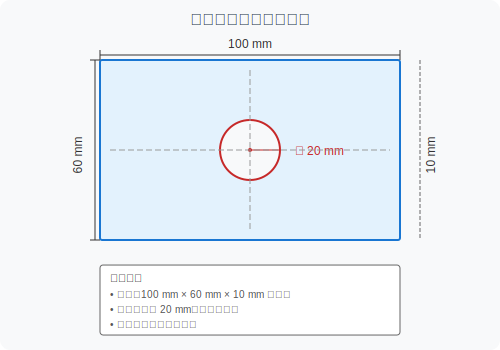
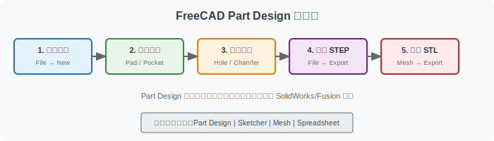
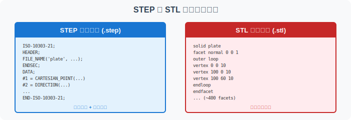

========================================
实操 Lab：用 FreeCAD 建一个带孔矩形板
========================================

本 Lab 带你完成第一个 CAD 建模实践：在 FreeCAD 中创建一个带孔的矩形板，导出 STEP 和 STL 两种格式，并对比它们的差异。

实验目标
========

1. 熟悉 FreeCAD 的 Part Design 工作区基本操作
2. 理解"基于特征的参数化建模"流程
3. 掌握 STEP 和 STL 的导出方法
4. 直观感受两种格式的文件结构差异
5. 为后续阅读 :doc:`step-stl-mini-lab` 建立实践基础

准备环境
========

软件：FreeCAD <https://www.freecad.org/downloads.php>`_（免费开源，支持 Windows/macOS/Linux）

建议版本 ： 0.20 或更新版本

预计时间 ： 30-45 分钟（首次使用 FreeCAD 可能需要额外时间熟悉界面）

零件规格
========

**几何参数**：

- 外形：100 mm × 60 mm × 10 mm 矩形板
- 通孔：直径 20 mm，位于板中心（距两边各 50 mm × 30 mm）
- 材料：不限（本次练习仅关注几何形状）

FreeCAD 建模步骤
================

步骤 1：新建文档并进入 Part Design 工作区
------------------------------------------

1. 打开 FreeCAD
2. 点击 File → New（或 Ctrl+N）新建一个空白文档
3. 在工作区选择器（界面中央上方或左侧面板）中选择 Part Design
4. 点击 Create body 按钮创建一个 Body（实体容器）

步骤 2：创建基础草图（Sketch）
-------------------------------

1. 在左侧的 Tasks 面板中，点击 Create sketch
2. 选择 XY_Plane（或 Base Plane 中的 XY 平面）作为草图平面，点击 OK
3. 现在进入了 Sketcher 工作区

**绘制矩形**：

1. 点击工具栏上的 Create rectangle 图标
2. 在原点附近点击一下确定第一个角点
3. 移动鼠标，在右上方再点击一下确定对角点
4. 按 Esc 键结束矩形绘制

**标注尺寸**：

1. 点击 Dimension（约束尺寸）图标
2. 点击矩形底边，输入 100 mm，按 Enter
3. 点击矩形左边，输入 60 mm，按 Enter
4. 点击矩形的两个相邻顶点，然后点击原点，选择 Symmetric constraint（对称约束），使矩形中心与原点重合

.. note::
   如果对称约束操作不熟悉，可以：先画矩形 → 标注 100 mm 和 60 mm → 选择矩形中心和原点 → 添加 Coincident constraint（重合约束），使矩形中心位于原点。

**关闭草图**：

点击 Close 按钮（或按 Esc 后点击左上角的 Close），退出 Sketcher 回到 Part Design。

步骤 3：拉伸为三维实体（Pad）
------------------------------

1. 确保左侧模型树中选中了刚创建的 Sketch
2. 点击工具栏上的 Pad（拉伸）图标
3. 在弹出的任务面板中：
   - Type ： Dimension
   - Length ： 输入 **10 mm**
4. 点击 OK

现在你应该看到一个 100×60×10 mm 的蓝色矩形块。

步骤 4：在顶面创建孔的草图
----------------------------

1. 点击 **Create a new sketch** 图标
2. 选择矩形块的**顶面**（Z 轴正方向的面）作为草图平面，点击 OK
3. 进入 Sketcher 工作区

**绘制圆**：

1. 点击 **Create circle** 图标
2. 点击原点（矩形中心）作为圆心
3. 移动鼠标确定半径，再点击一下

**标注直径**：

1. 点击 Dimension 图标
2. 点击圆周
3. 输入 **20 mm**，按 Enter

**关闭草图**：

点击 Close 退出 Sketcher。

步骤 5：创建通孔（Pocket / Hole）
----------------------------------

**方法一：使用 Pocket**

1. 选中刚创建的圆的 Sketch
2. 点击工具栏上的 Pocket（挖槽）图标
3. 在任务面板中：
   - Type ： Through all（贯穿全部）
4. 点击 OK

现在你应该看到矩形板中心有一个直径 20 mm 的通孔。

**方法二：使用 Hole 特征（推荐）**

1. 选中顶面的圆形草图
2. 点击工具栏上的 Hole 图标
3. 在任务面板中：
   - Profile ： Drilled（钻孔）
   - Diameter ： 20 mm
   - Depth ： Through all（贯穿）
4. 点击 OK

保存文件
--------

点击 File → Save，将文件保存为 ``plate-with-hole.FCStd``。

导出 STEP 格式
==============

STEP 格式保留了精确几何和拓扑信息，适合 CAD 系统间的数据交换。

导出步骤
--------

1. 点击 File → Export
2. 在文件类型下拉框中选择 **STEP with colors (*.step *.stp)** 或 **STEP (*.step *.stp)**
3. 输入文件名 ``plate.step``
4. 点击 **Save**

验证导出
--------

用文本编辑器（如 VS Code、Notepad++）打开 ``plate.step``，观察以下内容：

.. code-block:: text
   :linenos:

   ISO-10303-21;
   HEADER;
     FILE_DESCRIPTION((''), '2;1');
     FILE_NAME('plate.step', '2024-...', ...);
   ENDSEC;
   DATA;
     #1 = CARTESIAN_POINT('', (0., 0., 0.));
     #2 = DIRECTION('', (0., 0., 1.));
     ...
   END-ISO-10303-21;

**检查清单**：

- [ ] 文件以 ``ISO-10303-21;`` 开头
- [ ] 包含 ``HEADER`` 和 ``DATA`` 两个主要部分
- [ ] 能找到 ``CARTESIAN_POINT``、``DIRECTION`` 等几何实体
- [ ] 能找到描述圆柱面（孔）的相关实体

导出 STL 格式
=============

STL 格式将实体表面近似为三角面片，是 3D 打印机的标准输入格式。

导出步骤
--------

1. 先切换到 Mesh Design 工作区（工作区选择器）
2. 在模型树中选中 Body（或最终的实体）
3. 点击菜单 Meshes → Create Mesh from Shape...
4. 在弹出的对话框中：
   - **Meshing** ： Standard
   - Surface deviation ： 0.01 mm（越小越精确，文件越大）
   - 勾选 **Apply** 然后点击 OK
5. 在模型树中会出现一个新的 Mesh 对象
6. 选中 Mesh 对象
7. 点击 File → Export
8. 选择 **Mesh formats (*.stl *.ast *.bms ...)**
9. 输入文件名 ``plate.stl``
10. 点击 **Save**

.. note::
   较新版本的 FreeCAD 也可以在 Part 工作区直接通过 File → Export 导出 STL，系统会自动进行网格化。

验证导出
--------

用文本编辑器打开 ``plate.stl`` （ASCII 格式），观察以下内容：

.. code-block:: text
   :linenos:

   solid plate
     facet normal 0 0 1
       outer loop
         vertex 0 0 10
         vertex 100 0 10
         vertex 100 60 10
       endloop
     endfacet
     ...
   endsolid plate

**检查清单**：

- [ ] 文件以 solid ... 开头，以 endsolid ... 结尾（ASCII STL 格式标志）
- [ ] 包含多个 ``facet`` （三角面片）定义
- [ ] 每个 facet 包含 ``outer loop`` 和 3 个 ``vertex`` 

STEP 与 STL 对比
================

对比维度
--------

.. list-table:: STEP vs STL 导出结果对比
   :header-rows: 1
   :widths: 20 40 40

   * - 对比项
     - STEP (.step)
     - STL (.stl)
   * - 文件大小
     - 通常较小（精确描述）
     - 通常较大（大量三角面）
   * - 几何精度
     - 精确（数学方程描述）
     - 近似（三角面片逼近）
   * - 孔的边缘
     - 完美的圆（圆柱面方程）
     - 多边形近似（取决于细分精度）
   * - 可编辑性
     - 可导入其他 CAD 继续编辑
     - 难以修改特征和参数
   * - 主要用途
     - CAD 交换、CAM 编程
     - 3D 打印、快速原型

**思考题**：

1. 你的 ``plate.step`` 和 ``plate.stl`` 文件大小分别是多少？
2. STL 文件中大约有多少个三角面？（搜索 ``facet`` 出现的次数）
3. 如果将 Surface deviation 改为 0.1 mm（更粗糙），STL 文件大小会如何变化？
4. 为什么 3D 打印机需要 STL 而不是 STEP？

练习检查清单
============

**建模完成**：

- [ ] FreeCAD 中创建了 100×60×10 mm 的矩形板
- [ ] 矩形板中心有直径 20 mm 的通孔
- [ ] 文件保存为 ``plate-with-hole.FCStd``

**STEP 导出**：

- [ ] 成功导出 ``plate.step``
- [ ] 能用文本编辑器打开并识别文件结构
- [ ] 能找到描述圆柱面的几何实体

**STL 导出**：

- [ ] 成功导出 ``plate.stl``
- [ ] 能用文本编辑器打开并识别文件结构
- [ ] 能数出三角面片的大致数量

**理解验证**：

- [ ] 能解释 STEP 和 STL 的文件大小差异原因
- [ ] 能说出 STEP 的两个主要用途
- [ ] 能说出 STL 的两个主要用途
- [ ] 知道在 FreeCAD 中如何修改孔的位置或直径（回到 Sketch 修改尺寸）

进阶挑战（可选）
================

完成基础练习后，可以尝试：

**挑战 1：改变孔的位置**

1. 双击 Hole 特征之前的 Sketch（顶面圆）
2. 修改圆心位置，使孔偏离中心（如 X=30, Y=20）
3. 观察模型如何自动更新
4. 重新导出 STEP 和 STL，对比文件变化

**挑战 2：增加倒角**

1. 回到 Part Design 工作区
2. 选中顶面的四条边
3. 点击 **Chamfer** （倒角）图标
4. 设置倒角尺寸为 2 mm
5. 观察导出 STL 后三角面数量的变化

**挑战 3：对比不同偏差设置**

1. 分别用 Surface deviation = 0.1 mm、0.01 mm、0.001 mm 导出 STL
2. 记录每个文件的三角面数量和文件大小
3. 思考：更小的 deviation 意味着什么？

相关页面
========

- :doc:`step-stl-mini-lab`：更深入地理解 STEP 与 STL 格式的本质差异
- :doc:`../workflow-roadmap`：了解这个练习在整个 CAD/CAM 工具链中的位置
- :doc:`cad-to-gcode`：了解从 CAD 模型到加工代码的完整流程

常见问题
========

**Q：FreeCAD 界面全是英文，可以切换中文吗？**

A：可以。Edit → Preferences → General → Language，选择 Chinese (Simplified)，重启 FreeCAD。

**Q：Sketcher 中约束变红是什么意思？**

A：红色表示**过约束**（Over-constrained）——你给同一个几何元素添加了互相冲突的约束。删除多余的约束即可。

**Q：为什么我的孔不是通孔？**

A：检查 Pocket/Hole 的深度设置。确保选择了 "Through all" 或深度大于板厚（10 mm）。

**Q：导出 STL 时提示 "No mesh selected" 怎么办？**

A：确保先在 Mesh Design 工作区中通过 **Create Mesh from Shape** 创建了网格对象，然后选中该网格对象再导出。

**Q：可以在 FreeCAD 中直接生成 G-code 吗？**

A：FreeCAD 有 Path（CAM）工作区可以生成刀具路径和 G-code，但功能相对基础。对于专业加工，通常使用 Mastercam、Fusion CAM 等专用 CAM 软件。
