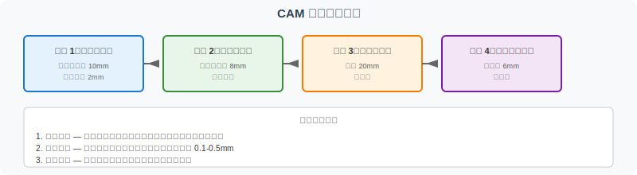
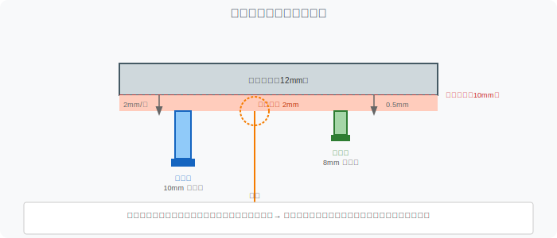

========================================
FreeCAD 到 CAM 加工任务单
========================================

本页面帮助读者在 FreeCAD 建模和导出完成后，理解如何为零件规划 CAM 加工任务，并为后续 G-code 学习做好准备。

练习目标
========

完成本练习后，读者应能理解：

1. **CAM 前置准备**: 建模完成后需要检查哪些内容才能进入 CAM
2. **加工任务拆解**: 如何将一个零件的加工需求分解为若干工序
3. **刀具与参数选择**: 根据零件特征（平面、通孔、圆角）选择合适的刀具和加工参数
4. **加工顺序规划**: 为什么先粗加工后精加工、先面后孔
5. **与 G-code 的衔接**: CAM 生成的刀路如何转化为 G-code 指令

零件设定
========

本练习延续 V5A 的零件。

.. list-table:: 零件参数
   :header-rows: 1
   :widths: 30 70

   * - 参数
     - 值
   * - 长度
     - 100 mm
   * - 宽度
     - 60 mm
   * - 厚度
     - 10 mm
   * - 中心孔直径
     - 20 mm
   * - 材质
     - 铝合金（6061-T6）
   * - 加工方式
     - 3 轴 CNC 铣床

注意：以上尺寸和材质仅用于学习目的，不是工程图纸。实际加工请参考专业工艺文件。

CAM 前置检查
============

在进入 CAM 之前，需要确认以下条件。

.. list-table:: CAM 前置检查表
   :header-rows: 1
   :widths: 25 40 35

   * - 检查项
     - 为什么重要
     - 检查方法
   * - 模型是闭合实体
     - CAM 软件需要实体模型计算刀路
     - 在 FreeCAD 中确认模型树显示 Solid
   * - 尺寸已确定
     - 加工参数（切削深度、进给）与尺寸相关
     - 对照尺寸要求确认
   * - 坐标原点清晰
     - 原点位置影响 G-code 的坐标值
     - 确认原点在零件的哪个角或中心
   * - 材料已选定
     - 不同材料的切削参数差异很大
     - 确定材质（铝合金/钢/塑料）
   * - 机床能力已知
     - 机床行程、主轴转速限制加工方案
     - 了解机床的最大行程和最高转速
   * - 夹具方案可行
     - 零件如何固定影响加工顺序
     - 考虑用虎钳、压板或真空吸盘

加工任务拆解
============

对于本零件，典型的加工任务拆解如下。

工序 1：顶面粗加工
-------------------

**目的**：去除毛坯余量，使顶面接近目标高度。

**加工区域**：整个 100 mm × 60 mm 顶面

**推荐策略**：

- 刀具：平底立铣刀，直径 10 mm
- 主轴转速：8000 RPM（铝合金）
- 进给速度：1200 mm/min
- 切削深度（Z 向）：2 mm/层
- 总厚度去除：从毛坯 12 mm 加工到 10 mm，去除 2 mm
- 步距（XY 向）：6 mm（刀具直径的 60%）

**刀路类型**：平行铣削或等高轮廓铣削

工序 2：顶面精加工
-------------------

**目的**：达到最终尺寸精度和表面质量。

**加工区域**：整个顶面

**推荐策略**：

- 刀具：平底立铣刀，直径 8 mm
- 主轴转速：10000 RPM
- 进给速度：800 mm/min
- 切削深度（Z 向）：0.5 mm（最后一次精加工）
- 步距（XY 向）：0.5 mm（小步距获得好表面）

工序 3：中心孔加工
-------------------

**目的**：加工直径 20 mm 的通孔。

**加工区域**：圆孔区域

**推荐策略**：

- 刀具：钻头，直径 20 mm
- 主轴转速：2500 RPM
- 进给速度：100 mm/min
- 加工方式：直接钻孔（孔径较小，无需螺旋铣）
- 深度：贯穿（Through all）

**替代策略** （如没有 20 mm 钻头）：

- 粗加工：先用 10 mm 钻头打中心孔
- 精加工：用 20 mm 平底立铣刀螺旋铣削扩孔

工序 4：圆角倒角（可选）
--------------------------

**目的**：去除锐边，防止割伤或应力集中。

**加工区域**：顶面四条边缘

**推荐策略**：

- 刀具：倒角刀（Chamfer mill）或圆角刀
- 主轴转速：6000 RPM
- 进给速度：500 mm/min
- 倒角尺寸：1 mm × 45°

加工顺序逻辑
============

为什么是这个顺序？

1. **先面后孔**
   - 平面是基准，先加工平面再加工孔可以确保孔的位置精度
   - 如果先钻孔，铣平面时可能破坏孔口

2. **先粗后精**
   - 粗加工去除大部分材料，但表面粗糙
   - 精加工只去除少量材料（0.1-0.5 mm），获得最终精度
   - 反过来做：精加工后再粗加工会破坏已精加工的表面

3. **先主后次**
   - 顶面和孔是主要特征，倒角是次要特征
   - 次要特征加工时若出错，不影响主要功能

加工工序流程图
==============

刀具与下切深度图
================

刀具与参数参考表
================

.. list-table:: 刀具参数参考表
   :header-rows: 1
   :widths: 18 15 12 12 15 15 13

   * - 工序
     - 刀具类型
     - 直径
     - 转速
     - 进给速度
     - 切削深度
     - 步距
   * - 顶面粗加工
     - 平底立铣刀
     - 10 mm
     - 8000 RPM
     - 1200 mm/min
     - 2 mm
     - 6 mm
   * - 顶面精加工
     - 平底立铣刀
     - 8 mm
     - 10000 RPM
     - 800 mm/min
     - 0.5 mm
     - 0.5 mm
   * - 中心孔
     - 钻头
     - 20 mm
     - 2500 RPM
     - 100 mm/min
     - 贯穿
     - 不适用
   * - 倒角（可选）
     - 倒角刀
     - 6 mm
     - 6000 RPM
     - 500 mm/min
     - 1 mm
     - 不适用

注意：以上参数为学习参考值，实际加工需根据机床、刀具、材料调整。高速加工请遵循安全规程。

Worksheet 填写区
================

以下内容由读者根据实际加工情况填写。

零件信息
--------

- **零件名称**: ________________________________
- **材质**: ________________________________
- **毛坯尺寸**: ____ mm × ____ mm × ____ mm
- **目标尺寸**: ____ mm × ____ mm × ____ mm
- **填写日期**: ____年____月____日

机床信息
--------

- **机床型号**: ________________________________
- **最大行程**: X ____ / Y ____ / Z ____ mm
- **最高主轴转速**: ____ RPM
- **刀库容量**: ____ 把

工序 1：顶面粗加工（填写）
---------------------------

.. list-table:: 工序 1 填写表
   :header-rows: 1
   :widths: 30 70

   * - 项目
     - 内容
   * - 加工区域
     - 
   * - 刀具类型
     - 
   * - 刀具直径
     - ____ mm
   * - 刀具编号（刀库）
     - T____
   * - 主轴转速
     - ____ RPM
   * - 进给速度
     - ____ mm/min
   * - 切削深度（Z 向每层）
     - ____ mm
   * - 步距（XY 向）
     - ____ mm
   * - 刀路策略
     - 
   * - 预估时间
     - ____ 分钟

工序 2：顶面精加工（填写）
---------------------------

.. list-table:: 工序 2 填写表
   :header-rows: 1
   :widths: 30 70

   * - 项目
     - 内容
   * - 加工区域
     - 
   * - 刀具类型
     - 
   * - 刀具直径
     - ____ mm
   * - 主轴转速
     - ____ RPM
   * - 进给速度
     - ____ mm/min
   * - 切削深度
     - ____ mm
   * - 步距
     - ____ mm
   * - 预估时间
     - ____ 分钟

工序 3：孔加工（填写）
-----------------------

.. list-table:: 工序 3 填写表
   :header-rows: 1
   :widths: 30 70

   * - 项目
     - 内容
   * - 孔直径
     - ____ mm
   * - 刀具类型
     - 
   * - 主轴转速
     - ____ RPM
   * - 进给速度
     - ____ mm/min
   * - 加工方式
     - 
   * - 预估时间
     - ____ 分钟

检查清单
--------

- [ ] 先面后孔（平面加工在孔加工之前）
- [ ] 先粗后精（粗加工在精加工之前）
- [ ] 换刀顺序合理（尽量减少换刀次数）
- [ ] 夹具不会与刀具干涉
- [ ] 加工顺序已优化（减少空行程）
- [ ] 刀具长度补偿已设置
- [ ] 工件坐标系（G54）已设定
- [ ] 主轴转速不超过机床上限
- [ ] 进给速度适合当前刀具和材料
- [ ] 已模拟刀路（如有条件）

问题记录
--------

.. list-table:: 问题与解决
   :header-rows: 1
   :widths: 40 40 20

   * - 问题描述
     - 解决方法
     - 是否解决
   * - 
     - 
     - 
   * - 
     - 
     - 
   * - 
     - 
     - 

与 G-code 的衔接
================

CAM 软件在完成上述刀路计算后，会生成 G-code 程序。读者可以继续阅读 :doc:`gcode-toolpath-visualization`，理解：

- **G00/G01**：快速定位和直线插补（对应粗加工和精加工的直线刀路）
- **G02/G03**：圆弧插补（对应圆孔的螺旋铣削）
- **G81/G83**：钻孔循环（对应中心孔加工）
- **M03/M05**：主轴启动/停止（对应每次换刀和加工结束）

理解 CAM 任务规划有助于读者在读到 G-code 时，知道这段代码对应的是哪个工序。

如果你有 FreeCAD 经验，可以参考 :doc:`freecad-path-workbench-intro` 使用 FreeCAD 内置的 Path Workbench 实际生成 G-code。

进阶思考
========

1. **如果零件厚度改为 20 mm，加工策略需要改变吗？**
   - 顶面粗加工的层数会增加（从 1 层增加到更多层）
   - 中心孔仍为通孔，但钻孔深度增加，可能需要啄钻（Peck drilling）

2. **如果要求孔的位置公差 ±0.05 mm，需要增加什么工序？**
   - 可能需要先钻小孔（如 10 mm），再用铰刀精加工到 20 mm
   - 或者使用坐标镗床进行精加工

3. **如果机床没有 20 mm 钻头，如何用立铣刀加工这个孔？**
   - 使用螺旋铣削（Helical interpolation）：刀具沿螺旋路径下切，逐渐扩大孔径
   - 需要 CAM 软件支持螺旋铣削策略

相关页面
========

- :doc:`freecad-plate-modeling`：回顾零件建模过程
- :doc:`freecad-export-checklist`：确认导出文件质量可靠
- :doc:`step-stl-mini-lab`：理解 STEP 模型如何用于 CAM
- :doc:`gcode-toolpath-visualization`：逐行理解 CAM 生成的 G-code
- :doc:`../workflow-roadmap`：了解这个练习在整个 CAD/CAM 工具链中的位置

工作单模板
==========

本仓库提供了配套的 CAM 工作单模板：

- ``assets/freecad-plate/cam-worksheet/README.md`` — 工作单包说明
- ``assets/freecad-plate/cam-worksheet/worksheet-template.md`` — 工作单填写模板
- ``assets/freecad-plate/cam-worksheet/tool-list.csv`` — 刀具参数参考表

使用建议：根据实际零件尺寸和机床能力，填写 worksheet 空白项。
