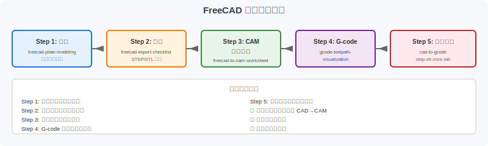
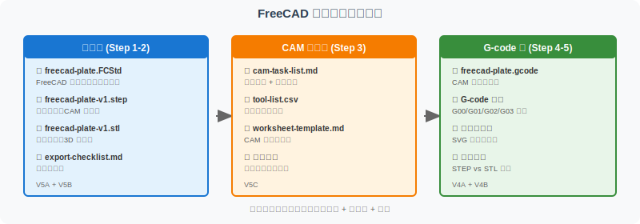

========================================
FreeCAD 实操五步学习路线
========================================

本页面是 FreeCAD 实操线的总入口和收口页。如果你已经完成了 V5A 建模、 V5B 导出检查、 V5C CAM 任务规划，请回到这里确认掌握情况，并进入完整链路学习。

如果你刚开始学习，建议按本页的五步顺序逐步完成。

为什么需要五步学习路线？
==========================

CAD/CAM 学习常见困惑：

- 看完教程但不知道下一步该学什么
- 不知道建模、导出、CAM、G-code 之间如何串联
- 不知道每一步的产出物是什么、学到什么程度算"会了"
- 学了某个环节但不知道它在完整链路中的位置

本页面通过五步学习路线，回答这些问题，让你完成 V5A-V5C + V4A-V4B 后，能独立完成"从 FreeCAD 建模到 G-code 理解"的完整学习闭环。

五步学习路线
============

Step 1：建模（V5A）
-------------------

**页面**：:doc:`freecad-plate-modeling`

**学习内容**：

- FreeCAD Part Design 工作区使用
- 草图绘制（矩形、圆）
- 几何约束和尺寸约束
- 拉伸（Pocket）操作
- 孔特征（Pocket on Sketch）

**产出物**：

- ``freecad-plate.FCStd`` （FreeCAD 原生文件）
- 完成带孔矩形板的参数化建模

**完成标准**：

- [ ] 能独立创建 100mm × 60mm × 10mm 矩形板
- [ ] 能添加 Ø20mm 居中通孔
- [ ] 草图完全约束（绿色对勾）
- [ ] 能通过修改尺寸参数化更新模型

Step 2：导出（V5B）
-------------------

**页面**：:doc:`freecad-export-checklist`

**学习内容**：

- STEP 与 STL 格式本质差异
- 导出前检查清单（单位、尺寸、约束、孔、圆角）
- STEP 验证（实体边界、圆柱孔、CAM/CAE 适用）
- STL 验证（网格密度、破洞、法向、切片）
- 文件命名规范
- 常见错误排查（6 个典型问题）

**产出物**：

- ``freecad-plate-v1.step`` （精确几何）
- ``freecad-plate-v1.stl`` （三角网格）
- ``export-checklist.md`` （检查记录）

**完成标准**：

- [ ] 能在其他 CAD 软件中打开 STEP 文件
- [ ] STL 文件能在切片软件中正常切片
- [ ] 理解 STEP 与 STL 的适用场景差异
- [ ] 能命名规范的版本化文件

Step 3：CAM 任务规划（V5C）
----------------------------

**页面**：:doc:`freecad-to-cam-worksheet`

**学习内容**：

- CAM 前置检查（6 项）
- 加工任务拆解（粗加工、精加工、孔加工、倒角）
- 加工顺序逻辑（先面后孔、先粗后精、先主后次）
- 刀具与参数选择
- Worksheet 填写规范

**产出物**：

- ``cam-task-list.md`` （工序列表）
- ``tool-list.csv`` （刀具参数表）
- ``worksheet-template.md`` （填写的 CAM 工作单）

**完成标准**：

- [ ] 能识别零件需要哪几个工序
- [ ] 能为每个工序选择合适的刀具和参数
- [ ] 能解释"先面后孔、先粗后精"的工艺逻辑
- [ ] 能填写完整的 CAM 任务单

Step 4：G-code 理解（V4A）
--------------------------

**页面**：:doc:`gcode-toolpath-visualization`

**学习内容**：

- G-code 基础指令（G00/G01/G02/G03）
- 钻孔循环（G81/G83）
- 辅助功能（M03/M05/M08）
- 逐行解读数控程序
- 路径可视化（SVG 刀具路径图）

**产出物**：

- 能阅读 G-code 程序并理解每行含义
- 能在脑中"看到"机床的运动轨迹

**完成标准**：

- [ ] 能区分 G00（快速定位）和 G01（直线插补）
- [ ] 能理解 G02/G03（顺/逆时针圆弧）
- [ ] 能解释 M03（主轴正转）和 M05（主轴停止）
- [ ] 能对应 G-code 指令到 Step 3 的工序

Step 5：全链路整合（V4B + 综合）
----------------------------------

**页面**：:doc:`step-stl-mini-lab` + :doc:`cad-to-gcode`

**学习内容**：

- STEP 与 STL 格式结构对比
- 数据流转：模型 → 工艺 → 加工
- 工具链角色整合

**产出物**：

- 能独立完成"零件 → STEP → CAM → G-code"的学习闭环
- 能根据下游环节选择合适的数据格式

**完成标准**：

- [ ] 能解释为什么 STEP 用于 CAD 交换、STL 用于 3D 打印
- [ ] 能用文本编辑器阅读 STEP 和 STL 文件结构
- [ ] 理解全链路各环节的输入输出

全链路产出物表
==============

完成五步后，你将获得以下产出物：

.. list-table:: 全链路产出物清单
   :header-rows: 1
   :widths: 15 30 35 20

   * - 步骤
     - 文件/产出
     - 用途
     - 版本
   * - Step 1
     - ``freecad-plate.FCStd``
     - FreeCAD 原生文件（可继续编辑）
     - V5A
   * - Step 2
     - ``freecad-plate-v1.step``
     - 精确几何（CAD 交换、CAM 入口）
     - V5B
   * - Step 2
     - ``freecad-plate-v1.stl``
     - 三角网格（3D 打印、预览）
     - V5B
   * - Step 2
     - ``export-checklist.md``
     - 导出检查记录
     - V5B
   * - Step 3
     - ``cam-task-list.md``
     - 工序拆解与顺序
     - V5C
   * - Step 3
     - ``tool-list.csv``
     - 刀具参数参考
     - V5C
   * - Step 3
     - ``worksheet-template.md``
     - CAM 任务单填写
     - V5C
   * - Step 4
     - ``freecad-plate.gcode``
     - 数控加工程序
     - V4A
   * - Step 5
     - 格式对比笔记
     - STEP vs STL 理解
     - V4B

初学者完成标准
==============

如果你刚学完 unit1-unit8，建议达到以下标准后再进入进阶内容：

建模能力
--------

- [ ] 能使用 FreeCAD/Fusion/SolidWorks 任一软件完成简单零件建模
- [ ] 理解草图约束（完全约束 vs 欠约束 vs 过约束）
- [ ] 能创建拉伸、旋转、扫描、放样等基本特征
- [ ] 能创建孔、圆角、倒角等修饰特征

导出能力
--------

- [ ] 能根据下游需求选择 STEP/STL/IGES 格式
- [ ] 能检查导出文件是否正确（打开、测量、对比）
- [ ] 理解文件命名规范和版本管理
- [ ] 知道常见导出错误及排查方法

CAM 规划能力
-------------

- [ ] 能识别零件的加工特征（面、孔、槽、圆角）
- [ ] 能规划加工顺序（粗→精、面→孔、主→次）
- [ ] 能选择合适的刀具类型和参数
- [ ] 能填写完整的 CAM 任务单

G-code 理解能力
-----------------

- [ ] 能阅读简单 G-code 程序
- [ ] 理解 G00/G01/G02/G03 等基础指令
- [ ] 理解 M 代码（主轴、冷却液、换刀）
- [ ] 能在脑中将 G-code 映射到机床动作

数据流转认知
-------------

- [ ] 理解 CAD → CAM → CNC 的数据流
- [ ] 知道每个环节的输入、输出、工具选择
- [ ] 能根据下游环节选择合适的数据格式
- [ ] 理解 PDM/PLM 在系统集成中的作用

---

**如果你所有项目都已勾选 ✓**：

恭喜！你已经具备 FreeCAD 实践的完整学习闭环。可以继续：

- 深入某个具体软件（Mastercam、Fusion 360 CAM 等）
- 学习多轴加工（4 轴/5 轴）
- 学习后处理（Post-processor）定制
- 阅读真实工业案例

**如果你有些项目未勾选**：

建议回到对应的 Step 重新学习。可以用本页作为 checklist，标记自己的掌握情况。

---

相关页面
========

- :doc:`freecad-plate-modeling`：Step 1 建模
- :doc:`freecad-export-checklist`：Step 2 导出检查
- :doc:`freecad-to-cam-worksheet`：Step 3 CAM 任务规划
- :doc:`gcode-toolpath-visualization`：Step 4 G-code 理解
- :doc:`step-stl-mini-lab`：Step 5 格式对比
- :doc:`cad-to-gcode`：Step 5 全链路整合
- :doc:`../workflow-roadmap`：工具链总览
- :doc:`../release-showcase`：版本发布说明
