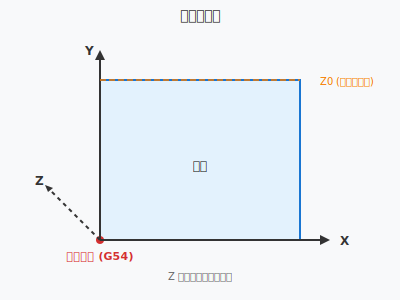
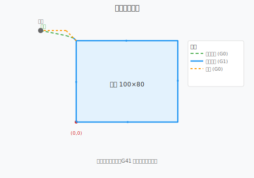
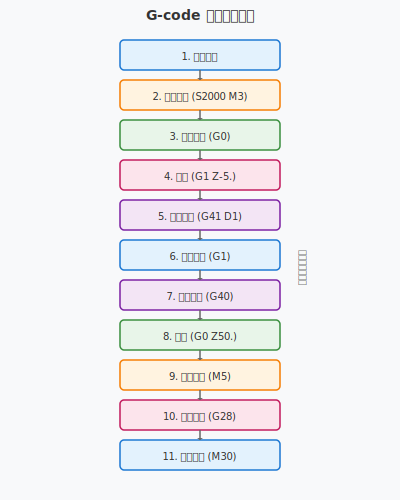

====================================
G-code 路径可视化：从指令到动作
====================================

本页面通过图示和逐行解释，帮助你理解 G-code 程序如何控制机床完成加工动作。

坐标系与工件原点
================

**关键概念**

- **机床坐标系**：机床出厂时固定的坐标系，原点通常在机床极限位置
- **工件坐标系（G54）**：操作者设定的坐标系，原点通常设在工件上表面中心或角点
- **绝对编程（G90）**：所有坐标值相对于工件原点
- **Z0 的含义**：工件上表面，Z 负方向向下进入材料

教学示例：矩形轮廓加工
=========================

**场景**：在一块 100mm × 80mm 的矩形板上，加工一个矩形外轮廓。

**坐标设定**：

- 工件原点：矩形左下角（X=0, Y=0）
- Z0：工件上表面
- 切削深度：Z=-5mm

G-code 程序
-----------

.. code-block:: gcode
   :linenos:

   O1000 (SIMPLE_RECTANGLE)
   G21 G90 G54 G40 G80
   T1 M6
   S2000 M3
   G0 X-5. Y-5. Z50.
   G1 Z-5. F100.
   G41 D1
   G1 X0. Y0. F300.
   Y80.
   X100.
   Y0.
   X0.
   G40
   G0 Z50.
   M5
   G28 G91 Z0.
   G28 X0. Y0.
   M30

逐行解释
--------

.. list-table:: G-code 逐行解释
   :header-rows: 1
   :widths: 8 25 25 25 17

   * - 行号
     - G-code 内容
     - 含义
     - 机床动作
     - 初学者提示
   * - 1
     - O1000 (SIMPLE_RECTANGLE)
     - 程序号与注释
     - 无动作，仅标识程序
     - 括号内为注释，机床忽略
   * - 2
     - G21 G90 G54 G40 G80
     - 初始化指令组
     - 设置单位/模式/取消补偿
     - 安全起见，程序开头重置所有状态
   * - 3
     - T1 M6
     - 换刀指令
     - 自动换刀装置切换到 1 号刀
     - 换刀前确保 Z 轴在安全高度
   * - 4
     - S2000 M3
     - 主轴转速与启动
     - 主轴以 2000 转/分钟正转
     - M3=正转，M4=反转（很少用）
   * - 5
     - G0 X-5. Y-5. Z50.
     - 快速定位到起点上方
     - 快速移动到 (-5,-5) 上方 50mm
     - G0 是"快速移动"，非切削，速度最快
   * - 6
     - G1 Z-5. F100.
     - 直线插补下刀
     - 以 100mm/min 进给速度下刀至 Z-5
     - 下刀用 G1（进给速度），不要用 G0
   * - 7
     - G41 D1
     - 刀具半径左补偿
     - 激活刀具半径补偿，偏移量存在 D1 中
     - 在切入工件前建立补偿，否则轮廓错误
   * - 8
     - G1 X0. Y0. F300.
     - 切入工件
     - 以 300mm/min 移动到轮廓起点 (0,0)
     - 从 (-5,-5) 到 (0,0) 是切入动作
   * - 9
     - Y80.
     - 沿 Y 轴正方向切削
     - 从 (0,0) 直线切削到 (0,80)
     - 切削第一边：左侧边
   * - 10
     - X100.
     - 沿 X 轴正方向切削
     - 从 (0,80) 切削到 (100,80)
     - 切削第二边：顶边
   * - 11
     - Y0.
     - 沿 Y 轴负方向切削
     - 从 (100,80) 切削到 (100,0)
     - 切削第三边：右侧边
   * - 12
     - X0.
     - 沿 X 轴负方向切削
     - 从 (100,0) 切削到 (0,0)
     - 切削第四边：底边，回到起点
   * - 13
     - G40
     - 取消刀具半径补偿
     - 补偿取消，刀具回到中心轨迹
     - 在离开工件前取消补偿
   * - 14
     - G0 Z50.
     - 快速抬刀
     - 快速提升到 Z=50 安全高度
     - 抬刀用 G0，尽快离开工件
   * - 15
     - M5
     - 主轴停止
     - 主轴停止旋转
     - 先停主轴，再回参考点
   * - 16
     - G28 G91 Z0.
     - Z 轴回参考点
     - Z 轴先回到参考点（安全位置）
     - G91 Z0 表示回到当前坐标系的零点
   * - 17
     - G28 X0. Y0.
     - X/Y 轴回参考点
     - X/Y 轴回到参考点（机床原点）
     - 程序结束前的标准动作
   * - 18
     - M30
     - 程序结束
     - 程序停止，复位到开头
     - M30 比 M2 更完整，推荐用 M30

加工路径分阶段说明
==================

**阶段 1：准备**

- 行 1-4：程序初始化、换刀、主轴启动
- 机床状态：刀具已安装，主轴在转，等待定位

**阶段 2：接近工件**

- 行 5：G0 快速移动到工件起点上方 (-5,-5,50)
- 动作特点：非切削，速度最快，路径为直线

**阶段 3：下刀**

- 行 6：G1 Z-5. F100
- 动作特点：进给速度下刀，避免撞击工件
- 安全要点：下刀必须用 G1（可控速度），不能用 G0

**阶段 4：切入与补偿建立**

- 行 7-8：G41 D1 → G1 X0. Y0.
- 动作特点：从工件外侧切入到轮廓起点，同时建立刀具半径补偿
- 关键：补偿必须在切入工件前建立，否则轮廓尺寸错误

**阶段 5：轮廓切削**

- 行 9-12：Y80. → X100. → Y0. → X0.
- 动作特点：按矩形四边顺序切削，回到起点
- 顺序：左→上→右→下（逆时针）

**阶段 6：补偿取消与抬刀**

- 行 13-14：G40 → G0 Z50.
- 动作特点：先取消补偿，再快速抬刀离开工件
- 顺序：补偿取消 → 抬刀 → 主轴停止 → 回参考点

**阶段 7：结束**

- 行 15-18：M5 → 回参考点 → M30
- 动作特点：主轴停止，各轴回到安全位置，程序结束

程序执行流程
============

**流程说明**：

1. **程序开始** → 读取程序号，初始化状态
2. **主轴启动** → 刀具旋转达到设定转速
3. **快速定位** → 移动到工件附近（安全高度）
4. **下刀** → 以进给速度接近切削深度
5. **补偿建立** → 激活刀具半径补偿
6. **轮廓切削** → 按路径加工工件轮廓
7. **补偿取消** → 关闭刀具半径补偿
8. **抬刀** → 快速提升到安全高度
9. **主轴停止** → 刀具停止旋转
10. **回参考点** → 各轴回到安全位置
11. **程序结束** → 复位，等待下一个程序

常见错误与避免方法
==================

1. **安全高度不足**
   - **错误**：Z 轴安全高度设置过低，移动时刀具碰撞夹具或工件
   - **后果**：刀具损坏、工件报废、甚至机床损坏
   - **避免**：安全高度至少比工件最高点高 20-50mm

2. **Z 方向符号理解错误**
   - **错误**：以为 Z 正方向是"下刀"，实际 Z 负方向才是下刀
   - **后果**：程序写 Z5.（抬刀）但实际可能是下刀，导致撞刀
   - **避免**：记住"Z 越大越高，Z 越小越低"，Z0 通常在上表面

3. **进给速度过大**
   - **错误**：F 值设置过高，如 F1000（mm/min）用于下刀
   - **后果**：刀具折断、工件表面烧伤、尺寸超差
   - **避免**：下刀速度用 F50~F200，切削速度根据材料和刀具计算

4. **单位 mm/inch 混淆**
   - **错误**：程序用 G21（mm）但机床实际按 inch 运行，或反之
   - **后果**：所有尺寸放大 25.4 倍或缩小，严重超差
   - **避免**：程序开头明确写 G21（mm）或 G20（inch），与机床设置一致

5. **工件原点设置错误**
   - **错误**：G54 工件坐标系原点与实际对刀点不一致
   - **后果**：刀具在错误位置开始加工，可能直接切削夹具
   - **避免**：对刀后确认 G54 坐标值，试切前使用"单段运行"模式

6. **刀具半径补偿遗漏**
   - **错误**：忘记写 G41/G40，刀具中心直接走轮廓线
   - **后果**：加工出的轮廓比设计小一个刀具直径
   - **避免**：轮廓加工必须加刀具半径补偿，补偿在切入前建立、切出后取消

7. **后处理器与机床不匹配**
   - **错误**：CAM 生成的 G-code 与机床控制系统不兼容
   - **后果**：程序报警、无法运行、或运行结果错误
   - **避免**：确认后处理器对应机床控制系统（如 Fanuc、Siemens、Heidenhain）

与完整案例的关联
================

本页面是 :doc:`cad-to-gcode` 的配套教学页面。

建议学习顺序：

1. 先阅读 :doc:`cad-to-gcode` 了解完整制造流程
2. 再阅读本页面深入理解 G-code 的每一行含义
3. 对照 :doc:`cad-to-gcode` 中的完整 G-code 示例，尝试自己逐行解释

相关课程章节：

- **unit7 数控编程**：G-code 程序结构、M/G 代码详解
- **unit3 图形变换**：坐标系、绝对/相对编程
- **unit6 CAPP**：工艺分析如何决定 G-code 的内容

