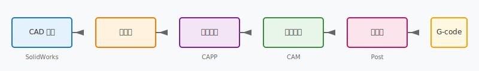

==================
工程案例
==================

本文档通过三个完整的工程案例，帮助你将 unit1~unit8 的理论知识应用到实际制造场景中。每个案例都对应课程中的多个章节，建议在学习完相关章节后再阅读。

工程案例学习目标
==================

1. 理解 CAD/CAM 技术在实际制造中的完整应用流程
2. 掌握从设计模型到加工代码的转换方法
3. 了解不同数据交换格式的特点和使用场景
4. 熟悉 CAPP 工艺路线的设计思路
5. 建立"设计→工艺→制造"的系统性思维

三个案例之间的关系
====================

**案例 A — 从 CAD 到 G-code**：
  覆盖完整制造流程：几何建模 → 工艺分析 → 刀具路径 → G-code 生成。对应 unit3、unit4、unit6、unit7。

**案例 B — 数据交换**：
  关注数据在不同系统间的流转：CAD 模型 → CAE 分析 → CAM 编程 → 3D 打印。对应 unit1、unit5、unit8。

**案例 C — CAPP 工艺路线**：
  聚焦工艺规划环节：毛坯选择 → 定位基准 → 工序排序 → 工艺卡片。对应 unit6、unit8。

推荐阅读顺序
============

1. **初学者**：先阅读 :doc:`data-exchange`，了解数据如何在不同系统间流转
2. **有一定基础**：阅读 :doc:`capp-process-plan`，理解工艺规划的核心思路
3. **系统学习**：最后阅读 :doc:`cad-to-gcode`，建立从设计到制造的完整认知

每个案例对应的课程章节
========================

.. list-table:: 案例与课程章节对应关系
   :header-rows: 1
   :widths: 25 35 40

   * - 案例
     - 核心内容
     - 对应课程章节
   * - CAD 到 G-code
     - 几何建模、刀具路径、后处理
     - unit3, unit4, unit6, unit7
   * - 数据交换
     - STEP/STL/IGES 格式、跨系统协作
     - unit1, unit5, unit8
   * - CAPP 工艺路线
     - 工艺规划、工序设计、工艺卡片
     - unit6, unit8

如何用案例复习 unit1~unit8
============================

1. **学完 unit1（概论）后**
   - 阅读 :doc:`data-exchange` 中的格式对比部分
   - 理解 CAD/CAM 系统间的数据流转

2. **学完 unit3（图形变换）和 unit4（建模）后**
   - 阅读 :doc:`cad-to-gcode` 中的几何建模部分
   - 理解模型如何用于后续加工

3. **学完 unit5（工程分析）后**
   - 阅读 :doc:`data-exchange` 中 CAE 分析的数据准备
   - 理解分析结果如何反馈给设计

4. **学完 unit6（CAPP）后**
   - 阅读 :doc:`capp-process-plan` 完整案例
   - 对照教材中的 CAPP 设计步骤

5. **学完 unit7（数控加工）后**
   - 阅读 :doc:`cad-to-gcode` 中的 G-code 生成部分
   - 理解刀具路径如何转化为机床指令

6. **学完 unit8（集成）后**
   - 回顾三个案例中的数据流
   - 思考如何实现更高效的系统集成

.. toctree::
   :hidden:

   cad-to-gcode
   data-exchange
   capp-process-plan
