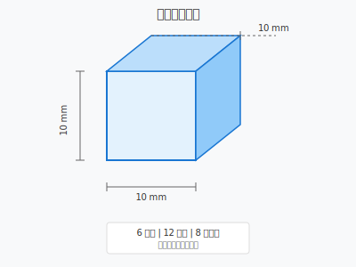
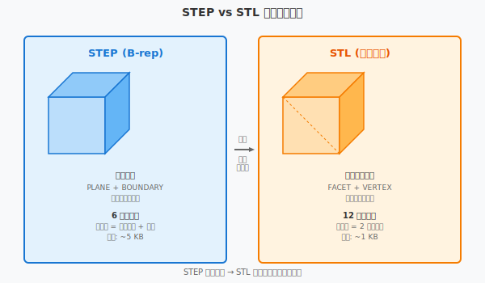
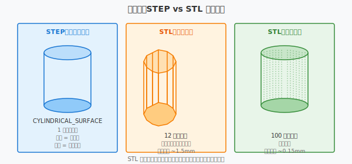

========================================
Mini-Lab：STEP 与 STL 格式对比实验
========================================

本页面通过对比实验，帮助你理解 STEP 和 STL 两种数据格式的本质区别：一个是精确几何描述，一个是近似三角网格。

如果你已经完成 :doc:`freecad-plate-modeling` 练习，可以用自己导出的 STEP 和 STL 文件对照本实验。也建议先阅读 :doc:`freecad-export-checklist`，确保导出文件质量可靠。

实验目标
========

1. 理解 STEP 的边界表示（B-rep）与 STL 的三角网格表示的本质差异
2. 掌握两种格式的文件结构（ASCII 可读部分）
3. 了解格式选择对下游应用（CAE、CAM、3D 打印）的影响
4. 培养"根据应用场景选择数据格式"的决策能力

测试对象
========

**同一个零件** ：一个简单的立方体，尺寸 10mm × 10mm × 10mm

为什么用立方体？
----------------

立方体是最简单的三维实体：

- 6 个平面
- 12 条边
- 8 个顶点

这个简单性让我们能看清两种格式的本质差异，而不被复杂曲面干扰。

STEP 格式解析
=============

什么是 STEP？
-------------

**STEP** （Standard for the Exchange of Product Model Data，ISO 10303）是一种中性格式，用于在不同 CAD 系统间交换精确的产品模型数据。

核心特点：

- **精确几何** ：用数学方程描述曲面（平面、圆柱面、圆锥面等）
- **拓扑信息** ：记录面、边、顶点的连接关系
- **参数化支持** ：AP214/AP242 可携带参数历史
- **工业标准** ：航空、汽车行业的强制要求格式

STEP 文件结构（简化）
----------------------

一个 STEP 文件由三部分组成：

.. code-block:: text
   :linenos:

   ISO-10303-21;              /* 文件头：标识为 STEP 格式 */
   HEADER;
     FILE_DESCRIPTION((''), '2;1');
     FILE_NAME('cube.step', '2024-06-29', ...);
     FILE_SCHEMA(('AUTOMOTIVE_DESIGN { ... }'));
   ENDSEC;
   
   DATA;
     /* 几何数据实体 */
     #1 = CARTESIAN_POINT('', (0., 0., 0.));
     #2 = DIRECTION('', (1., 0., 0.));
     #3 = DIRECTION('', (0., 0., 1.));
     #4 = AXIS2_PLACEMENT_3D('', #1, #3, #2);
     #5 = SHAPE_DEFINITION_REPRESENTATION(...);
     /* ... 更多实体 ... */
   ENDSEC;
   
   END-ISO-10303-21;

教学用 STEP 片段（立方体）
----------------------------

以下是立方体的一个面的简化表示：

.. code-block:: text
   :linenos:

   /* 立方体的一个顶点 */
   #10 = CARTESIAN_POINT('Vertex', (0., 0., 0.));
   
   /* 立方体的一个平面（Z=0 平面） */
   #20 = PLANE('Bottom', #4);  /* #4 是坐标系定义 */
   
   /* 平面边界（由边围成的封闭环） */
   #30 = FACE_BOUND('Outer', #40, .T.);
   #40 = EDGE_LOOP('', (#50, #51, #52, #53));
   
   /* 一条边：从 (0,0,0) 到 (10,0,0) */
   #50 = ORIENTED_EDGE('', *, *, #60, .T.);
   #60 = EDGE_CURVE('', #10, #11, #70, .T.);
   #70 = LINE('', #10, #80);   /* 直线 */
   #80 = VECTOR('', #2, 10.);  /* 方向 + 长度 */

关键概念：

- **CARTESIAN_POINT** ：精确的三维坐标点
- **PLANE** ：由点和法向量定义的无限平面
- **EDGE_CURVE** ：边的几何定义（这里是直线）
- **FACE_BOUND** ：面的边界（由边围成的环）
- **拓扑连接** ：通过 # 编号引用，形成完整 B-rep

STL 格式解析
============

什么是 STL？
------------

**STL** （Stereolithography）是一种用三角网格近似三维表面的简单格式。最初为 3D 打印发明，现已成为 3D 打印和快速原型的事实标准。

核心特点：

- **三角网格** ：所有曲面用三角形平面片逼近
- **无拓扑信息** ：只记录三角形，不记录边/面的连接关系
- **简单通用** ：几乎所有 3D 软件都支持
- **精度可调** ：通过控制网格密度调整近似精度

STL 文件结构（ASCII）
----------------------

.. code-block:: text
   :linenos:

   solid cube
     facet normal 0.0 0.0 -1.0
       outer loop
         vertex 0.0 0.0 0.0
         vertex 10.0 0.0 0.0
         vertex 10.0 10.0 0.0
       endloop
     endfacet
     facet normal 0.0 0.0 -1.0
       outer loop
         vertex 0.0 0.0 0.0
         vertex 10.0 10.0 0.0
         vertex 0.0 10.0 0.0
       endloop
     endfacet
     /* ... 更多 facet ... */
   endsolid cube

教学用 STL 片段（立方体底面）
------------------------------

立方体底面（Z=0）被分成 2 个三角形：

.. code-block:: text
   :linenos:

   /* 三角形 1：左下 → 右下 → 右上 */
   facet normal 0.0 0.0 -1.0    /* 面朝下，法向量指向 -Z */
     outer loop
       vertex 0.0 0.0 0.0       /* 左下角 */
       vertex 10.0 0.0 0.0      /* 右下角 */
       vertex 10.0 10.0 0.0     /* 右上角 */
     endloop
   endfacet
   
   /* 三角形 2：左下 → 右上 → 左上 */
   facet normal 0.0 0.0 -1.0    /* 同一个面，法向量相同 */
     outer loop
       vertex 0.0 0.0 0.0       /* 左下角 */
       vertex 10.0 10.0 0.0     /* 右上角 */
       vertex 0.0 10.0 0.0      /* 左上角 */
     endloop
   endfacet

关键概念：

- **facet** ：一个三角形平面片
- **normal** ：三角形的法向量，指示朝向
- **vertex** ：三角形的顶点坐标
- **outer loop** ：三个顶点按右手定则顺序排列

格式对比实验
============

.. list-table:: STEP vs STL 核心对比
   :header-rows: 1
   :widths: 25 35 40

   * - 对比项
     - STEP
     - STL
   * - 几何表示
     - 精确数学曲面（B-rep）
     - 三角网格近似
   * - 文件大小（立方体）
     - 约 5 KB（含拓扑信息）
     - 约 1 KB（仅表面）
   * - 精度
     - 精确到浮点精度
     - 取决于网格密度
   * - 拓扑信息
     - 有（面-边-顶点关系）
     - 无（只有三角形列表）
   * - 参数化历史
     - AP214/242 可携带
     - 无
   * - 曲面质量
     - 原始曲面质量
     - 多边形化，有棱角
   * - 主要用途
     - CAD 间精确交换、工程分析
     - 3D 打印、快速原型
   * - 可读性
     - 结构化实体，较复杂
     - 非常简单，每三角形 7 行

精度对比：圆柱体示例
---------------------

**问题** ：一个直径 50mm、高 30mm 的圆柱体，用 STL 表示需要多少个三角形？

.. list-table:: 圆柱体精度对比
   :header-rows: 1
   :widths: 30 35 35

   * - 表示方式
     - 侧面描述
     - 文件特点
   * - **STEP**
     - 一个圆柱面（CYLINDRICAL_SURFACE）
     - 数学精确，侧面是光滑曲面
   * - **STL（低精度）**
     - 12 个三角形（每 30° 一个）
     - 侧面呈十二边形，明显棱角
   * - **STL（高精度）**
     - 100 个三角形（每 3.6° 一个）
     - 接近圆形，但文件更大

关键结论：

- STEP 用 **1 个数学方程** 描述圆柱侧面
- STL 用 **成百上千个三角形** 逼近圆柱侧面
- 精度越高，STL 文件越大，但永远不是真正的圆

格式选择决策
============

.. code-block:: text

   需要精确几何数据？
   ├── 是 → 需要参数化历史？
   │       ├── 是 → STEP AP242
   │       └── 否 → STEP AP214
   └── 否 → 只需要可视化/3D 打印？
           ├── 是 → STL（控制网格密度）
           └── 否 → 二维图纸 → DXF/DWG

常见场景推荐
------------

.. list-table:: 常见场景推荐
   :header-rows: 1
   :widths: 30 20 50

   * - 场景
     - 推荐格式
     - 原因
   * - SolidWorks → CATIA
     - STEP
     - 保留精确几何，跨厂商兼容
   * - CAD → 3D 打印机
     - STL
     - 所有切片软件支持，文件简单
   * - CAD → CAE 分析
     - STEP
     - 保留拓扑，网格划分更智能
   * - 逆向工程 → CAD
     - STEP/IGES
     - 从扫描数据重建精确曲面
   * - 网页 3D 展示
     - STL/OBJ
     - 格式简单，浏览器支持好

实验练习
========

练习 1：文件大小估算
--------------------

一个复杂的汽车零件有 1000 个曲面。估算：

- **STEP 文件** ：约 5-10 MB（含拓扑、参数、PMI）
- **STL 文件（低精度）** ：约 50-100 MB（每个曲面用 100 个三角形近似）
- **STL 文件（高精度）** ：约 500 MB-1 GB（每个曲面用 1000 个三角形近似）

**问题** ：为什么 STL 比 STEP 大得多？

**答案** ：STEP 用数学方程描述曲面，STL 用离散三角形逼近。曲面越复杂，STL 的三角形数量呈指数增长。

练习 2：精度分析
----------------

一个直径 100mm 的球体，用 STL 表示：

.. list-table:: STL 精度与文件大小
   :header-rows: 1
   :widths: 30 35 35

   * - 三角形数量
     - 每个三角形覆盖角度
     - 表面最大偏差
   * - 20
     - 18°
     - 约 1.5 mm
   * - 100
     - 3.6°
     - 约 0.15 mm
   * - 1000
     - 0.36°
     - 约 0.015 mm
   * - 10000
     - 0.036°
     - 约 0.0015 mm

**结论** ：STL 的精度与文件大小直接相关。对于精密零件，STEP 更优。

练习 3：格式转换思考
--------------------

**场景** ：你有一个 STEP 文件，需要发给 3D 打印服务商。

**问题** ：

1. 可以直接发送 STEP 文件吗？
   - 大多数 3D 打印服务商接受 STEP，但会转换为 STL 内部处理
   - 转换时的网格密度由服务商控制，可能不符合你的要求

2. 应该自己转换为 STL 吗？
   - 推荐自己转换，可以控制网格密度
   - 用 CAD 软件导出 STL 时设置合适的 Chord Tolerance

3. 转换时需要注意什么？
   - 检查模型是否水密（watertight）
   - 确认没有破面或缝隙
   - 设置合适的网格密度（平衡精度与文件大小）

与 data-exchange 案例的关联
============================

本页面是 :doc:`data-exchange` 的深入实验补充。

:doc:`data-exchange` 介绍了多种格式（STEP、STL、IGES、DXF、G-code）的用途对比和跨系统流转。

本页面聚焦于 **STEP 和 STL 的底层结构差异** ，通过实际文件片段和对比实验，帮助你理解：

- 为什么 CAD 系统间用 STEP？
- 为什么 3D 打印用 STL？
- 格式转换时会发生什么信息损失？

建议学习顺序：

1. 先阅读 :doc:`data-exchange` 了解格式全貌
2. 再阅读本页面深入理解 STEP 和 STL 的结构差异
3. 在 CAD 软件中实际导出同一个零件的 STEP 和 STL，对比文件大小和内容

相关课程章节：

- **unit4 建模** ：B-rep 与实体建模
- **unit8 集成** ：数据交换标准与 CAD/CAM 集成
- **unit5 工程分析** ：CAE 网格划分与几何离散化

V9B CadQuery 实际运行
====================

本环境未能真实运行 CadQuery 并导出 STEP/STL 。如果你本地有 OCCT 环境，可以使用 :doc:`cadquery-runtime-export-pilot` 中的指导生成 CadQuery 导出的 STEP/STL 作为本 mini-lab 的补充样本。

---

*本页面为教学实验用途，文件片段已简化，实际 STEP 文件结构更复杂。*
