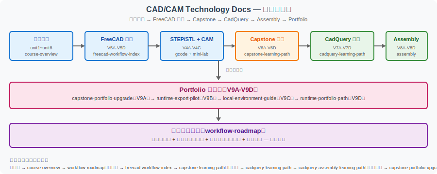
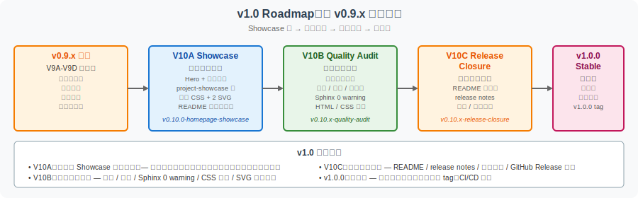

================================================
项目展示：CAD/CAM Technology Docs 全景导览
================================================

本页是 **CAD/CAM Technology Docs** 项目的**全景展示页**。如果你刚开始访问这个站点，不知道从哪开始，请阅读本页。如果你想了解项目从哪里来、演进到哪里、有什么核心资源，本页提供完整图景。

A. 项目从哪里来
=================

起源
-----

本站起源于《CAD/CAM 技术基础》一书的**阅读笔记**。最初以 SAE 静态页形式托管在 SinaAppEngine（已归档），内容偏个人笔记，质量参差不齐。

现代化（V1 - V2）
-----------------

2024 年中迁移到 **Sphinx + Furo** 主题 + **GitHub Pages** 部署：

- 改造为现代化文档站，支持中文搜索、数学公式、响应式布局
- 重构为**课程化结构**（course-overview → unit1 → unit8）
- 增加学习辅助（章节地图、复习题、词汇表、学习路径）

工程化与作品集化（V3 - V9）
----------------------------

逐步扩展为**工程案例 + 实操线 + 代码化建模 + 作品集**四位一体的学习站：

- **V3-V4C**：工程案例化（G-code 教学、STEP/STL mini-lab、工具链路线图）
- **V5A-V5D**：FreeCAD 实操线（建模 → 导出 → CAM → 收口）
- **V6A-V6D**：支架 Capstone 项目线
- **V7A-V7D**：CadQuery 代码化建模线
- **V8A-V8D**：CadQuery Assembly 装配体线
- **V9A-V9D**：Runtime / Portfolio 作品集收口线

展示化（V10A - v1.0）
---------------------

当前阶段，把内容丰富但偏文档型的站点**升级为作品集型学习站**：

- 首页加入 Hero / 入口矩阵 / 推荐阅读路径 / 能力矩阵 / v1.0 路线图
- 新增 project-showcase 全景页（本页）
- 轻量 CSS 增强视觉层次
- 为 v1.0 稳定版做准备

B. 当前站点包含什么
====================

按模块介绍当前站点：

模块清单
---------

.. list-table:: 当前站点模块清单
   :header-rows: 1
   :widths: 18 28 25 14 15

   * - 模块
     - 内容
     - 推荐起点
     - 成熟度
     - 入口
   * - 8 章基础课程
     - unit1-unit8 系统教材
     - :doc:`course-overview`
     - ⭐⭐⭐⭐⭐
     - 课程基础
   * - 学习辅助
     - 章节地图、词汇表、复习题
     - :doc:`chapter-map`
     - ⭐⭐⭐⭐⭐
     - 学习辅助
   * - 工程案例
     - CAD→G-code、数据交换、CAPP
     - :doc:`examples/cad-to-gcode`
     - ⭐⭐⭐⭐
     - 工程案例
   * - FreeCAD 实操线
     - V5A-V5D 五步路线
     - :doc:`examples/freecad-workflow-index`
     - ⭐⭐⭐⭐⭐
     - 实操
   * - 支架 Capstone 项目线
     - V6A-V6D 综合项目
     - :doc:`examples/capstone-learning-path`
     - ⭐⭐⭐⭐⭐
     - 项目
   * - CadQuery 代码化建模线
     - V7A-V7D 代码建模
     - :doc:`examples/cadquery-learning-path`
     - ⭐⭐⭐⭐
     - 代码
   * - Assembly 装配体线
     - V8A-V8D 多零件装配
     - :doc:`examples/cadquery-assembly-learning-path`
     - ⭐⭐⭐⭐
     - 装配
   * - Runtime / Portfolio 路线
     - V9A-V9D 运行与作品集
     - :doc:`examples/cadquery-runtime-portfolio-path`
     - ⭐⭐⭐⭐
     - 作品集

C. 项目演进时间线
==================

下方表格按版本线展示主要里程碑：

.. list-table:: 版本演进时间线
   :header-rows: 1
   :widths: 14 22 32 18 14

   * - 版本线
     - 主题
     - 主要交付
     - 关键页面
     - 状态
   * - v0.2.0
     - 课程化结构
     - course-overview → unit1-8
     - :doc:`course-overview`
     - ✅
   * - v0.3.0
     - 工程案例
     - CAD→G-code、数据交换、CAPP
     - :doc:`examples/cad-to-gcode`
     - ✅
   * - v0.4.x
     - G-code / STEP-STL / 工具链
     - G-code 教学、mini-lab、路线图
     - :doc:`workflow-roadmap`
     - ✅
   * - v0.5.x
     - FreeCAD 实操
     - 建模 → 导出 → CAM → 收口
     - :doc:`examples/freecad-workflow-index`
     - ✅
   * - v0.6.x
     - 支架 Capstone
     - V6A-V6D 综合项目
     - :doc:`examples/capstone-learning-path`
     - ✅
   * - v0.7.x
     - CadQuery 单零件
     - V7A-V7D 代码建模
     - :doc:`examples/cadquery-learning-path`
     - ✅
   * - v0.8.x
     - CadQuery Assembly
     - V8A-V8D 多零件装配
     - :doc:`examples/cadquery-assembly-learning-path`
     - ✅
   * - v0.9.x
     - Runtime / Portfolio
     - V9A-V9D 作品集收口
     - :doc:`examples/cadquery-runtime-portfolio-path`
     - ✅
   * - **v0.10.0**
     - **首页 Showcase**
     - **首页视觉升级 + project-showcase**
     - **本页**
     - **本次**

D. Showcase 入口表
==================

最值得展示的 8 个页面：

.. list-table:: Showcase 入口表
   :header-rows: 1
   :widths: 6 32 35 27

   * - #
     - 页面
     - 适合读者
     - 链接
   * - 1
     - 工作流路线图
     - 想理解 CAD/CAM 全流程的人
     - :doc:`workflow-roadmap`
   * - 2
     - FreeCAD 五步路线
     - 想做实操的人
     - :doc:`examples/freecad-workflow-index`
   * - 3
     - 支架 Capstone 项目
     - 想做综合项目的人
     - :doc:`examples/bracket-capstone-project`
   * - 4
     - Capstone 项目线
     - 想理解 V6 项目线全貌的人
     - :doc:`examples/capstone-learning-path`
   * - 5
     - CadQuery 学习路径
     - 想学代码建模的人
     - :doc:`examples/cadquery-learning-path`
   * - 6
     - Assembly 学习路径
     - 想理解多零件装配的人
     - :doc:`examples/cadquery-assembly-learning-path`
   * - 7
     - Capstone 作品集升级
     - 想合并提交 V6/V7/V8 成果的人
     - :doc:`examples/capstone-portfolio-upgrade`
   * - 8
     - CadQuery 运行与作品集路线
     - 想理解 V9 完整闭环的人
     - :doc:`examples/cadquery-runtime-portfolio-path`

E. 适合展示给谁
=================

本站适合以下读者群体：

**CAD/CAM 初学者**
-------------------

- 想系统学习 CAD/CAM 基础的人
- 机械、工业、智能制造专业学生
- 自学者：从阅读教材入门，到实操练习

**想做工程数据流的读者**
-------------------------

- 想理解 CAD → CAE → CAM 完整链路的人
- 想学习 STEP/STL/IGES 等数据交换格式的人
- 想理解 G-code 与刀具路径的人

**想把 CAD/CAM 学习成果做成作品集的人**
-----------------------------------------

- 想把多条学习线合并成一份可提交作品集
- 想把代码建模结果（CadQuery）合并到图形化作品集（FreeCAD）
- 想真实运行代码而不是只"代码看着对"

**想用代码建模展示工程理解的人**
-----------------------------------

- 想用 CadQuery 做参数化建模
- 想用 Assembly 表达多零件装配
- 想展示 BOM / 装配检查 / 教学诚信

F. 与 workflow-roadmap 的关系
==============================

- **workflow-roadmap** ：**学习路线** —— 教读者如何从设计到制造的完整认知
- **project-showcase**（本页）：**项目全景** —— 展示本站有什么、演进到哪里、读者怎么开始

两者是互补的：

- workflow-roadmap 是**纵向**的（按学习阶段展开）
- project-showcase 是**横向**的（按模块和读者类型展开）

G. 后续规划
=============

.. seealso::

   本页是 V10A 成果。下一步：

   - **V10B**：全站质量审计（链接失效检查、死链排查、Sphinx 0 warning、HTML/CSS 验证）
   - **V10C**：最终发布收口（README 最终版、release notes、导航/标签收口）
   - **v1.0.0**：稳定版发布（长期支持里程碑）

H. 相关页面
============

- :doc:`index` — 首页（含 Hero / 入口矩阵 / v1.0 路线图）
- :doc:`workflow-roadmap` — 学习路线（互补页）
- :doc:`release-showcase` — 站点发布说明（V1-V9）
- :doc:`course-overview` — 课程总览
- :doc:`examples/index` — 工程案例总入口

I. 教学声明
============

本页面是 **CAD/CAM Technology Docs 项目的全景展示页** ：

- 仅展示项目结构与路径，不重写 unit1~unit8
- 不引入后端、数据库或复杂前端
- 优先静态站路线（Sphinx + Furo + GitHub Pages）
- 轻量 CSS 增强视觉层次，不破坏 Furo 默认主题

---

| 项目维护者：ConanXin | 当前版本：v0.10.0-homepage-showcase