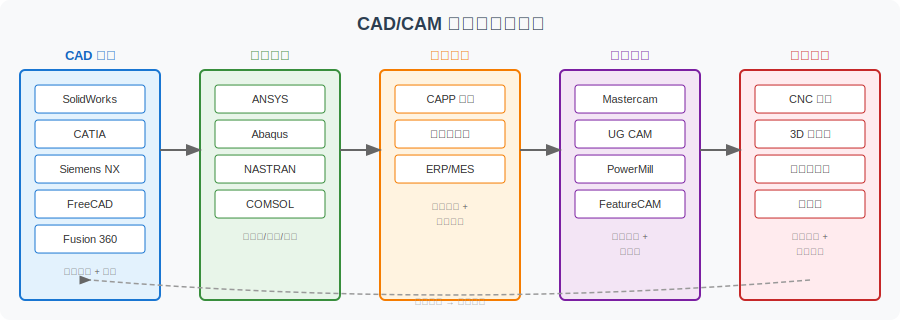
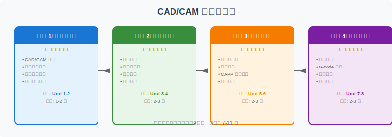

========================================
工作流路线图：从设计到制造
========================================

本页面帮助你建立 CAD/CAM 全流程的系统认知，理解每个环节的角色、工具选择和数据流转。

为什么需要工作流路线图？
================================

学完 unit1~unit8 后，你可能会问：

- 这些知识在实际工作中如何串联？
- 不同软件分别在哪个环节发挥作用？
- 面对具体任务时，应该选什么文件格式？
- 学习的先后顺序如何安排最高效？

本页面回答这些问题，帮你把碎片知识拼接为完整的制造工作流认知。

CAD/CAM 工具链总览
================================

一个完整的 CAD/CAM 工作流通常包含五个环节，每个环节有专门的软件工具支撑：

工具链角色详解
----------------

.. list-table:: 各环节核心角色与典型工具
   :header-rows: 1
   :widths: 18 25 30 27

   * - 环节
     - 核心任务
     - 典型工具
     - 输出物
   * - **CAD 设计**
     - 几何建模、装配设计、工程图生成
     - SolidWorks, CATIA, Siemens NX, FreeCAD, Fusion 360
     - 三维模型、装配体、二维工程图
   * - **工程分析**
     - 有限元分析、运动仿真、优化设计
     - ANSYS, Abaqus, NASTRAN, COMSOL
     - 分析报告、优化建议、安全系数
   * - **工艺规划**
     - 工序设计、资源分配、生产调度
     - CAPP 系统, ERP, MES
     - 工艺卡片、工序流程、BOM
   * - **数控编程**
     - 刀具路径计算、后处理、仿真验证
     - Mastercam, UG CAM, PowerMill, FeatureCAM
     - G-code 程序、刀具清单、加工时间
   * - **制造执行**
     - 物理加工、质量检测、装配
     - CNC 机床, 3D 打印机, 三坐标测量机
     - 成品零件、检测报告

各环节之间的数据流
--------------------

.. code-block:: text

    CAD 模型 ──→ 分析验证 ──→ 工艺规划 ──→ 数控编程 ──→ 加工制造
       ↑                                                    │
       └──────────── 质量反馈 / 设计迭代 ←──────────────────┘

**关键数据交换点：**

1. **CAD → CAE**：通常使用 STEP 或原生格式，保留完整几何和装配信息
2. **CAD → CAM**：STEP 或 IGES 格式，确保曲面精度用于刀具路径计算
3. **CAM → CNC**：G-code 程序，通过后处理器转换为特定机床指令
4. **制造 → 设计**：测量数据反馈，用于设计修正或公差分析

四阶段学习路线
================================

阶段 1：建立基础认知（Unit 1-2）
------------------------------------

**目标**：理解 CAD/CAM 是什么、能解决什么问题、技术如何发展至今。

**核心内容**：

- CAD/CAM 基本概念与发展历程
- 计算机图形学基础
- 制造业信息化整体框架
- 主要应用领域（航空、汽车、模具、医疗）

**建议实践**：

- 浏览 :doc:`course-overview` 建立全局观
- 阅读 :doc:`modern-cadcam-context` 了解技术趋势
- 熟悉 :doc:`glossary` 中的核心术语

阶段 2：掌握建模技术（Unit 3-4）
------------------------------------

**目标**：理解计算机如何表达和变换几何形状，掌握主流建模方法。

**核心内容**：

- 二维/三维图形变换（平移、旋转、缩放）
- 曲线与曲面表示（Bezier, B-spline, NURBS）
- 实体建模（CSG, B-rep）
- 特征建模与参数化设计

**建议实践**：

- 在 FreeCAD 或 Fusion 360 中建立简单零件
- 阅读 :doc:`examples/cad-to-gcode` 中的建模部分
- 尝试 :doc:`examples/step-stl-mini-lab` 理解不同格式的几何表达差异

阶段 3：理解分析与工艺（Unit 5-6）
--------------------------------------

**目标**：掌握工程分析方法和工艺规划思路，理解"设计是否可行"和"如何制造"。

**核心内容**：

- 有限元分析基本原理
- 优化设计方法
- CAPP 的基本概念与类型
- 工艺路线设计与工序规划

**建议实践**：

- 阅读 :doc:`examples/capp-process-plan` 完整案例
- 理解 :doc:`examples/data-exchange` 中 CAE 分析的数据准备流程
- 尝试分析一个简单的零件工艺路线

阶段 4：实现编程与集成（Unit 7-8）
--------------------------------------

**目标**：理解数控加工原理，掌握 G-code 基础，建立系统集成认知。

**核心内容**：

- 数控加工基本原理
- G-code 程序结构与常用指令
- 刀具路径规划
- CAD/CAM 系统集成与数据交换

**建议实践**：

- 阅读 :doc:`examples/gcode-toolpath-visualization` 逐行理解 G-code
- 阅读 :doc:`examples/cad-to-gcode` 完整制造流程
- 理解 :doc:`examples/data-exchange` 中的格式选择决策

文件格式决策指南
================================

在实际工作中，"应该保存为什么格式？"是最常见的问题之一。

格式选择决策表
----------------

.. list-table:: 常见文件格式选择指南
   :header-rows: 1
   :widths: 20 20 20 20 20

   * - 场景
     - 推荐格式
     - 备选格式
     - 避免使用
     - 原因
   * - CAD 系统间交换
     - STEP (AP214/AP242)
     - IGES, Parasolid
     - STL
     - 保留精确几何和拓扑
   * - 3D 打印
     - STL
     - OBJ, 3MF
     - STEP
     - 三角网格是打印机原生输入
   * - CAM 编程
     - STEP, IGES
     - Parasolid, ACIS
     - STL
     - 需要精确曲面用于刀具路径
   * - CAE 分析
     - STEP, 原生格式
     - IGES, Parasolid
     - STL
     - 需要完整几何和装配信息
   * - 网页展示
     - glTF, OBJ
     - STL (仅几何)
     - STEP
     - 轻量化、浏览器友好
   * - 长期归档
     - STEP AP242
     - PDF 3D
     - 私有格式
     - 开放标准、语义完整

格式选择速查口诀
----------------

.. list-table:: 格式选择速查
   :header-rows: 1
   :widths: 35 65

   * - 需求关键词
     - 选择建议
   * - "要继续编辑 / 修改特征"
     - STEP 或原生 CAD 格式
   * - "要 3D 打印"
     - STL（检查壁厚和支撑）
   * - "要 CNC 加工"
     - STEP → CAM → G-code
   * - "要仿真分析"
     - STEP 或 CAE 原生接口
   * - "要给别人看（不修改）"
     - PDF 3D, glTF, 截图
   * - "要长期保存"
     - STEP AP242（带 PMI）
   * - "文件太大"
     - 检查是否可用 STEP 替代 STL
   * - "曲面丢失 / 精度不够"
     - 避免 STL，改用 STEP/IGES

常见格式误区
------------

**误区 1：STL 可以替代 STEP 用于 CAD 交换**

❌ **错误**：把 SolidWorks 模型导出为 STL，再导入到 CATIA 中继续编辑。

✅ **正确**：使用 STEP 格式进行 CAD 系统间交换，保留精确曲面和特征信息。

**误区 2：所有 3D 格式都支持颜色/材质**

❌ **错误**：认为 STEP 文件可以携带渲染材质信息用于展示。

✅ **正确**：STEP 携带的是工程语义（几何、拓扑、公差），颜色和材质需要另外处理或使用 glTF/FBX 等展示格式。

**误区 3：IGES 已经过时，完全不需要学**

❌ **错误**：认为 IGES 已被 STEP 完全取代，不再需要了解。

✅ **正确**：IGES 在曲面数据交换中仍有广泛应用，许多老系统和特定行业仍在使用，了解其局限性是必要的。

学习路径与案例对照
================================

将学习路线与工程案例结合，效果更佳：

.. list-table:: 学习阶段与案例对照
   :header-rows: 1
   :widths: 20 35 45

   * - 学习阶段
     - 推荐案例
     - 学习目标
   * - 阶段 1 完成后
     - :doc:`examples/data-exchange`
     - 理解数据在不同系统间如何流转
   * - 阶段 2 完成后
     - :doc:`examples/step-stl-mini-lab`
     - 理解建模背后的几何表达方式
   * - 阶段 3 完成后
     - :doc:`examples/capp-process-plan`
     - 理解"设计好"到"能加工"的决策过程
   * - 阶段 4 完成后
     - :doc:`examples/cad-to-gcode` + :doc:`examples/gcode-toolpath-visualization`
     - 理解从模型到机床指令的完整转换

一张图看懂本站
================================

本站内容分为四个层次，形成完整的学习闭环：

- **基础课程层**：course-overview -> unit1 -> unit2 -> unit3 -> unit4 -> unit5 -> unit6 -> unit7 -> unit8

- **学习辅助层**：chapter-map（快速定位）、glossary（术语查询）、practice-questions（效果检验）、learning-path（阅读建议）

- **工程案例层** / examples/index：cad-to-gcode（完整制造流程）、data-exchange（格式流转）、capp-process-plan（工艺设计）

- **深度理解层**：gcode-toolpath-visualization（V4A: G-code 逐行解释与路径可视化）、step-stl-mini-lab（V4B: STEP 与 STL 格式对比实验）

**阅读关系**：先读基础课程建立知识，再用案例串联应用，最后用深度理解层检验掌握程度。

下一步建议
================================

**如果你刚开始学习**：

1. 从 :doc:`course-overview` 开始，建立全局认知
2. 按 Unit 1 → Unit 8 顺序系统学习
3. 每学完一个阶段，回顾对应的工程案例

**如果你已有基础，想查漏补缺**：

1. 对照上面的"阶段"定位自己的知识缺口
2. 针对性阅读对应 Unit 和案例
3. 重点关注文件格式选择和工具链理解

**如果你想深入某个环节**：

- **CAD 建模**：重点学习 Unit 3-4，实践 FreeCAD/Fusion
- **工程分析**：重点学习 Unit 5，了解 ANSYS/ABAQUS 入门
- **数控编程**：重点学习 Unit 7，配合 :doc:`examples/gcode-toolpath-visualization`
- **系统集成**：重点学习 Unit 8，理解 STEP/IGES/PDM 的作用

低门槛实践任务
----------------

以下是 3 个不需要昂贵软件即可完成的实践任务：

**任务 1：用 FreeCAD 建一个带孔矩形板并导出 STEP 与 STL**

完整步骤见 :doc:`examples/freecad-plate-modeling`。该页面包含：

- FreeCAD Part Design 工作区的逐步操作指南
- 100mm × 60mm × 10mm 矩形板 + 直径 20mm 通孔的建模过程
- STEP 和 STL 导出方法
- 文件结构对比和思考题
- 练习检查清单

导出后建议继续阅读 :doc:`examples/freecad-export-checklist`，系统验证导出结果。

导出验证后，建议继续阅读 :doc:`examples/freecad-to-cam-worksheet`，学习如何为零件规划 CAM 加工任务，理解从模型到刀路的转换。

完成上述三步后，请阅读 :doc:`examples/freecad-workflow-index`，查看 FreeCAD 五步学习路线总览和初学者完成标准。

**任务 1.5：完成 L 型支架 Capstone 项目**

完成以上三步后，作为综合验证，建议完成 :doc:`examples/bracket-capstone-project` L 型支架 Capstone 项目。项目包含 5 个阶段（需求分析、CAD 建模、导出验证、CAM 规划、G-code 理解），集成 V5A-V5D 全部学习成果。

**任务 1.6：尝试 FreeCAD Path Workbench**

如果你有 FreeCAD 经验，可以阅读 :doc:`examples/freecad-path-workbench-intro` 了解 FreeCAD 内置的 CAM 模块，用 Path Workbench 生成真实 G-code。本任务为可选，不依赖真实机床。

**任务 2：对比 STEP 与 STL 文件差异**

1. 用文本编辑器打开上一步导出的 STEP 文件
2. 观察文件头、几何实体定义（CARTESIAN_POINT, DIRECTION 等）
3. 用文本编辑器打开 STL 文件
4. 观察三角面片定义（facet normal, vertex 等）
5. 记录：STEP 文件中出现了多少个实体？STL 文件中有多少个三角面？

**你能学到什么**：直观理解 B-rep（精确边界表示）与三角网格表示的本质差异。这与 :doc:`examples/step-stl-mini-lab` 中的实验原理一致。

**任务 3：读懂一段简单 G-code 的运动顺序**

阅读以下 G-code 程序，按顺序写出刀具的运动轨迹：

.. code-block:: text

    G21          ; 设置单位为毫米
    G90          ; 绝对坐标模式
    G0 Z5        ; 快速抬刀到安全高度
    G0 X0 Y0     ; 快速移动到起点
    G1 Z-1 F100  ; 下刀，进给速度 100mm/min
    G1 X50 Y0 F200
    G1 X50 Y50
    G1 X0 Y50
    G1 X0 Y0
    G0 Z5        ; 抬刀
    M30          ; 程序结束

**问题**：

1. 刀具加工出的形状是什么？（正方形 / 圆形 / 三角形？）
2. 加工深度是多少毫米？
3. 实际切削时的进给速度是多少？
4. G0 和 G1 的区别是什么？

**参考答案**：正方形，50mm × 50mm，深度 1mm，切削进给 200mm/min，G0 是快速定位，G1 是直线插补切削。

**你能学到什么**：理解 G-code 的基本结构和坐标运动逻辑，为阅读 :doc:`examples/gcode-toolpath-visualization` 打下基础。
